AI(인공지능) - artificial intelligence

##### [1. Uninformed Search](#Uninformed-Search)
##### [2. Informed(Heuristic) Search](#Informed-Search)
##### [3. Adversarial Search(적대적 탐색)](#adversarial-search)
##### [4. Constraint Satisfaction Problem(제약 충족 문제)](#Constraint-Satisfaction-Problem)
##### [5-0. K-nearest-neighbor Classification (KNN)](#K-nearest-neighbor)
##### [5-1. Decision Tree(의사결정트리)](#Decision-Tree)
##### [6. Clustering(군집화)](#Clustering)
##### [7. Naive Bayes(나이브 베이즈)](#Naive-Bayes)
##### [8. Expectation Maximization](#Expectation-Maximization)
##### [9. Reinforcement Learning(강화학습)](#Reinforcement-Learning)
##### [10. Artificial Neural Networks(인공신경망네트워크)](#Artificial-Neural-Networks)


## Search Strategy
탐색 전략이란 어떤 노드부터 탐색할 것인지 그 순서를 정하는 것.

대표적으로 네가지 기준으로 탐색 전략을 평가한다.

1. completeness : 만약 답이 존재한다고 한다면 매번 그 답을 찾아내는가.
2. time complexity : 동작 수행 시간
3. space complexity : 메모리 사용량
4. optimality : 찾은 답은 최적해(lost-cost solution)인가.


## Uninformed Search
탐색. 문제에서 정의한 것 이외의 추가적인 정보가 없을 때 사용하는 Search Strategy 이다.

이 전략이 할 수 있는 행위는 자식 노드(Successor)를 생성하거나 목표 도달 여부를 구별하는 것 밖에 없다.

1. Breadth-First Search

    Complete 만족, Optimal 만족

    시간복잡도 :
      depth를 d라고 하고, tree의 가지(branch)를 b 라고 한다.

      b + b^2 + b^3 + b^4 + ... + b^d = O(b^d)

2. Uniformed-Cost Search

    만일 모든 과정의 Cost가 동일하다면 BFS가 이상적이나, 일반적으로 그렇지 않다.
Uniform-cost Search는 lowest path cost g(n)까지의 노드 n까지 Expand한다. 
즉 현재 Frontier에서 확장되지 않은 노드 중에서 가장 비용이 적은 노드부터 선택해서 확장하는 것을 의미한다.
이를 위해서는 Frontier가 Path Cost에 따라 정렬된 Priority Queue로 구현이 되어야 한다.
가장 낮은 비용의 노드가 먼저 위치하게 한다.

    Complete 만족, Optimal 만족


    시간복잡도는 O(b^1+⌊C∗/ϵ⌋)=b^d+1
    
    깊이가 깊어질수록 메모리 공간이 많이 필요하다.


​    
​    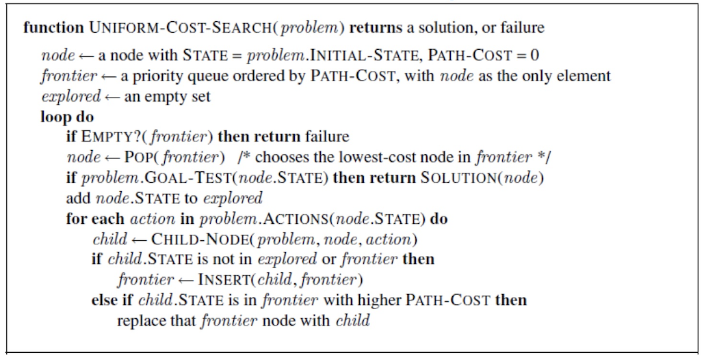

3. Depth-First Search

    Complete X, Optimal X
    현 트리구조의 최대깊이를 m이라고 노드의 개수는 오직 O(m)의 메모리만을 사용하면 된다.
    순환 고리가 없는 트리구조에서는 Complete를 만족한다.

    시간복잡도 : O(b^D)
    공간복잡도 : O(bD)

4. Depth-Limited Search

    무한한 State space에서의 Depth-first Search는 실패를 일으킬 수 있는데, 미리 설정해놓은 깊이 값인 l을 이용함으로써 이 실패를 줄일 수 있다. 즉, 깊이 l까지 도달하면 더 이상의 자식노드는 존재하지 않는다고 간주하는 알고리즘이다.
이 알고리즘의 Time-complexity는 O(bl)이 되며, Space-complexity는 O(bl)이 된다.

    
    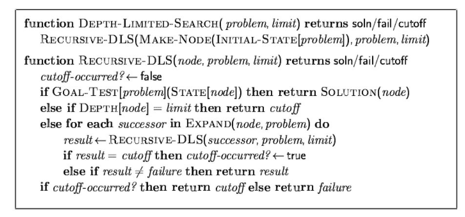

5. Iterative Deepening Depth-First Search

    Depth Limit Search에서 Limit을 점차적으로 늘려나가는 방식.
    전체 상태공간의 지름을 알지 못할때 사용하면 좋다.
    Time-complexity로는 O(bd)이다. 

    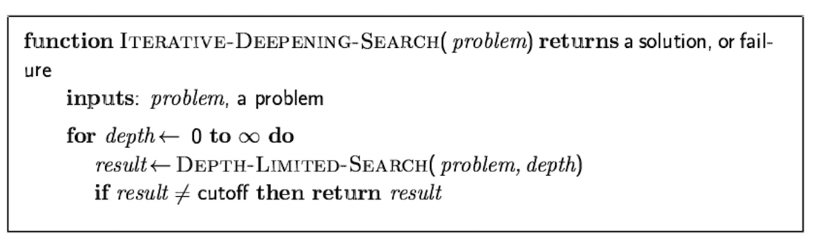


#### Overall


   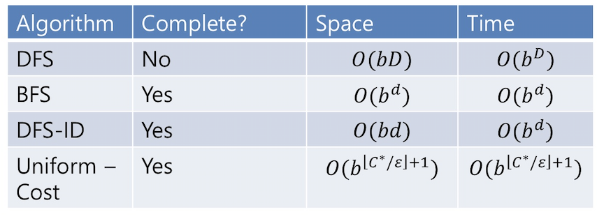

---

## Informed Search

Heuristic
  - 논리적으로 증명할 수 없으나(주먹구구식) 문제를 푸는데 도움이 될 수 있는 것.
  - 해결책을 보장하지는 않음
  - 하지만 확률적으로 성능이 높아짐.


Evaluate function(평가함수) f : 확장시킬 노드들을 각각의 근거를 통해 평가하여 순위를 매김


#### Best-first Search

- Depth-first Seatch를 최적화하는 탐색 알고리즘.
- 노드를 확장시킬 때, 평가함수 f의 값이 가장 작은 값을 선택한다.
- 대표적인 예로는 Dijkstra's algorithm, A* algorithm이 있다.

1. Greedy Best-First Search

    평가함수를 오직 Heuristic 함수로만 구성.<br>
    언제나 최적의 정답만을 주는 것은 아님.

- Complete: 유한한 공간의 graph에서 repeated-state checking이 있을때만 만족
- Time: O(b^D), 하지만 평균 속도는 월등히 높아질 수 있음.
- Space: 평균 공간은 월등히 낮아질 수 있음.
- Optimal: X


2. A* Search

    시작점과 목표점 사이의 최단거리를 찾아주는 알고리즘.<br>
    g(n) = 시작점으로부터의 비용<br>
    h(n) = 목적지까지의 예상(Heuristic) 비용<br>
    평가함수 f(n) = g(n) + h(n)


  1) 현재 노드를 closed list에 올려둔다.
  2) 현재 노드에서 가능한 노드를 opened List에 올려둔다.
  3) 값이 가장 낮은 노드로 확장한다.
  4) 노드로 항햔다.

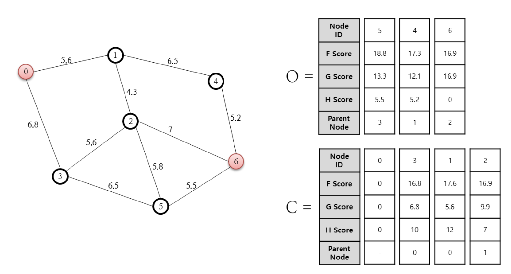


- Complete을 만족한다.
- 휴리스틱 함수 h(n)이 admissible하다면, Optimal을 만족한다.

    <small>※  A heuristic h(n) is admissible if for every node n,
h(n) ≤ h*(n), where h*(n) is the true cost to reach the goal
state from n.</small>


#### Local Search

1. Hill Climbing
- 현재 노드를 기준으로 이웃 노드들을 확인하여 조금이라도 더 좋은 노드로 이동하는 방식을 이용.
- 아주 적은 메모리를 이용한다. 현재노드만을 기록하기에 O(1)
- 아주 큰 상태 공간에서 그나마 합리적인 해를 찾아내는 이점.

    문제점 : Local Maximum에 빠질 수 있다.
    
    
    <br>

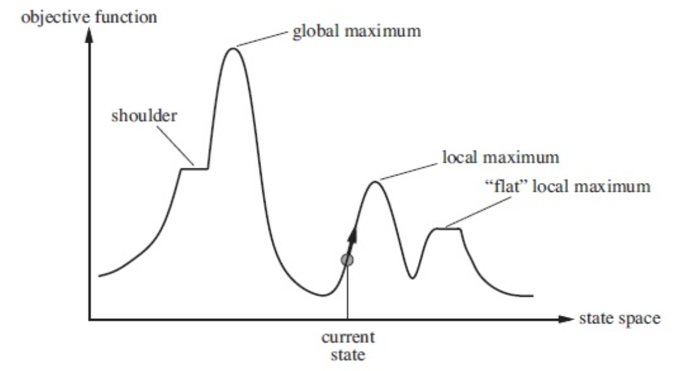


2. Simulated Annealing

    커다란 탐색공간에서 주어진 함수의 전역 최적점에 대한 훌륭한 근사치를 찾으려고 하는 전역최적화 문제에 대한 일반적인 확률적 휴리스틱 접근방식

시작 위치에서 공을 굴리면, 공은 Local Minima에 빠질 것이다. (가속도는 생각하지 말도록 하자) 하지만 우리가 원하는 것은 Global Minima에 공이 도달하는 것이다. 하지만 Hill Climbing Method에 의해서는, 공은 현재 위치보다 높은 곳으로는 이동하지 않기 때문에, 위 그림과 같은 상황이 발생한다.


이 때, 이 언덕 전체를 살짝 흔들어주면 어떻게 될까? 공이 Local Minima를 겨우 빠져 나갈 정도로 흔들어 준다면, 공은 Global Minima에 도달할 수 있을 것이다. 이렇게 흔들어 주는 것이 Simulated Annealing에 적용된 Heuristics이다.


참고 : https://sens.tistory.com/404


## Adversarial Search

### Adversarial Search(적대 탐색) 란?

- AI 프로그램(게임 프로그램)들은 탐색 알고리즘으로 **[Minimax algorithm](#1.-Minimax-algorithm(최대최소-방법)),** **[alpha-beta pruning](#2.-Alpha-Beta-Pruning(알파-베타-방법))** 등을 사용하는데, 이러한 알고리즘을 사용한 탐색을 적대 탐색이라고 한다.

- 적대 탐색에서는 두 명의 게임플레이어 중 한 명이 이기거나, 지거나 ,비길 때까지 번갈아 행동하는 것을 가정한다. 또, 사용가치가 서로 상반되기 때문에 한쪽이 점수를 얻으면, 한쪽은 잃게 된다. 이러한 특성이 적대적인 상황을 만든다.

- 게임이론 용어 :

  - Deterministic : 어떤 행동의 결과도 예측 가능하다. 즉, operation이 정확히 수행된다.
  
  - turn-taking : 두 플레이어의 행동이 번갈아서 일어난다. 즉, 동시에 작동하는 경우가 없다.
  
  - zero-sum game : 모든 이득의 총합이 항상 제로인 게임
  
  - perfect information : 현재 모든 게임 상태는 완전히 관찰 가능하다. 즉, optimal하게 선택 가능하다.

<br>

**적대 탐색 알고리즘 소개 전 해당 장에서 필요한 정보**

- 해당 장에서는 두 명의 플레이어를 MAX와 MIN으로 표현한다.

- [Tic-Tac-Toe(삼목게임)에 대한 게임 트리](#Game-Tree-for-Tic-Tac-Toe)를 예시로 사용한다.

- 게임트리의 대략적인 사이즈

  - b = branching factor(각 노드의 자식 노드 수)
  
  - d = search depth 라고 할 때, **O(b^d)**
  
  - 체스의 경우, b ~ 35 / d ~ 100 으로 엄청 큰 사이즈이기 때문에 이것을 다 탐색하기는 어렵다. 그래서 Game-playing은 **한정된 시간에 최적의 결정**을 내리는 것을 강조한다.
  
  -  주요 쟁점은 " 커다란 게임트리에서 어떻게 optimal move를 탐색할 것인가? " 이다. 이를 위해 적대 탐색 알고리즘이 사용된다.
  

<br>  

#### Game Tree for Tic Tac Toe

<br>

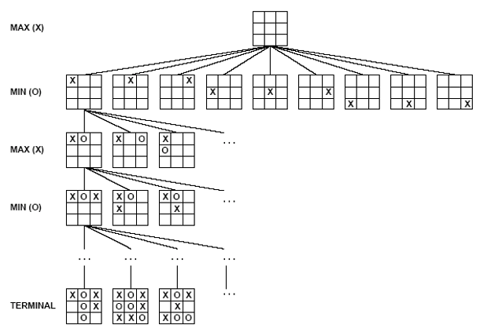

### 적대 탐색 알고리즘 종류

#### 1. Minimax algorithm(최대최소 방법)

- 본인 차례에는 본인에게 제일 유리한 수, 상대방 차례에는 본인에게 제일 불리한 수가 선택하며, 다음 턴만이 아니라 그 이후까지 바라보며 탐색하는 과정이다.

- **MAX** 가 X 를 표시하고, **MIN** 은 0 를 표시하며, **MAX** 가 먼저 시작한다고 가정하자. 깊이 제한이 2 인 경우, 레벨 2 의 모든 노드가 생성될 때까지 너비우선 탐색을 수행한 다음, 이들 노드에 대하여 평가 함수를 적용한다. 상태 p에 대한 평가 함수 e(p) 가 다음과 같이 주어진다고 하자.

  ```
  if MAX가 이기는 상태 : e(p) = ∞
  
  if MIN이 이기는 상태 : e(p) = -∞
  
  if 결정이 나지 않은 상태 : e(p) = (MAX가 이길수 있는 경우의 수) - (MIN이 이길수 있는 경우의 수)
  ```

만약 상태가 다음과 같다면, 


e(p) = 6 - 4 = 2 가 될 것이다.

<br>

**START**

탐색의 첫번째 단계


위부터 e(p)의 값이 각 1, -2, -1이기 때문에 MAX는 e(p) = 1 을 선택하여 행동할 것이다.

<br>

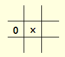


MIN은 여기에 대해 위 그림과 같이 X의 왼편에 O를 표시했다고 하자.(MIN은 좋은 탐색 전략을 갖고 있지 않다고 볼 수 있다.)

그리고 다시 MAX가 탐색을 수행하고 아래와 같은 탐색트리가 만들어진다.

<br>


여기서 두 가지 최상의 선택이 가능하지만, 빨간표시의 행동을 선택했다고 하자. 그렇다면 MIN은 패배를 피하기 위해 아래와 같은 행동을 취할 것이다.

<br>


MAX는 탐색을 다시 수행하여 아래와 같은 트리를 생성한다. MAX는 이번에도 최상의 선택을 할 것이고, 이 선택이 MAX의 패배를 피할 수 있는 행동이라는 것을 알 수있다. 그리고 다음 차례에서 MIN은 패배했다는 것을 알 수있고 게임은 종료된다.

<br>


#### 2. Alpha-Beta Pruning(알파 베타 방법)

- 위에 설명한 Minimax algorithm의 경우 탐색트리 생성 과정과 상태 평가 과정이 완전히 분리되어 있다. 즉, 트리 생성이 완전히 끝난 후에야 상태 평가가 시작된다. 그래서 비효율적인 전략이라고 볼 수 있다.

- 이를 보완하기 위해 나온 방법이 Alpha-Beta Pruning으로 최종 결정에 영향이 없는 노드들은 가지치기를 해 시간을 줄이는 것이다.

<br>

**Example**

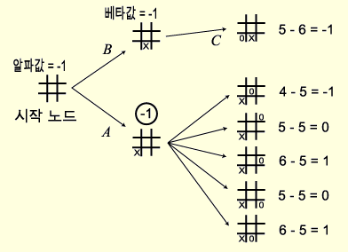

<br>

위 그림을 예로 들어 설명해보자.

해당 그림은 노드 A와 A의 자식이 생성되고, B의 자식 노드 C까지 생성된 직후이다.

여기서 A의 평가값이 -1인데, 이 시점에서 시작 노드의 평가값은 -1 이상으로 제한된다.

왜냐하면 시작 노드는 MAX 차례이므로 최댓값을 탐색할 것이다. 근데 이미 A에서 평가값 -1을 받았으므로 그보다 작은 값을 선택할 수는 없다. 이 하한을 시작 노드의 **Alpha Value(알파값)** 라고 한다.

반대로 노드 B를 보면 노드 C의 평가값이 -1이기 때문에 노드 B의 평가값은 -1이하로 제한된다는 것을 확인할 수 있다. 왜냐하면 노드 B는 MIN 차례이므로 최솟값을 탐색할 것이다. 근데 노드 C에서 평가값 -1을 받았으므로 그보다 큰 값을 선택할 수 없다. 노드 B에 대한 이러한 상한을 **Beta Value(베타값)** 라고 한다.

즉,  

**MAX 노드의 알파값은 자식 노드의 평가값 중 현재까지 가장 큰 값이 된다.**

**MIN 노드의 베타값은 자식 노드의 평가값 중 현재까지 가장 작은 값이 된다.**


알파값보다 작거나 같은 베타값을 갖는 노드의 탐색을 중단하는 것을 **알파 절단(Alpha cut-off)** 라고 하고,

그 반대를 **베타 절단(Beta cut-off)** 라고 한다. 

그리고 이러한 과정을 수행해 가는 모든 과정을 일반적으로 **Alpha-Beta Pruning(알파 베타 방법)** 이라고 한다.

---

# Constraint-Satisfaction-Problem

### 정의
-   제약 조건을 만족하는 경우를 찾는 탐색 문제의 일종
-   엄밀한 정의
    - Variable : X = {x1, x2, … , xn}
	    - 제약조건이라 함은 각 객체의 상태가 특정 조건을 만족해야함을 의미
		- 각 객체를 variable로 놓고, 해당 variable에 value를 담아 state를 표현한다.
	- Domain : D = {d1, d2, … , dn}
	    - State(=value)의 정의역. 3색문제의 경우 {빨간색, 초록색, 파란색}이 domain이 됨
	- Constraint : C = {c1, c2, … , cn}
	    - 제약 조건을 나타냄.
		- C 집합 원소 Cj에 대해서는 <tj, rj>로 표현되며, tj는 Variable 집합에서의 k개 원소로 이뤄진 부분집합이고, rj는 tj내의 variable 원소들이 각각 가지는 k개의 state를 담고있는 tuple을 나타냄.
    - Evaluation : tj 내의 모든 variable 원소에 어떤 state를 assign 했을 때 그 state 상태가 rj내의 원소로 표현 되면 제약조건 만족, 그런 원소가 없다면 만족하지 않음

### 제약 충족 문제 예시
-   3색 문제
<image src="./assets/ukk/map.png">

-	V = {WA, NT, SA, Q, NSW, V, T}
-	D = {R,G,B}
-	C = {<(WA, NT), {(R,G), (R,B), (G,R), (G, B), (B, R), (B, G)}>, …………..} => 명시적(explict) 제약충족 표현, k = 2
- 	C = 인접한 두 나라의 색이 다름 => 암시적(implict) 제약 충족 표현
-   생활속의 CSP
    -   시간표 짜기
    -   버스 배차 스케줄링
    -   버스 노선 설계

### CSP 구현
- 백트래킹이 기본(dfs)
- 탐색 공간을 줄이지 않으면 |V| = n, |D| = m O(m^n) 시간 복잡도
- 최적화 관건
	- 다음 어떤 변수를 assign 할 것인가?
	- 어떤 순서로 value를 선택할 것인가?
	- 필연적 제약 조건 위배를 미리 알 수 없는가?
    - 문제 구조상의 이점을 채택할 수 없는가?
- local search도 가능

### CSP 백트래킹 최적화
#### 다음 어떤 변수를 assign 할 것인가?

###### Ordering: Minimum Remaining Values(MRV)

<image src="./assets/ukk/mrv.png">

Variable Ordering: Minimum remaining values (MRV): 다음 할당해야할 변수로 Minimum remaining values를 할당한다. MRV를 most constrained variable라고도 부르며 이 오더링을 "Fail-fast" ordering이라 한다.

#### 어떤 순서로 value를 선택할 것인가?

###### Ordering: Least Constraining Value(LCV)

<image src="./assets/ukk/lcv.png">

Value Ordering: Least Constraining Value: 변수를 택할때 제약 조건이 가장 적은 값을 선택한다. 예를 들어 나머지 변수 중에서 가장 작은 값을 규정하는 변수를 택하는 것. 이때 필터링을 다시 실행하는 등의 계산이 필요할 수 있다. LCV Ordering을 적용하지 않을 경우 도메인이 조금만 많아져도 계산에 무리가 있으나 적용할 경우 계산 가능 도메인 수의 한계가 급격히 올라간다.

#### 필연적 제약 위배 조건을 미리 알 수 없는가?

###### Forward Checking

<image src="./assets/ukk/forward checking.png">

Filtering을 사용하여 Backtracking Search보다 수고를 줄인다. 예를 들어 WA에 Red를 칠했다면 WA와 연결 된 NT, SA에서 Red 색을 지운다. Q에 Green을 칠했다면 NT, SA, NSW에서 Green을 지웠다. 이렇게 한다면 Backtracking Search보다는 수고가 훨씬 줄어들게 된다. 하지만 이것도 만족스럽지는 않다.

###### Arc Consistency

<image src="./assets/ukk/arc checking.png">

색칠된 모든 노드와 인접한 노드간의 일관성을 체크한다. 모순이 발생하는지 체크를 해보는 것이다. 포워드 체킹과 차이점이 뭔지 헷갈릴 수 있다. 포워드 체킹은 WA 노드에 Red를 칠하면 A와 인접한 노드에서 Red를 지운다. 이 지워진 노드를 Arc라고 하자. 그리고 Q에서 Green을 칠하면 NT, SA, NSW에서 Green이 지워지는데 지워진 노드 3개를 또 아크로 본다. 그럼 Arc는 4개가 되고 이 Arc간의 Consistency를 보는 것이다. 위 이미지에서는 NT와 SA Arc에서 모순이 일어났기에 WA, Q 중 하나는 다른 색으로 칠해져야 하고 이 다른색으로 칠하러 돌아 가는 것이 Backtracking이다.

#### 문제 구조상의 이점을 채택할 수 없는가?
###### Tree-Structure CSPs


<image src="./assets/ukk/tree_structure_csps2.png">

Theorem: 제약 그래프에 루프만 없다면 CSP는 

에 풀 수 있다.

###### Nearly Tree-Structured CSPs

<image src="./assets/ukk/nts2.jpg">
​    
- Conditioning: 변수를 인스턴스화 하고 이웃 도메인을 prune 해버린다.
- Cut set conditioning: 나머지 제약 그래프가 트리가 되도록 변수 세트를 인스턴스와 한다.
- Cut set size c는 small c에 대해 매우 빠른 런타임

### CSP local search

#### Iterative Algorithms for CSPs

- Local search methods는 일반적으로 "complete" states에서 작동합니다. i.e., 모든 variable이 어떤 상태로 모두 결정되어 있는 상태
- To apply to CSPs:
    -   불만족스러운 constraints로 과제를 수행한다.
    -   Operators가 variable values를 재할당 한다.

<image src="./assets/ukk/local_search_csp.png">

- Algorithm: While not solved
    -   Variable selection: conflicted variable를 랜덤하게 선택한다.
    -   Value selection: min-conflicts heuristic:
    -   가장 적은 constraints를 위반하는 value를 선택한다.
    -   i.e., h(x) = 위반 된 제약 조건의 총개수	

---
# K-nearest-neighbor

### instance-based learning의 한 종류
-   어떤 instance의 class가 뭔지 묻는 query가 주어지면, 메모리상에 있는 instance들 그 자체들을 이용하여 classification 하게 됨
-   미리 learning 을 통한 hypotheses를 결정해놓는 것이 아닌, training data set 자체가 hypotheses임
-   training data set 모두를 메모리 상에 올려야함 (그래서 instance-based)
-   알고리즘 마다 다르겠지만, 최악의 경우 모든 instance들을 탐색해야함
### lazy learning의 한 종류
-   미리 학습해놓는 것이 아닌, query가 주어질 때마다 학습을 해야함

### KNN 알고리즘 (뒤지게 간단)
-   어떤 instance 가 어디 class인지 물어보는 query가 주어지면, 해당 instance의 최근접 k개의 instance들을 찾음
-   찾은 instance 들의 label을 확인함
-   가장 많이 나오는 쪽으로 classification
-   적절한 k를 찾는 것이 쉽지 않은 일


---

### Decision Tree

의사결정트리

**데이터를 분석하여 이들 사이에 존재하는 패턴을 예측 한 규칙의 조합으로 나타냄**

- 강력하고 유명한 classification, prediction 방법


**종류**

* binary decision tree
  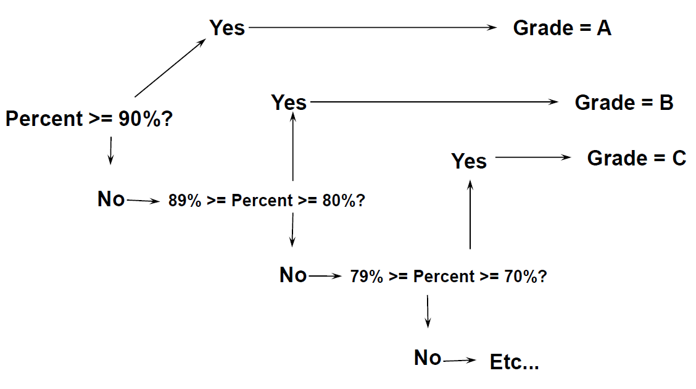

* N-way decision tree

  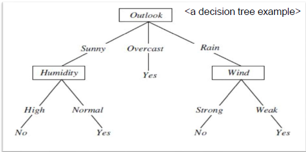


**Good & Poor 기준**

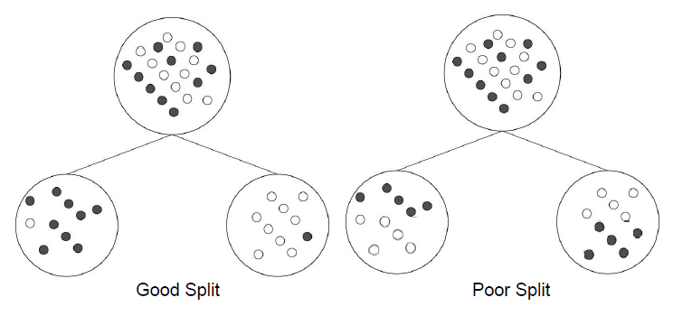

분류가 잘 된것을 측정하는 기준으로 **순도(purity)**를 측정

만약 group에 하나의 class만 존재하면 순도가 높고 복수의 class가 존재하면 순도가 낮다.


**impurity(diversity) 측정**

* **information Gain** - Entropy
* **Gini**
* information gain ratio (information gain / entropy)
* chi-square test based


**information gain**

- Entropy 
  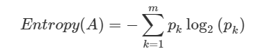
- information gain  : original data set S , split subset S1 사이의 impurity관계를 비교

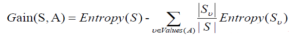

예시

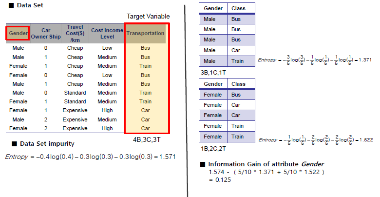


이렇게 비교를 하여 **information gain이 가장 큰 값이 순도가 가장 높은 것**(impurity가 낮음)

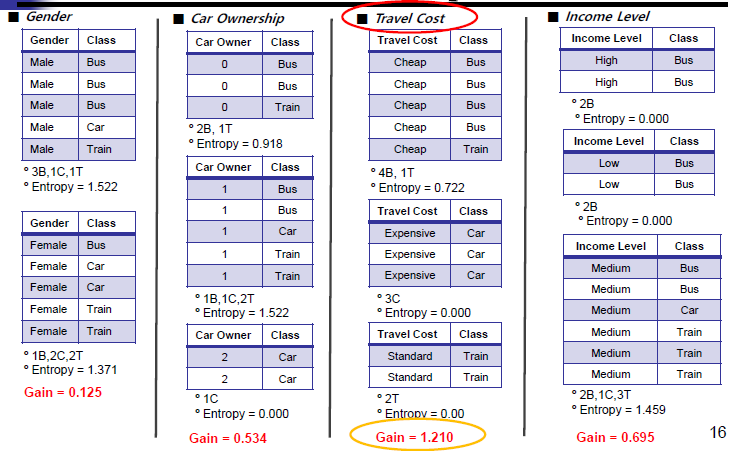


이를 반복적으로 작업하면 decision tree를 만들 수 있음

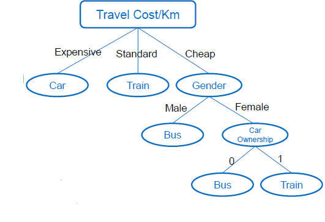


**gini**

확률의 제곱의 합으로  순도 계산

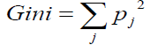

예시

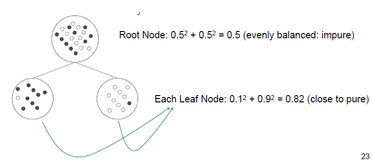

gini도 gain값을 얻는다. 이때에 subset의 gini값에서 original set의 gini값을 빼준다.

여기서는 **gain의 값이 작을 수록 순도가 높음**

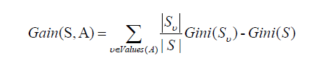


#### decision tree의 장단점

**장점**

* 트리구조이므로 쉽게 이해 가능
* 데이터에 대해서 사전에 인지할 필요(prior assumption)가 없음
* 의사결정시에 사용되는 일반상식에 맞추기 쉽다
* 다양한 카테고리로 분류할 수 있다.
* 분류와 관련이 없는 속성도 분류가능
* 계산 비용이 작음
* outlier에 민감하지 않음.

**단점**

* 특정 변수에 의해 수직/수평적으로 구분되지 못할 때 분류율이 떨어짐. 이 경우 분류를 위해서 트리를 복잡하게 만들어야하는 문제 발생 - **한개의 변수만으로 구분하기에 발생**
* greedy방식이므로 최적해를 보장하지 못함.
* 경계점 부근에서 예측 오류가 클 가능성이 있음.
* 기존의 training set에 의해서만 결정이 되므로 새로운 set에 대해서 불안정할 가능성이 있음.
* 복수의 속성의 set을 분류하는 것을 생성하기가 복잡함.

---
### Clustering


clustering(군집화) - 비슷한 개체끼리 하나의 그룹으로 묶는 것

* 군집 간 분산 최대화
* 군집 내 분산 최소화


**clustering**은 **비지도학습(unsupervised learning)**이다. - label이 없음

**classification**은 **지도학습(supervised learning)**이다. - label이 있음.


### Flat algorithm - 유사한 것 끼리 묶는 것

### k-means

* 군집은 하나의 중심(centroid)를 가진다.
* 각 개체는 가장 가까운 중심에 할당이 되며 같은 중심에 할당된 것끼리 하나의 군집을 이룸.
* 사용자가 k개의 군집 수를 사전에 정의해야함.
* EM알고리즘에 기반한다.


**알고리즘**

1. 특정 갯수의 군집의 중심을 랜덤으로 선정한다.
2. 각각의 중심에 개체들을 할당한다. (Expectation)
3. 할당 후 중심을 다시 재조정한다. (Maximization)
4. 2-3번 과정을 반복한다.
5. 중심이 수렴이되면 종료한다.


**장점**

* 복잡도가 O(n)
* 수행속도가 빠르다


**단점**

* 초기값의 위치에 따라서 원하는 결과가 나오지 않을 수도 있습니다.

  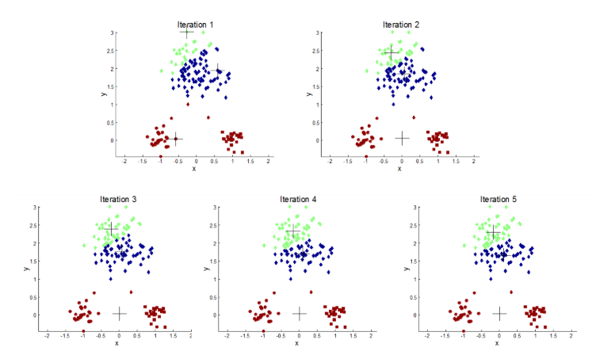

* 군집의 크기가 다른 경우 정상 작동이 안될 수 있음.
  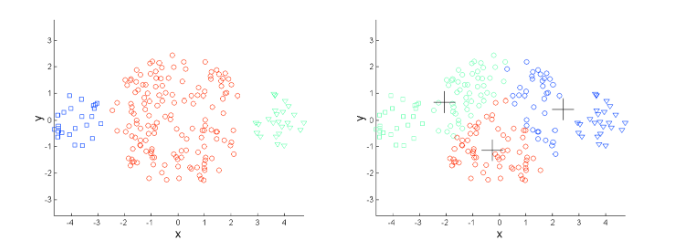

* 군집의 밀도가 다른 경우 정상 작동이 안될 수 있음.
  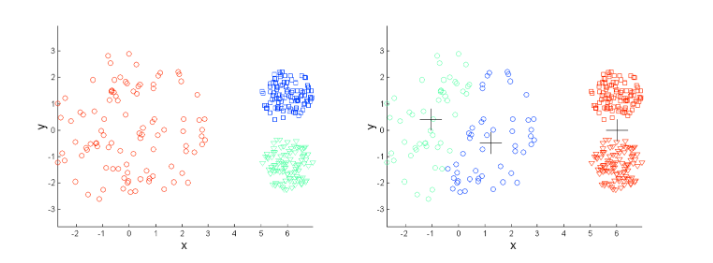

* 특이한 케이스의 경우 군집화가 잘 안됨.
  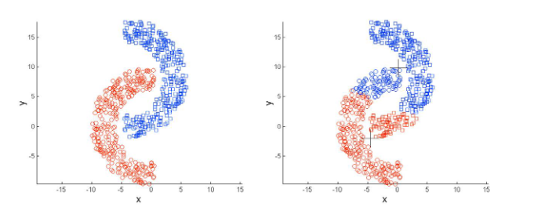

* outlier에 민감하다.

<br>

**사용하는 경우**
* pixel segmentation에 드물게 사용된다.


### Mean Shift

* 탐색 반경을 정한다. (scale, bandwidth)
* 군집의 갯수를 정의할 필요가 없다.


**알고리즘**

1. search window를 선택한다.
2. window 내의 데이터의 mean을 계산한다
3. mean의 위치로 window의 중앙을 옮긴다.
4. 수렴될 때까지 2-3과정을 반복한다.


**cluster에 이용되는 방법**

1. kernel(원, 사각형, gaussian 등등)과 bandwidth(variance of Gaussian 등)을 선택한다.
2. 각각의 point에 대하여
   * window의 중앙을 각각의 점에 위치함.
   * window 내의 데이터의 mean을 계산한다.
   * mean의 위치로 window의 중앙을 위치시킨다.
   * 수렴될 때까지 2-3의 과정을 반복한다.
3. 가까운 위치로 모인 점들에 대해서 같은 cluster라고 할당한다.

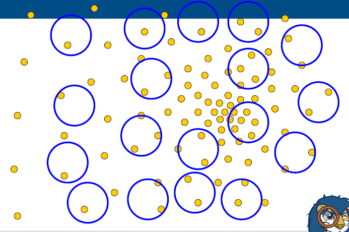


**장점**

* segmentation에 적합하다.
* cluster의 갯수가 유동적이다
* outlier에 민감하지 않다

**단점**

* kernel shape/size를 잘 선택해야한다.
* 고차원 특징에는 적합하지 않다.


**사용하는 경우**

* over-segmentation
* multiple segementation
* tracking, clustering, filtering application


### Hierarchical algorithm - 군집화한 것을 다시 군집화 함

##### top-down

* clustering을 recursive하게 한다.
* 효율이 떨어진다.


##### bottom-up

* 하나씩 비슷하게 묶어가며 최후에 하나로 묶일 때까지 함.


**Hierarchical Agglomerative Clustering**

1. N개의 벡터가 있으면 서로의 similarity를 비교하여 가장 높은 similarity를 합친다.
2. 두개짜리 cluster가 생기고 이를 하나로 보고 또 similarity 비교
3. 위의 과정 반복하면서 하나로 합쳐질 때 까지 진행


**similarity 비교 옵션**

1. Single-link clustering
   * 가장 가까운 개체와 결합
   * 큰 것이 계속해서 커지는 현상이 생김
   * 편향적인 트리 생성 가능
2. Complete-link clustering
   * 가장 먼쪽에 있는 개체와 결합
   * 일정 수준이상으로 커진 클러스터를 막아줌.
3. average-link clustering
   * 평균 거리에 있는 것에 결합

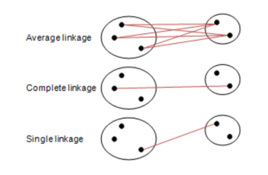

**예시**

거리표

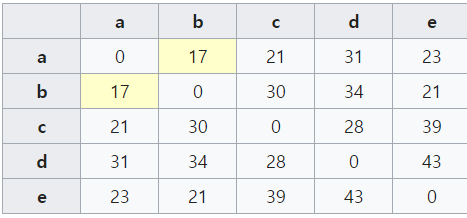

single-link

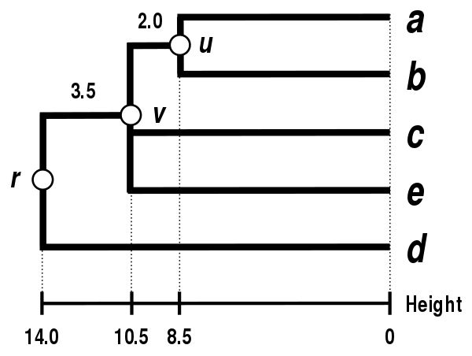

complete-link

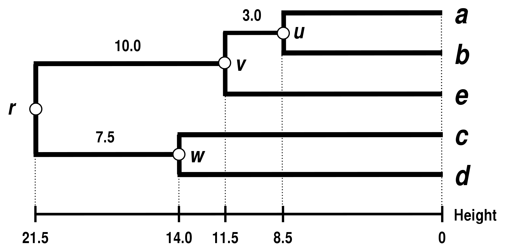


**single - complete 비교**

* 정보검색 측면에서는 complete가 더 적절하다.
* 성능대비 비용적인 측명은 single이 더 좋다.


reference


 [https://ratsgo.github.io/machine%20learning/2017/04/19/KC/](https://ratsgo.github.io/machine learning/2017/04/19/KC/) 

 https://bcho.tistory.com/1204 

 https://en.wikipedia.org/wiki/Single-linkage_clustering 

-----------

## Naive Bayes

### 1. Bayes' theorem, Bayes' rule (베이즈 정리) 

:  두 확률 변수의 **사전 확률**과 **사후 확률** 사이의 관계를 나타내는 정리

즉, 이전의 경험과 현재의 증거(**사전 확률**)를 토대로 어떤 사건의 확률(**사후 확률**)을 추론하는 과정을 보여준다.

<br>

**Bayes' Rule**

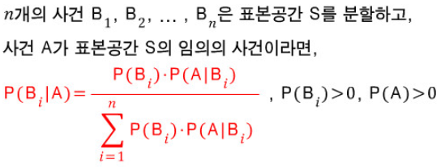

<br>

**증명**

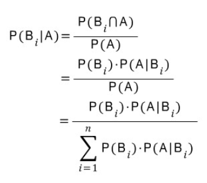


**P(A), P(B)** : 사전 확률

**P(A | B)** : 사건 B가 주어졌을 때, A의 조건부 확률(likelihood)

**P(B | A)** : 사건 A라는 증거에 대한 사후 확률(posterior probability)

<br>

예시) 

어떤 병을 검사하는 검사기의 정확도가 90%이고, 전세계 1%의 사람이 병에 걸렸다고 할 때,

이 때, 검사 결과가 양성인 사람이 병 앓고 있을 확률은??

(검사의 정확도란 병을 앓고 있을 때의 양성 확률이다. P(D) : 병에 걸릴 확률, P(T) : 검사 양성일 확률)

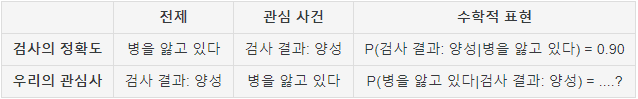
<br>
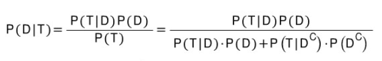
<br>

### 2. Naive Bayes Model

* Bayes Rule에 기반한 분류기(classifier) 혹은 학습 방법을 말한다. 

* Naive라는 형용사가 붙은 이유는 분류를 쉽고 빠르게 하기 위해 특징들이 "확률적으로 독립"이라는 가정이 들어갔기 때문이고, 그래서 "Simple Bayes" or "Idiot Bayes"라고도 불린다.
* 확률적으로 독립이라는 가정에 위반될 경우 에러가 발생할 수 있기에 주의가 필요하다.
* 주로 문서 분류, 질병 진단, 스패 메일 분류 등에서 많이 사용된다.

<br>

**독립**

<br>

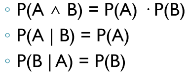

**조건부 독립**

<br>

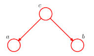
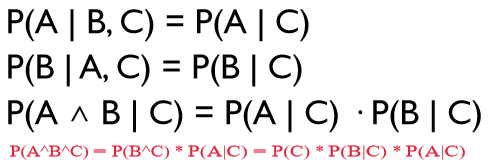

<br>

**Naive Bayes General Case**

<br>

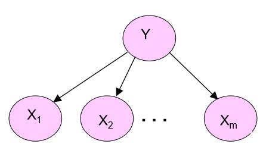
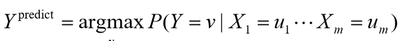
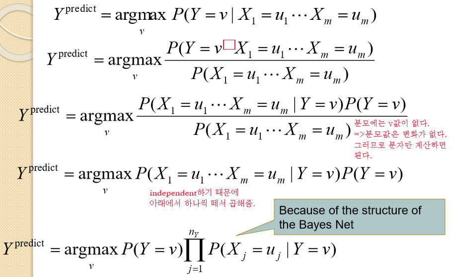

<br>

예시)

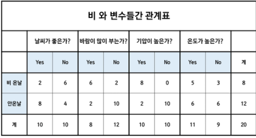


**여기에서 날씨가 좋고 / 바람이 많이 불지 않고 / 기압은 높고 / 온도가 낮다면 오늘 비가 올까? 안올까??**

<br>

sol)

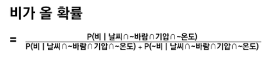

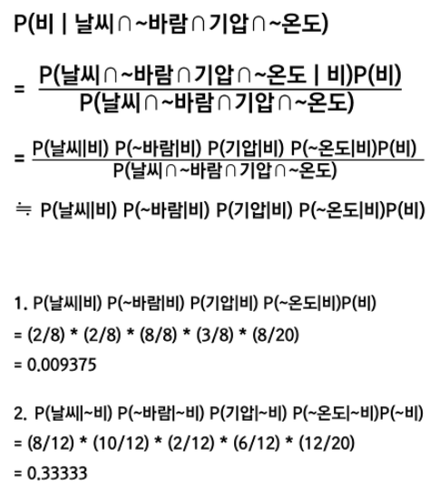

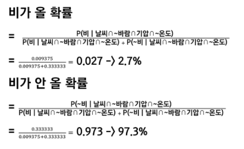

**Naive Bayes의 장점**

* 그룹이 여러개 있는 분류에서 특히 쉽고 빠르게 예측이 가능하다.

* 독립이라는 가정이 유효할 때, 다른 방식에 비해 훨씬 결과가 좋고, 학습 데이터도 적게 필요하다.

* 수치형 데이터보다 범주형 데이터에 특히 효과적이다.

  수치형 : 관측값이 수치로 측정되는 자료 (키, 몸무게)

  범주형 : 관측결과가 범주 또는 항목의 형태로 나타나는 자료 (성별[남,여], 혈액형[A, B, O,  AB])
  

<br>

**Navie Bayes의 단점**

* 독립이라는 가정이 성립하지 않거나, 약한 경우 에러가 발생할 수 있다.
* 실 적용에서는 완전 독립인 상황이 많지 않아, 사용에 어려움이 있다.

-------------------------------------

### Expectation Maximization

<br>

**기본 개념 : Hidden variable(결측값)을 무시 하지 않고 Training data로 사용하기 위한 알고리즘**

<br>

**Introduction to EM**

\- 통계학의 거장 Rubin의 역작 중 하나이다. 

\- 보통의 데이터에는 결측값( *, 혹은 NA로 표시되는 것들)이 많이 존재한다.

\- 결측값이 있을시 무시하기도 하지만, imputation을 통해 채워넣기도 한다. 대표적인 imputation방법으로, 평균이나 중앙값으로 결측값을 대체하는 경우가 많다.

\- **EM algorithm은 결측값을 무시하지 않고, 단순히 평균이나 중앙값으로 결측치를 대체하지 않으면서, 통계적 추론을 하는 기법으로 가능도에 기반을 둔다.** 

\- EM algorithm은 결측값이 있을 때의 최대가능도추정량(MLE)을 추정하기 위해 제안된 방법이다. 결측값 그 자체를 채울수도 있다.

\- 결측값을 채우는 것뿐만 아니라 다양한 목적으로 활발하게 사용되는 도구이기도 하다. ex) 가우시안 혼합 모형, latent variable기반 모델 등

-**항상 Optimal한 결과를 가져오는 것은 아니다. (Local search)**

**\- E : Expectation과 M : Maximization, 두 단계로 구성이 된다.** 

\- EM알고리즘을 이해하기 위해서는 가능도(likelihood, 수리통계학2)에 대한 지식이 필요하다. 

<br>

Hidden Variable을 어떻게 training data로 사용할 것인가?

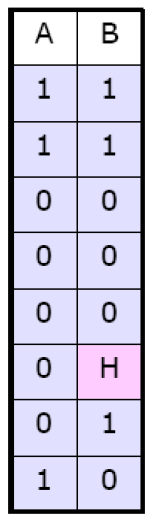

1. 사용하지 않는다.

   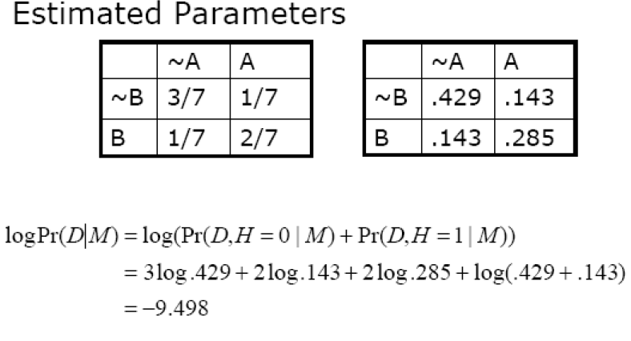

2. Fill in with Best Value

   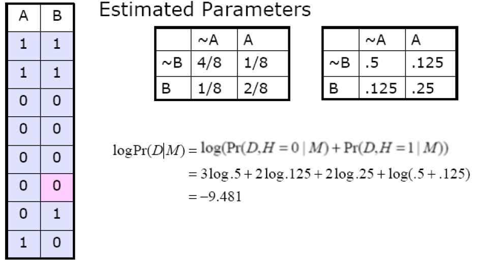

3. **확률 분포를 적용시켜서 사용 (EM 알고리즘)**

   초기에는 확률값을 랜덤하게 설정(Random initialize를 여러번 해봐서 최상의 optimal을 찾아야한다.)

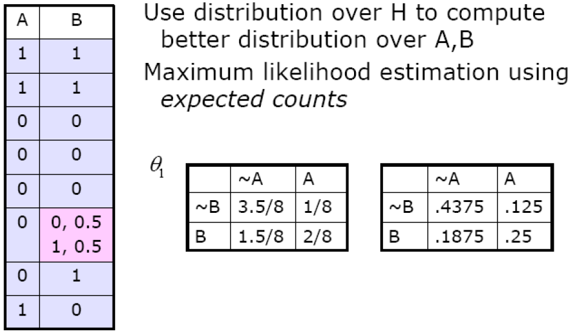

아래와 같이 E-step(Expectation)과 M-step(Maximum likelihood)을 반복해가면서 일정한 값에 수렴하도록 계산

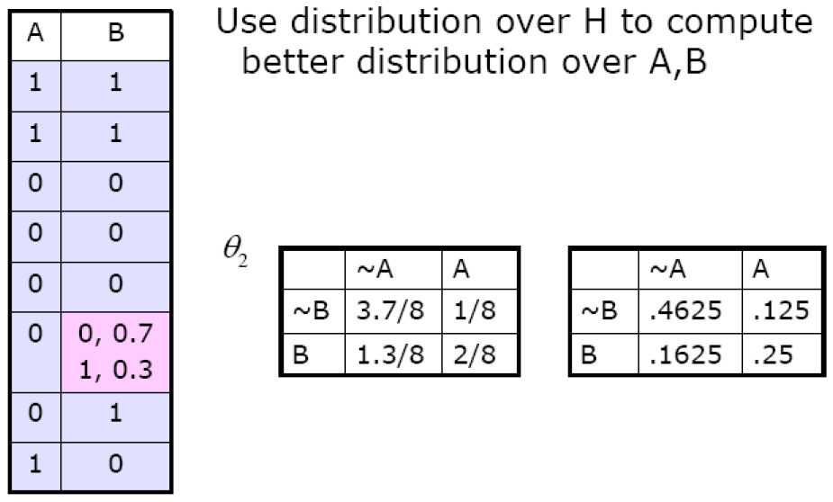

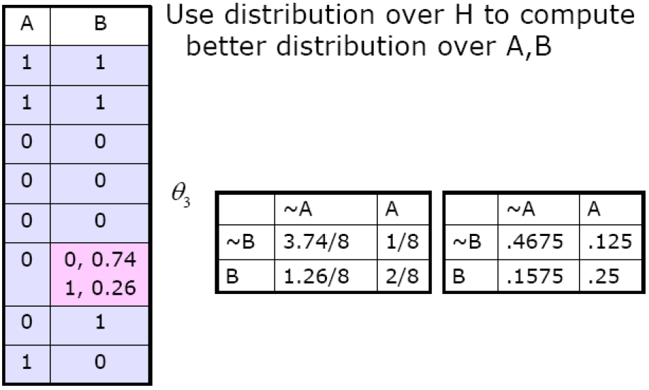

**M-step을 통해 증가하는 likelihood**

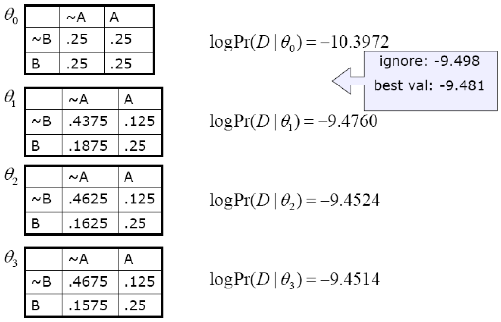

---
### Reinforcement Learning


**기계학습** : 인공지능의 한 방법론으로서 다량의 데이터를 컴퓨터가 학습하는 알고리즘과 기술을 개발하는 분야

* 표현(representation) : 학습을 위해 주어진 데이터에 대한 표현
* 일반화(generalization) : 아직 주어지지 않은 데이터에 대한 처리


**기계학습 분류**

* **지도 학습(Supervised Learning)**
  목표값(label)이 제시된 데이터로 학습을 진행
* **비지도 학습(Unsupervised Learning)**
  목표값(label)이 제시되지 않은 데이터로 학습을 진행 (특성 추출)
* **강화 학습(Reinforcement Learning)**
  어떤 환경 안에서 정의된 에이전트가 현재의 상태(state)를 인식하여, 선택 가능한 행동들 중 보상(reward)을 최대화하는 행동 혹은 행동 순서를 선택하는 방법

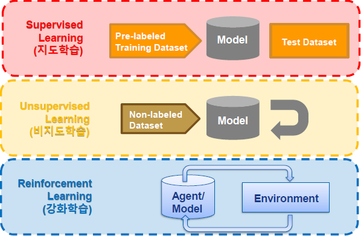


**강화학습**

* 에이전트(agent) : 상태를 관찰, 행동을 석택, 목표지향
* 환경(environment) : 에이전트를 제외한 나머지
* 상태(state) : 현재 상황을 나타내는 정보
* 행동(action) : 현재 상황에서 에이전트가 하는 것
* 보상(reward) : 행동의 좋고 나쁨을 알려주는 정보


**특징**

* 반복적인 시도를 통해 **시행착오**를 겪으며 environment로부터 최대의 reward를 찾고 목표에 도달한다.
* **Delayed reward** - 시행착오 중 선택한 action이 가장 적합한 선택인지 알 수 없다.(최대의 reward인지 알 수 없다는 것)
* 강화학습에서는 당장의 보상값이 조금은 적더라도, 나중에 얻을 값을 포함한 보상값의 총 합이 최대화되도록 Action을 선택해야 한다.


**Exploration(탐험)-Exploitation(이용) dilemma**

* 더 높은 보상을 받기 위해서 주어진 state에서 최적의 선택을 이용(exploit)해야함.
* 각 action들의 미래지향적 가치를 알기 위해서는 사전 탐험(explore)이 필요
* 탐험(explore)을 위해서는 지금 당장 최적은 선택(exploit)을 포기할 수 있어야함


#### Q-Learning

* 강화 학습 가운데 가장 널리 사용되는 알고리즘

* 선택가능한 action중 임의로 선택하고 environment로 부터 reward를 받음(시행착오)

* 학습 시점에는 action에 대한 평가가 완료되지 않았으므로, 해당 시점에서 최적으로 평가된 action이 실제로는 최적의 action이 아닐 수 있음.

* **Q(s,a)는 estimated utility function**으로 state s 에서 action a를 선택하는 것이 유리한 정도를 나타냄. 이는 a를 선택하여 나타나는 **즉각 reward**와 선택 후 상태변화 s'에서 얻을 수 있는 **잠재적 reward** 중 최대값의 합으로 정의

  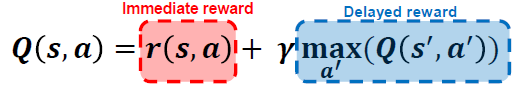


**알고리즘**

1. 각 state-action pair(s,a)에 대해서 Q(s,a)값을 0으로 초기화
2. 현재 state s에서 선택 가능한 임의의 action a 선택 후 실행
3. 외부환경으로 부터 immediate reward를 받음
4. 새로운 state s'을 감지
5. Q(s,a)값을 수식(위에 제시)으로 갱신
6. s=s'
7. 2-6과정을 Q(s,a)가 수렴할 때까지 반복


예시)

**초기상태**


**학습완료**

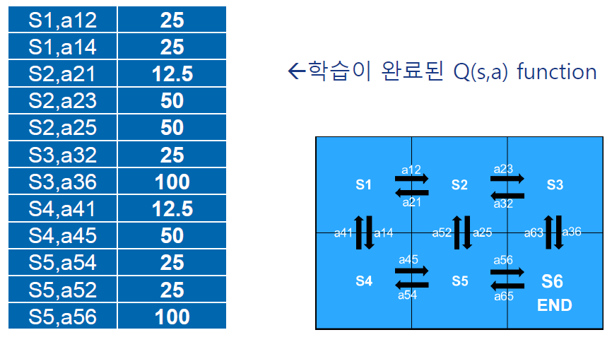

---
### Artificial Neural Networks

ANN : 인공신경망 네트워크


**인공지능 분야를 대표하는 두가지 고전적 접근방법**

1. Connectionism : 지식을 network상에 분산된 형태로 표현 
   (ex - ANN)
2. Symbolism : 지식을 symbol과 그들간의 relation 또는 Logic으로 표현 
   (ex - Logical inference in Ontology)

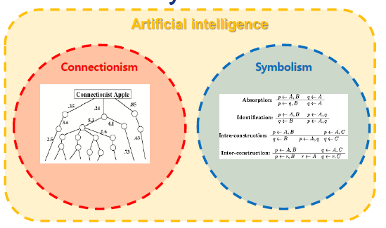

**Perceptron(퍼셉트론)**

* ANN을 구성하는 단위
* 복수개의 input을 입력 받은 뒤 처리를 거친 후 하나의 Output을 반환
* 입력신호 : pi와 가중치 : wi의 곱을 모두 합친 값이 임계치(세타)를 넘으면 흥분

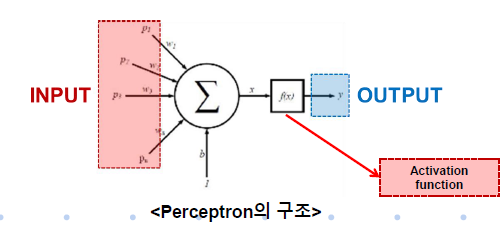

* Activation function : 뉴런에서 출력값을 결정하는 함수
  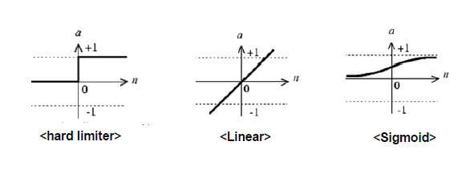

**Perceptron 학습**

* 지도학습(실수입력)
* 전체 출력뉴런들에 대하여 계산된 출력값과 목표값과의 차이를 최소화 
  (차이를 줄이는 방향으로 가중치를 변경)
  -> Widrow-Hoff rule(delta rule)


**Widrow-Hoff rule(delta rule)**

1. 가중치(Wi(0))와 임계치(세타)를 임의의 작은 값으로 초기화
   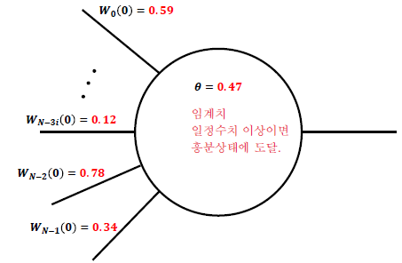
2. 새로운 입력패턴(X0,X1,...)과 목표출력 패턴(d(t))을 제시
   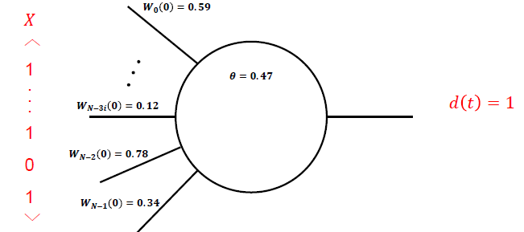
3. Activation function(hard limiter) fn을 사용하여 실제 출력값(y(t))를 계산
   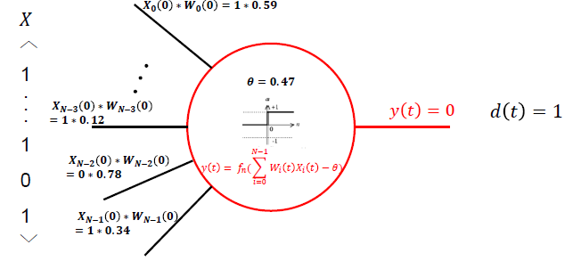
4. 목표값 d(t)와 출력값 y(t)를 이용한 가중치 갱신
   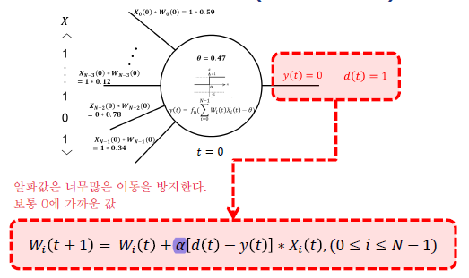


**퍼셉트론의 한계**

* 선형적으로 데이터를 구분하기 때문에 복잡한 구분의 경우 구분 불가
  (ex - AND,OR 구분 가능 / XOR 구분불가)
  


* 이러한 문제를 해결하기 위해서 단층 퍼셉트론이 아닌 다층 퍼셉트론을 구성
  (Backpropagation Neural Network)

  **비선형적인 문제들 해결 가능**

  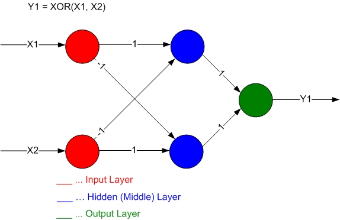q


**Backpropagation Neural Network**

* input later와 output layer 사이에 하나 이상의 hidden layer을 가지는 단방향 신경회로망
  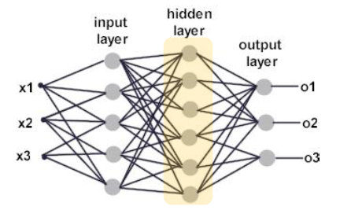
* 단층 퍼셉트론의 선형분리 문제점을 해결
* 일반적인 continuous function approximation 문제 해결을 위해 널리 사용
  (미분가능한 함수들을 추측할 수 있음)
* 학습 - 원하는 목표값과 실제 출력값 사이의 오차제곱합으로 정의된 error function의 값을 최소화하는 방식으로 학습(Error backpropagation Algorithm)
* 지도학습


**Error backpropagation Algorithm**

* hidden layer의 학습을 위해 output layer에서 발생한 오류를 이용하여 hidden layer 가중치 재계산
* 이 값을 다시 input layer으로 역전파(backpropagation)시켜 가중치를 재계산
* output layer의 오류를 **Gradient Descent Method** 기법으로 최소화함
  **경사하강법** : 함수의 기울기를 구하여 기울기가 낮은 쪽으로 계속 이동시켜서 극값에 이를 때까지 반복시키는 것
* 생물학적 현상과는 일치하지 않음
* **보편적으로 많이 사용되는 인공신경망 학습 방법**

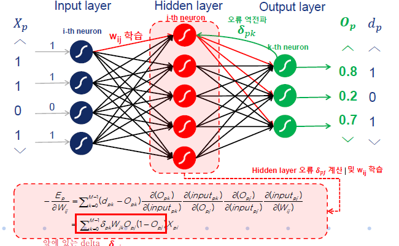


**Hopfield Memory**

* 자신을 제외한 모든 뉴런과 양방향으로 상호 연결된 형태의 ANN
* 지도학습(이진입력)
* activation함수로 hard limiter 사용
* 기본 모델은 bipolar 값 (+1,-1)을 사용
* 연상기억 또는 최적화 문제를 푸는데 주로 사용
* 다른 종류의 ANN model과 달리 점진적으로 학습을 하지 않고, 초기 학습패턴의 외적합을 사용하여 연결가중치를 만듦
* 하나의 뉴런층을 사용하므로 입력벡터와 출력벡터의 차원이 동일
* 주로 연상기억문제, 최적화 문제에 사용된다.
* 가장 큰 문제는 수렴결과가 최적인지 보장이 안된다.(잘못된 기억을 연상할 수 있음.)

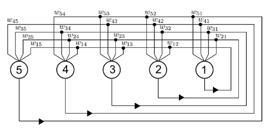


**Self Organizing Map(SOM)**

* 인접한 출력뉴런들은 비슷한 기능을 수행할 것이라는 예측

* 입력벡터와 가까운 출력뉴런 뿐만 아니라 위상적으로 이웃한 뉴런들도 함께 학습

* 주로 clustering, classification,최적화 문제에 사용된다.

  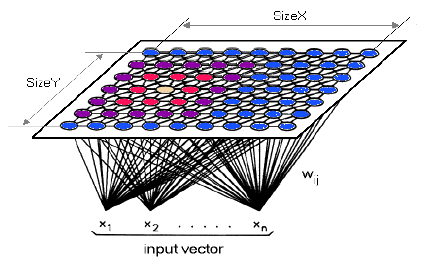

* 이웃 반경을 점차 감소시키면서 학습과정을 반복 (가까울 수록 가중치를 준다는 것)
  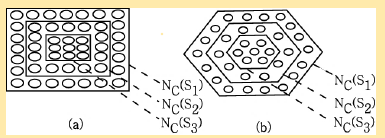


**reference**

http://ecee.colorado.edu/~ecen4831/lectures/NNet3.html

https://commons.wikimedia.org/wiki/File:Perceptron_XOR.jpg


