Data Structure(자료구조)
##### [1. Performance Analysis (intro)](#Performance_Analysis)
##### [2. List](#List)
##### [3. Stack & Queue](#Stack-and-Queue)
##### [4. Skip List](#Skip-List)
##### [5. Tree](#Tree)
##### [6. Heap](#Heap)
##### [7. BST](#binary-search-tree)
##### [8. AVL Tree](#avl-tree)
##### [9. Red Black Tree](#red-black-trees)

##### [10. Btrees](#Btrees)

##### [11. Hashing](#Hashing)

###### [12. BloomFilter](#BloomFilter)
###### [13. Graph1](#graph1)
###### [14. Graph2](#graph2)
###### [15. Sorting](#sorting)

<br>

### 자료구조 연산 Big-O

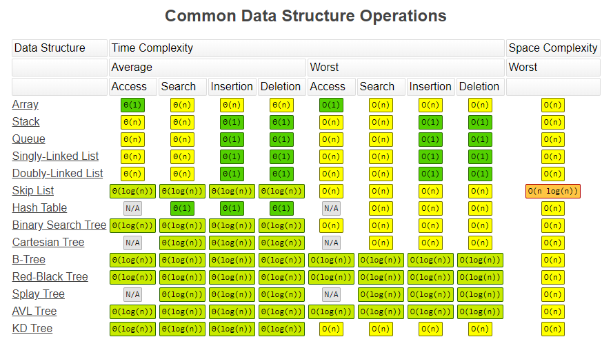

<br>

## Performance_Analysis
### 공간 복잡도
- 데이터 크기에 비례하여 얼마나 많은 메모리 공간을 사용해야 하는지 나타낸 것
### 시간 복잡도
- 데이터 크기에 비례하여 얼마나 많은 연산을 해야하는지 나타낸 것
##### 위의 복잡도는 O(g(n)) , Ω(g(n)), Θ(g(n))  로 나타냄.

- O(g(n)) : 충분히 큰 n에 대하여 f(n) <= C\*g(n)를 만족하는 상수 C가 존재할 경우 실제 계산량 f(n)을 O(g(n)) 로 나타낸다. 가령 선택정렬을 O(n^3)이라고 말하는데는 정의상 문제 없다. 하지만 가장 낮은 차수의 식으로 나타내야 의미가 있다.
- Ω(g(n)) :충분히 큰 n에 대하여 f(n) >= C\*g(n)를 만족하는 상수 C가 존재할 경우 실제 계산량 f(n)을 	Ω(g(n))로 나타낸다. 선택정렬을 Ω(n)이라고 하는데 문제가 없다.
- Θ(g(n)) : 충분히 큰 n에 대하여 c1·g(n) ≤ f(n) ≤ c2·g(n)를 만족하는 상수 c1, c2가 존재할 경우. 빅오와 빅오메가를 합쳐 좀 더 정밀한 복잡도를 표현할 때 사용한다 (하지만 빅오 표현을 더 많이 쓰긴 한다.)

*위의 복잡도는 데이터 크기를 기준으로 얘기를 하기 때문에, 가령 어떤 숫자 d가 소수인지 아닌지 판단하기 위해 2부터 d의 제곱근까지 약수를 구해 판단하는 알고리즘의 시간복잡도를 O(d^1/2)라고 얘기하기 쉽다. 하지만, 어떤 숫자 d의 크기는 log2(d)=n 이므로 시간복잡도는 O(2^n/2)라고 얘기해야 정확하다.

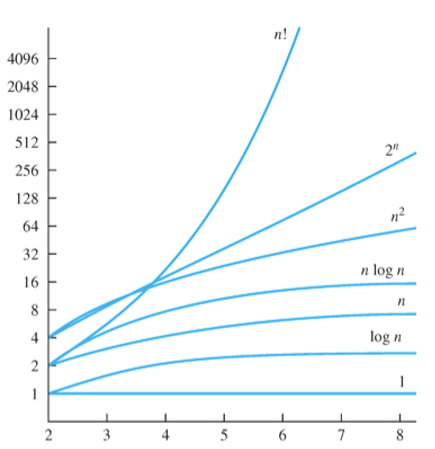


<br>

## List

순열(Sequence)이라고도 불리며, **순서**를 가지고 일렬로 나열한 원소들의 모임

순서가 있다는 점에서 **집합**과 구별 / 일렬로 나열되어 처음과 끝이 각 하나씩만 있다는 점에서 **그래프**와 구별 가능

<br>

#### 리스트 구분 

<br>

1)**구현 방식**에 따라

1-1) Array List (배열 리스트)

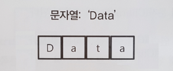

<br>

1-2) **Linked List (연결 리스트)**


<br>

2)**사용 방식**에 따라

2-1) Simple List (단순 연결 리스트)

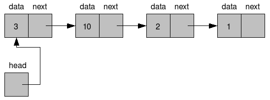

<br>

2-2) Doubly List (이중 연결 리스트)

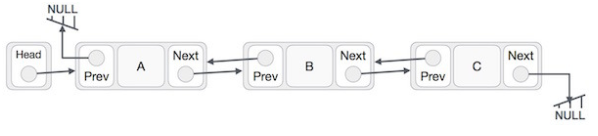

<br>

2-3) Circular List (환형 연결 리스트)

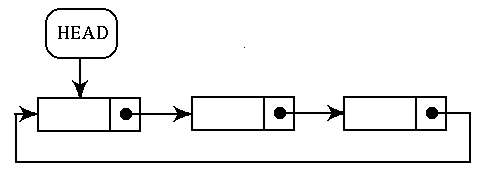

<br>


#### Linked List (연결 리스트)

: Node와 Node 간의 연결(link)을 이용해서 리스트를 구현한 것.

<br>

* ##### Linked List Header File


<br>

* **Node**

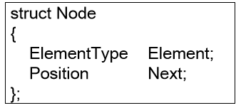

<br>

* **Insert**

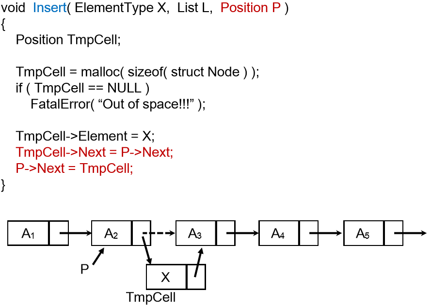

<br>

* **FindPrevious**

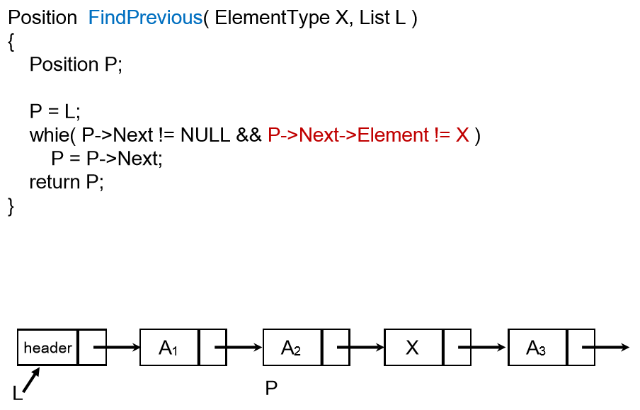

<br>

* **Delete**

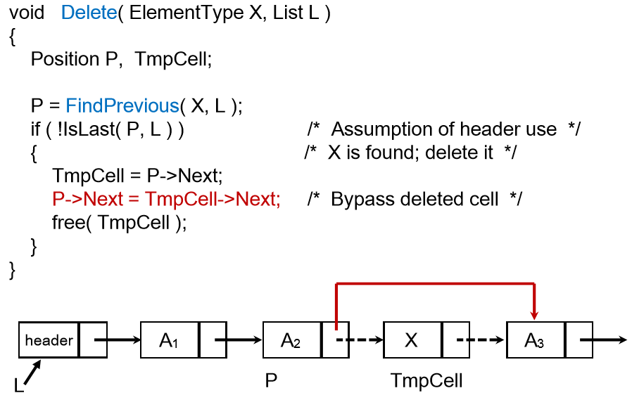

<br>

#### Doubly Linked List(이중 연결 리스트)

* **Insert**

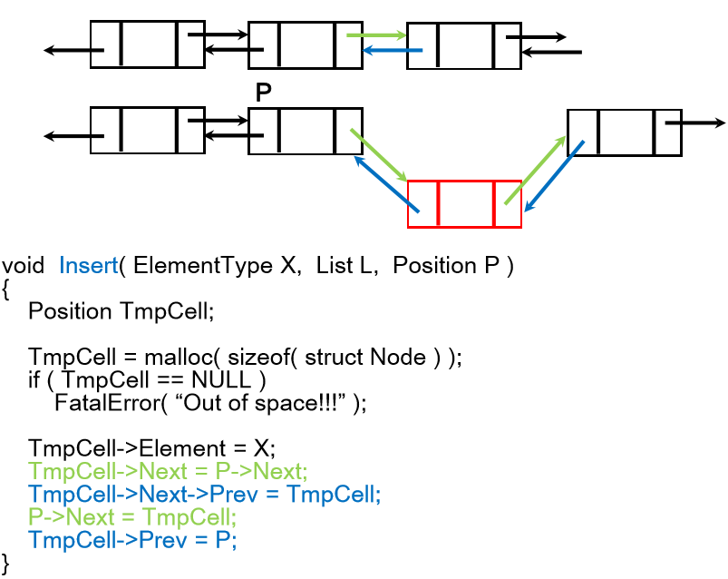

<br>

* **Delete**


<br>

#### 배열 vs 연결리스트 장,단점

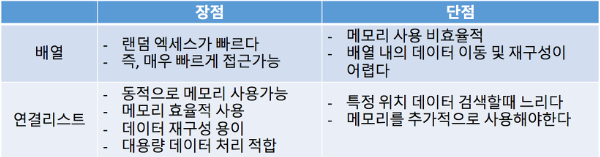

<br>

## Stack and Queue

## Stack

**스택(Stack)** 은 한 쪽 끝에서만 자료를 넣거나 뺄 수 있는 **선형 구조(LIFO- Last In First Out)** 으로 되어있습니다. **자료를 넣는 것을 PUSH**라고 하고 넣어둔 **자료를 꺼내는 것을 POP**이라고 합니다.


**활용예시**

- 웹 브라우저 방문기록 (뒤로가기) - 가장 나중에 열린 페이지부터 다시 보여줌
- 역순 문자열 - 가장 나중에 입력된 문자부터 출력
- 실행 취소 (undo) - 가장 나중에 실행된 것 부터 실행 취소
- 후위 표기법 계산
- 수식의 괄호 검사


### Linked List로 구현한 Stack

* **Node**

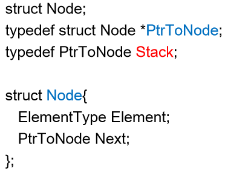

<br>

* **Create Stack  and MakeEmpty**

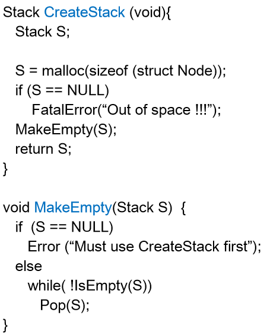

<br>

* **Push**

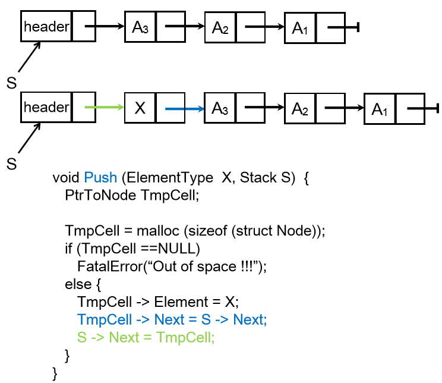

<br>

* **POP**

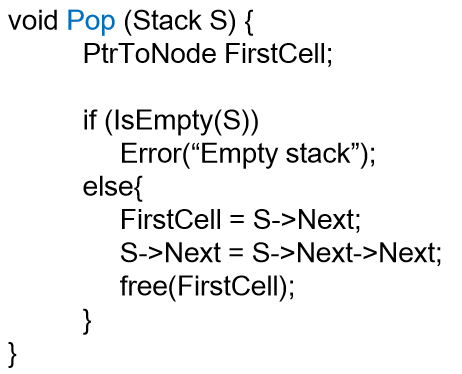

<br>

### Array List로 구현한 Stack

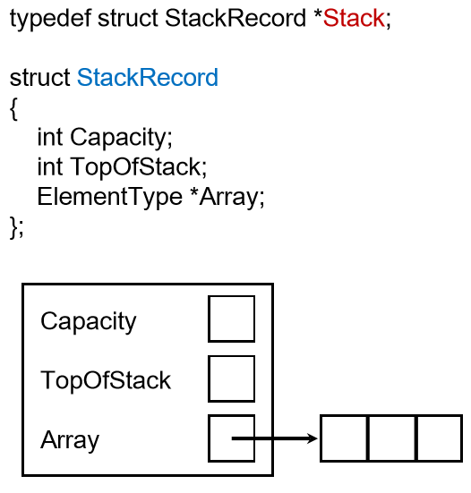

<br>

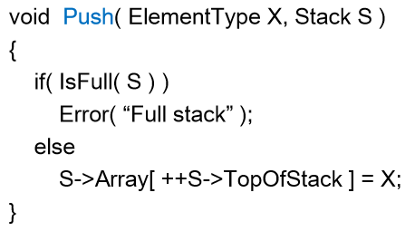

<br>

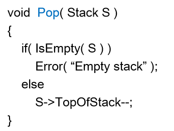

<br>

## Queue

: Queue는 가장 먼저 들어온 데이터가 가장 먼저 내보내지는 **(FIFO : First In First Out)** 구조를 가집니다.


**활용예시**

- 우선 순위가 같은 작업 예약 (프린터 인쇄 대기열)

- 은행 업무

- 콜센터 대기시간

- 프로세스 관리

- 너비 우선 탐색 구현

  


### Linear Queue (선형 큐)

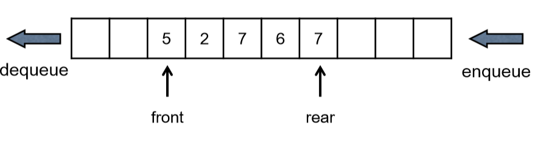

<br>

**선형 큐의 문제점**

일반적인 선형큐는 rear이 마지막 index를 가르키면서 데이터의 삽입이 이루어진다.

rear가 배열 마지막 index를 가르키게 되면 앞에 공간이 남아있어도 활용이 불가능하다.

<br>

### Circular Queue(원형 큐)

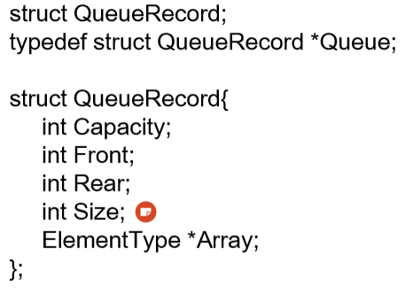

<br>

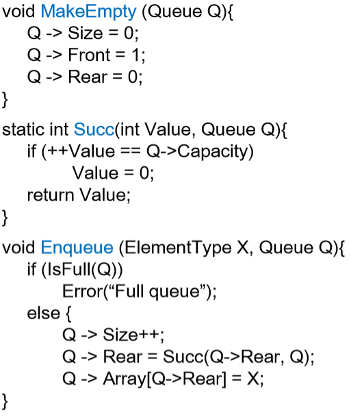

<br>


## Skip List

: Log(n) 시간에 검색/추가/제거를 수행할 수 있는 정렬된 자료구조

<br>

**Skip List 예시)**

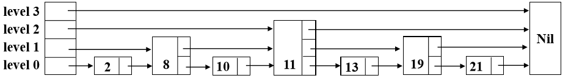

<br>

**Node**

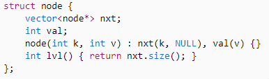

<br>

**Find**

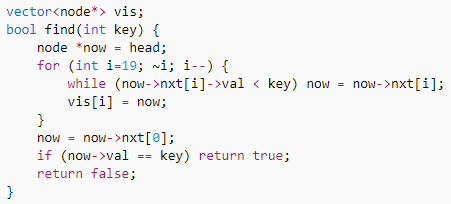

<br>

노드의 i번째 포인터는 노드 뒤에 있는 레벨이 i 이상인 노드들 중 가장 왼쪽에 있는 것를 가리킨다. 어떤 원소를 찾는 연산은 포인터를 계속 따라감으로써 할 수 있다. 레벨이 높은 포인터가 낮은 포인터보다 더 멀리 이동할 수 있을 것이므로, 레벨이 높은 포인터를 이용할 수 있다면 그것을 이용하고, 아니면 레벨을 낮추는 과정을 반복하자.

<br>

**Add & Erase**

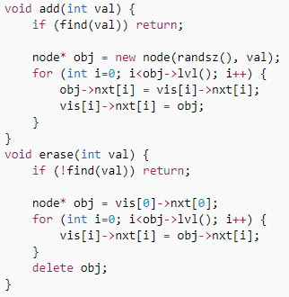

<br>

추가 및 삭제할 위치를 find 함수로 찾고, 그 위치에 원소가 들어가도록 조절해주면 된다.


## Tree
#### 트리의 정의
- 그래프 : 노드와 각 노드들의 연결관계를 간선으로 나타낸 자료구조
- 트리 : 그래프 중 회로가 없는 그래프.
- <=> 어떤 두 정점을 연결하는 경로가 유일한 그래프
- <=> 그래프 중 어느 한 정점을 루트라고 정했을 때, 그 루트에 연결된 노드를 루트로 하는 모든 서브 트리들이 전체 그래프의 루트와 각각 하나의 간선으로만 연결되어있는 그래프

#### 관련 용어 정리
- 자식(child), 부모<perent>, 노드(node), 정점(vertex), 간선(edge)
- 차수(degree) : 자식의 개수 (참고로 graph에선 연결된 간선의 개수)
- 잎(leaf) : 차수가 0인 정점
- 경로(path) : 한 정점에서 다른 정점으로 가기 위해 거치는 노드들의 순서
- 경로의 길이(length) : 경로의 노드들간의 간선의 개수
- 깊이(depth) : 루트로부터 한 정점까지의 경로의 길이
- 높이(height) : 한 정점으로부터 leaf까지 경로의 길이. log2(노드의 개수)로 계산
- 형제(?)(sibiling) : 부모와 연결된 다른 노드들
- 레벨(level) : 루트로부터 경로 거리

#### 트리 사용 예시
- 이진 탐색 트리(Binary Search Tree)
- Expression Tree : 피연산자들을 연산자의 우선순위를 고려하여 트리로 나타낸 것. 컴파일러 때 했었음

#### 트리 순회
- 전위 (preorder) : 자식 노드를 방문하기 전에 현재 노드 방문
- 중위 (inorder) : (이진 트리에서만 정의), 왼쪽 노드 방문 갔다가 돌아와서 현재 노드 방문, 후에 오른쪽 노드 방문.
- 후위 (postorder) : 자식 노드를 모두 방문하고 나서 현재 노드 방문

#### 트리의 구현
- 인접 행렬 (adjacency matrix) : 그래프 구현방법
  - 두 정점간의 연결관계 여부를 확인하는데 유리
- 인접 리스트 (adjacency graph) : 그래프 구현 방법
	- 한 정점에 연결된 자식노드들 iterate 하기에 유리
- 완전 이진 트리의 경우 1차원 배열로 구현 가능
	- 루트노드인 1번노드의 왼쪽 자식은 2번, 오른쪽 자식은 3번.
	- N번 노드의 왼쪽 자식은 n\*2, 오른쪽 자식은 n\*2+1번
	- N번 노드의 부모 노드는 N/2

## Heap
#### 정의
- 루트로부터 leaf까지 가는 경로의 노드의 데이터들이 오름차순 (혹은 내림차순)으로 정렬되어있는 트리 자료구조
- 완전 이진 트리(complete binary tree)로 구성 : 트리의 모든 레벨에 비어있는 노드가 없어야하며, leaf 노드는 왼쪽부터 차례로 채워져있어야함.
- H 높이의 트리라면, 노드의 개수는 2^h ~ 2^h-1개의 노드가 있을 수 있음
#### 성능 (시간 복잡도)
- 데이터 삽입 : O(log2(n))
- 데이터 제거 : O(log2(n))
- 여러개의 데이터를 한번에 heap으로 만들기 : O(n)

#### 사용 목적
- 여러개의 데이터 중 가장 큰데이터나, 가장 작은 데이터를 먼저 꺼내오고 싶을 경우.
- 그런 와중 잦은 데이터 삽입, 제거가 이뤄지는 경우
- 이진트리를 사용하면 되지 않느냐라고 반문 할 수 있지만, 여러개의 데이터를 이진트리화 하기 위해선 필연적으로 정렬 과정이 필요하여 O(nlog2(n)) 시간복잡도를 가지게 되는 반면, heap 으로 만드는 데엔 O(n)성능으로 할 수 있음

#### 관련 연산
##### insert (데이터 추가)
- Size+1번째 index에 새로운 데이터 추가 (root가 1번이라는 가정)
- Bottom-up으로 루트까지 올라가면서 sub tree가 heap 조건 맞는지 검사하며 새로운 데이터가 적절한 위치에 저장될 수 있도록 함
<image src="./assets/ukk/heap_insert.png">
	
##### DeleteMin(혹은 DeleteMax, 데이터 pop)
- 루트에 저장된 데이터를 빼옴
- 제일 마지막 index에 저장된 데이터를 루트 자리에 채워 놓음

<image src="./assets/ukk/heap_pop.png">
​	
##### BuildHeap
- N개의 노드가 1번을 루트로 N번까지 있을 때 N/2번 노드부터 루트까지 (N/2->1) 해당 노드를 루트로 하는 서브 트리가 heap 조건에 만족하는지 검사하고 고쳐나간다.
- 최악의 경우라 가정하고 시간 복잡도를 계산해보자
	- N개의 노드, h의 높이
	- Level 0(root) 노드의 경우 leaf까지 이동한다면 h
	- Level 1 노드 2개의 경우 leaf까지 이동한다면 h-1씩 
	- Level 2 노드 4개의 경우 leaf까지 이동한다면 h-2씩 …
	- Level h-1 노드 2^(h-1)개의 경우 leaf까지 이동한다면 1칸씩 이동
	- 이 이동한 회수의 합을 S라 하자. 참고로 트리의 높이 h는 log2(n)으로 계산 가능
<image src="./assets/ukk/heap_build_time_complexity.png">
<image src="./assets/ukk/heap_build.png">


## Binary Search Tree

1. concepts
  
    이진탐색(binary search)과 연결리스트(linked list)를 결합한 자료구조의 일종입니다. 이진탐색의 효율적인 탐색 능력을 유지하면서도, 빈번한 자료 입력과 삭제를 가능하게끔 고안됐습니다.

    노드의 왼쪽 서브트리에는 그 노드의 값보다 작은 값들을 지닌 노드들로 이루어져 있고, 노드의 오른쪽 서브트리에는 그 노드의 값보다 크거나 같은 값들을 지닌 노드들로 이루어지게 한다.


2. operations

    1. 삽입(insert)
       
        현재노드보다 작으면 오른쪽에 위치시킨다.
	
	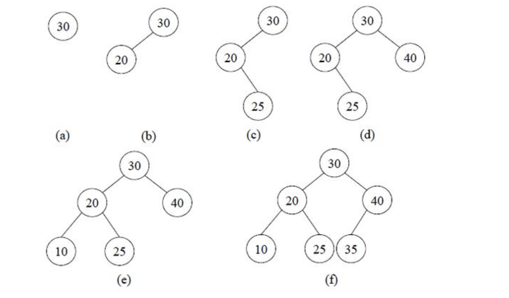

	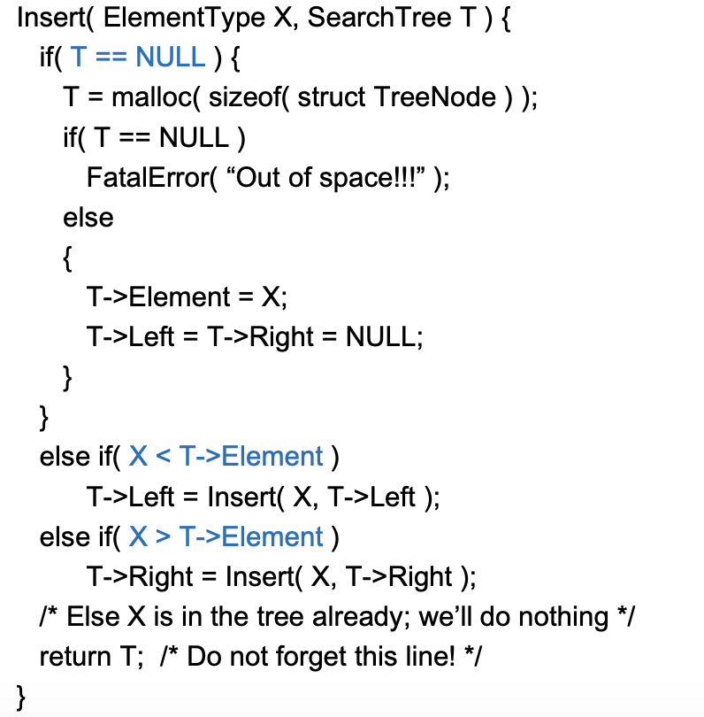

    2. 삭제(delete)

        Case 1. 삭제하고자 하는 노드가 리프노드 일 경우 그냥 삭제한다.

        Case 2. 삭제하고자 하는 노드의 자식노드가 하나인 경우 삭제하고자 하는 노드의 부모가 삭제하고자 하는 노드의 자식을 가리키게 한다.

        Case 3. 삭제하고자 하는 노드의 자식노드가 두개인 경우 삭제하고자 하는 노드의 오른쪽 자식노드의 영역 중 가장 작은 노드를 삭제하고자 하는 노드의 위치로 이동한다.
	
	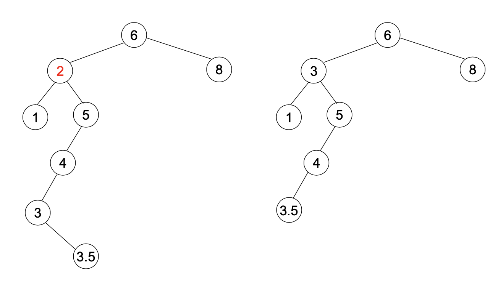

	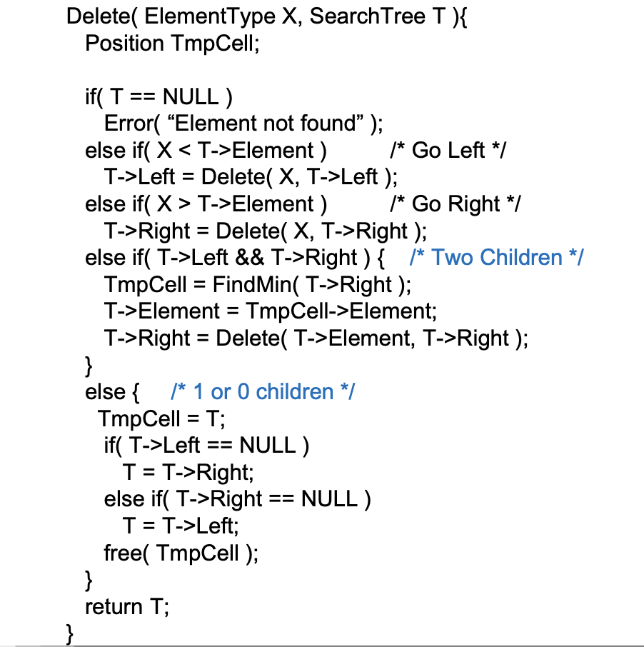

    3. 탐색(find)

        현재 노드가 찾고자 하는 값보다 크면 왼쪽, 그렇지 않으면 오른쪽을 탐색한다.
	
	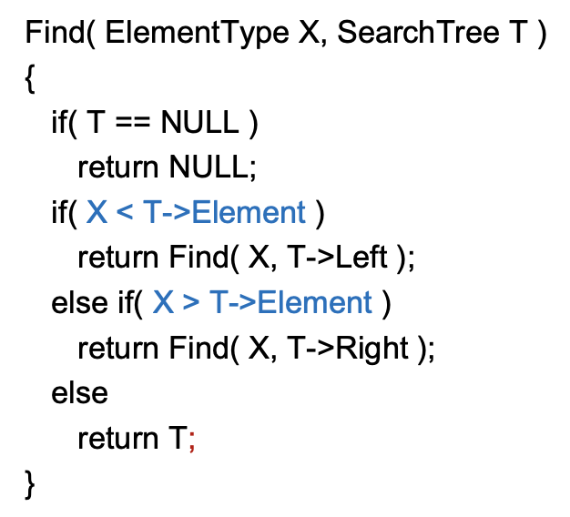

3. limitation

    최악의 경우 탐색의 속도는 O(n)이 된다.


## AVL Tree

1. concepts

    서브트리의 높이를 적절하게 제어해 전체 트리가 어느 한쪽으로 늘어지지 않도록 한 이진탐색트리(Binary Search Tree)의 일종입니다. 

    트리의 높이가 h라 할때 계산복잡성은 O(h)이다.

2. operation


    AVL 트리의 핵심 개념 가운데 하나가 Balance Factor(BF)입니다. 왼쪽 서브트리의 높이에서 오른쪽 서브트리의 높이를 뺀 것입니다. 두 서브트리의 높이가 같거나 잎새노드라면 BF는 0입니다(empty tree의 BF는 -1로 정의).
    
    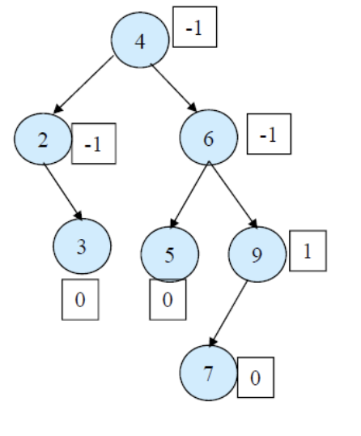
    
    AVL 트리는 요소를 삽입(insert)하거나 삭제(delete)하는 과정에서 서브트리를 재구성해 트리 전체의 균형을 맞춥니다. 삽입/삭제 연산시 BF가 일정 값 이상(보통 2) 혹은 이하(-2)로 바뀐 노드를 기준으로 그 서브트리들의 위치를 rotation하는 방식을 취합니다. rotation에는 두 가지 방식이 있는데 삽입 연산을 중심으로 살펴 보겠습니다.
    
    **Single Rotation**
    
    삽입 연산의 single rotation은 다음 두 가지 경우에 V(U의 자식노드, BF 절대값이 1이하)를 중심으로 실시합니다. (U는 BF의 절대값이 2 이상이면서 새 노드와 가장 가까운 조상 노드)
    
    - V가 U의 왼쪽 자식노드, V의 왼쪽 서브트리에 새 노드 삽입 : V를 기준으로 right rotation
    - V 가 U의 오른쪽 자식노드, V의 오른쪽 서브트리에 새 노드 삽입 : V를 기준으로 left rotation 
    
    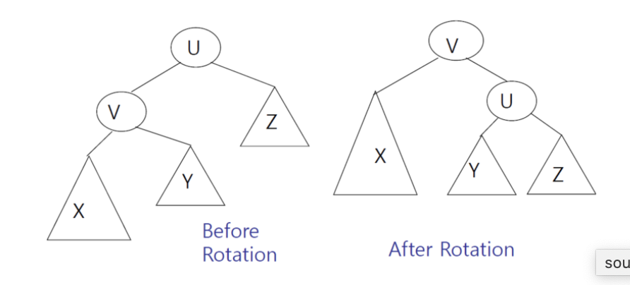
    
    
    
    **Double Rotation**
    
    다음 두 가지 경우 double rotation을 수행해 줍니다. (U는 BF의 절대값이 2 이상이면서 새 노드와 가장 가까운 조상 노드, V는 U의 자식노드이면서 BF 절대값이 1이하)
    
    - V가 U의 왼쪽 자식노드, V의 오른쪽 서브트리에 새 노드 삽입
    - V가 U의 오른쪽 자식노드, V의 왼쪽 서브트리에 새 노드 삽입
    
    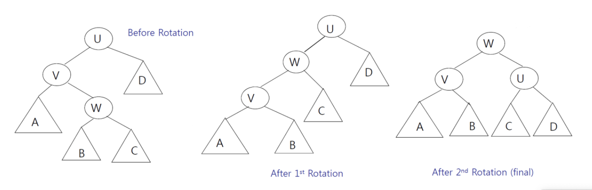
    
    **정리**
    
    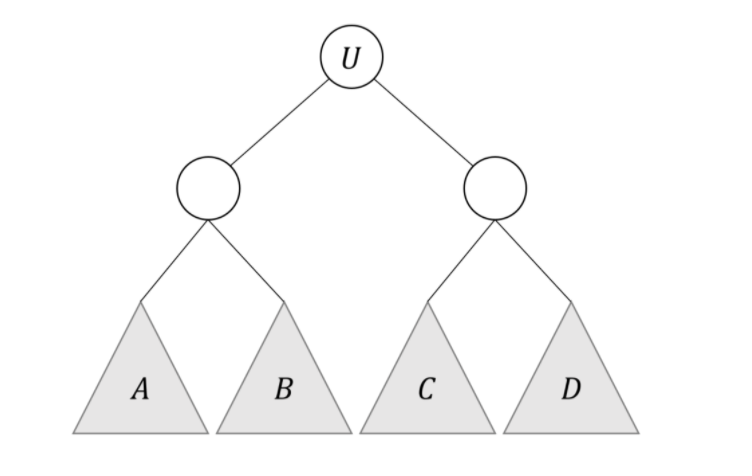	
    
    - 시나리오1 : U의 왼쪽 자식노드의 왼쪽 서브트리 A에 새 노드 삽입 : single right rotation
    - 시나리오2 : U의 왼쪽 자식노드의 오른쪽 서브트리 B에 새 노드 삽입 : double rotation(left-right)
    - 시나리오3 : U의 오른쪽 자식노드의 왼쪽 서브트리 C에 새 노드 삽입 : double rotation(right-left)
    - 시나리오4 : U의 오른쪽 자식노드의 오른쪽 서브트리 D에 새 노드 삽입 : single left rotation


## Red Black Trees

1. concepts

    search연산이 O(logn)인 균형 이진 트리. 지금까지 알려진 이진트리 알고리즘 중 가장 성능이 좋다고 평가받음.

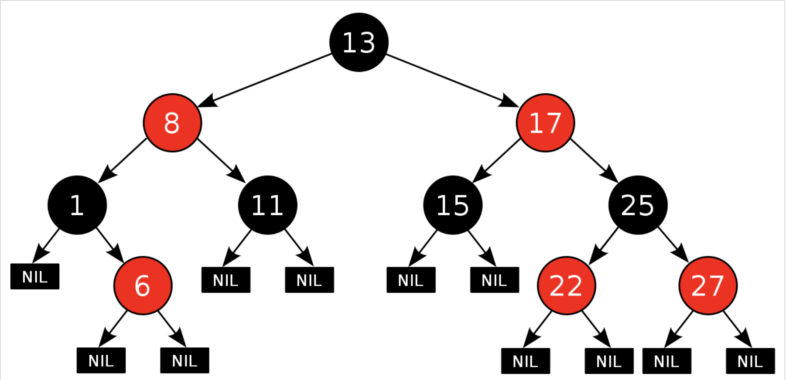

2. operations

    트리가 아래 네개의 조건을 항상 만족시켜야 한다.
    1. Root Property : 루트노드의 색깔은 검정(Black)이다.

    2. External Property : 모든 external node들은 검정(Black)이다.

    3. Internal Property : 빨강(Red)노드의 자식은 검정(Black)이다. (빨간색 노드가 연속으로 나올 수 없다.) 

    4. Depth Property : 모든 리프노드에서 Black Depth는 같다. 


    ### 삽입(insert)
    
    1. 삽입 하고자 하는 노드의 색은 red이다.
    2. 자신의 부모의 색이 red일 경우 3번 조건을 위배한다.
    3. 이 경우 삼촌(부모의 형제)에 따라 동작을 달리한다.
    
    - 부모의 형제가 red일 경우 : Recoloring
    - 부모의 형제가 black 혹은 없을 경우 : Restructing
    
    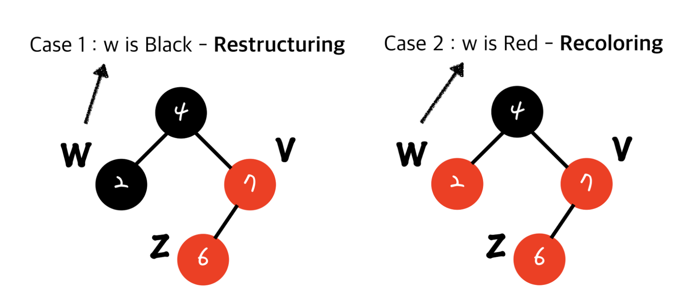
    
    **Restruction**
    
    1. 나(z)와 내 부모(v), 내 부모의 부모(Grand Parent)를 오름차순으로 정렬
    
    2. 무조건 가운데 있는 값을 부모로 만들고 나머지 둘을 자식으로 만든다.
    
    3. 올라간 가운데 있는 값을 검정(Black)으로 만들고 그 두자식들을 빨강(Red)로 만든다. 


    **Recoloring**
    
    1. 나의 부모의 부모의 형제를 모두 black으로 변경시키고 부모의 부모를 red로 한다.
    2. 부모의 부모의 부모가 red일 경우 다시 Recoloring을 진행한다.
    3. root까지 반복한다.


​    
​    ### 삭제(delete)
​    
​    삭제하려는 노드의 색이 red인 경우에는 규칙을 꺠는 일이 없으므로, 일반적인 이진트리의 방법을 사용하면 된다.
​    
​    삭제하려는 노드의 색이 black인 경우에는, 그 자리를 대체하는 노드를 black으로 칠해준다.
​    하지만 만약 그 노드가 이미 black이었을 경우, double black node라는 문제가 발생한다.
​    이를 해결하기 위한 방법은 케이스 별로 분류한다.
​    
​    1. double black node의 형제가 red인 경우
​    
​        형제를 검은색으로, 부모를 빨간색으로 칠하고 부모노드를 기준으로 좌회전한다.


	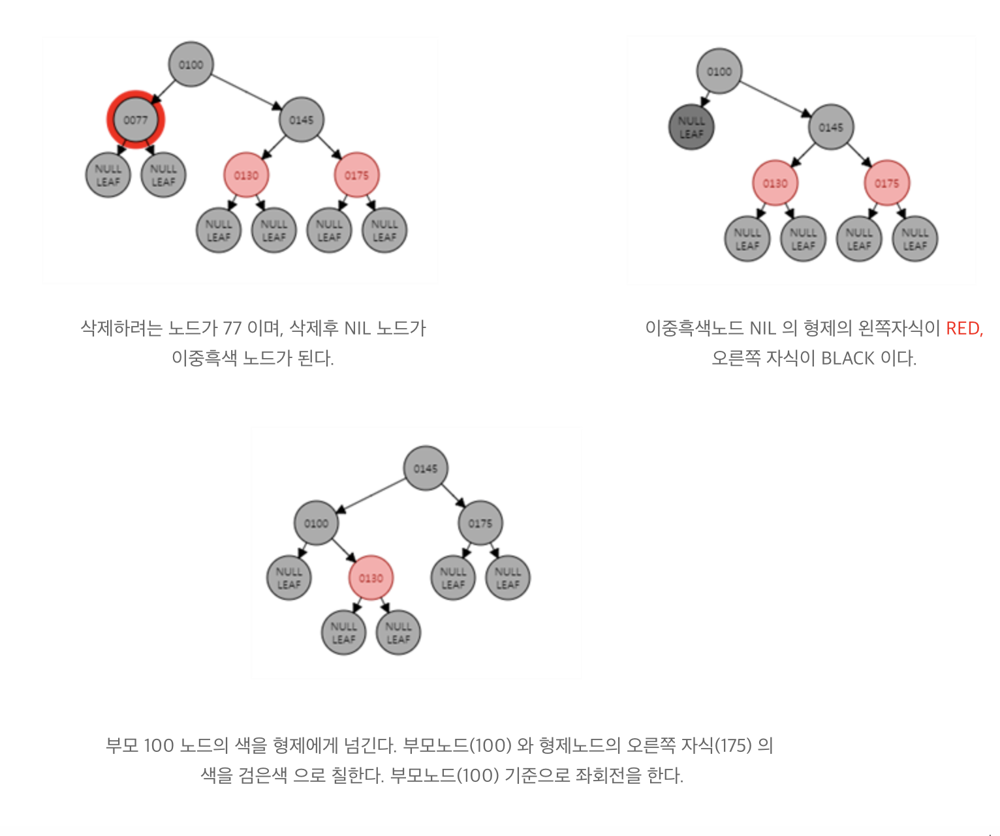
	
	2. double black node의 형제가 black이고 형제의 자식이 모두 black인 경우
	
	    형제 노드만 red로 만들고 부모노드를 double black node로 바꾸어 준다.(이 방법을 계속 진행한다.) 이 후 double black node가 root가 되면 종료한다.


	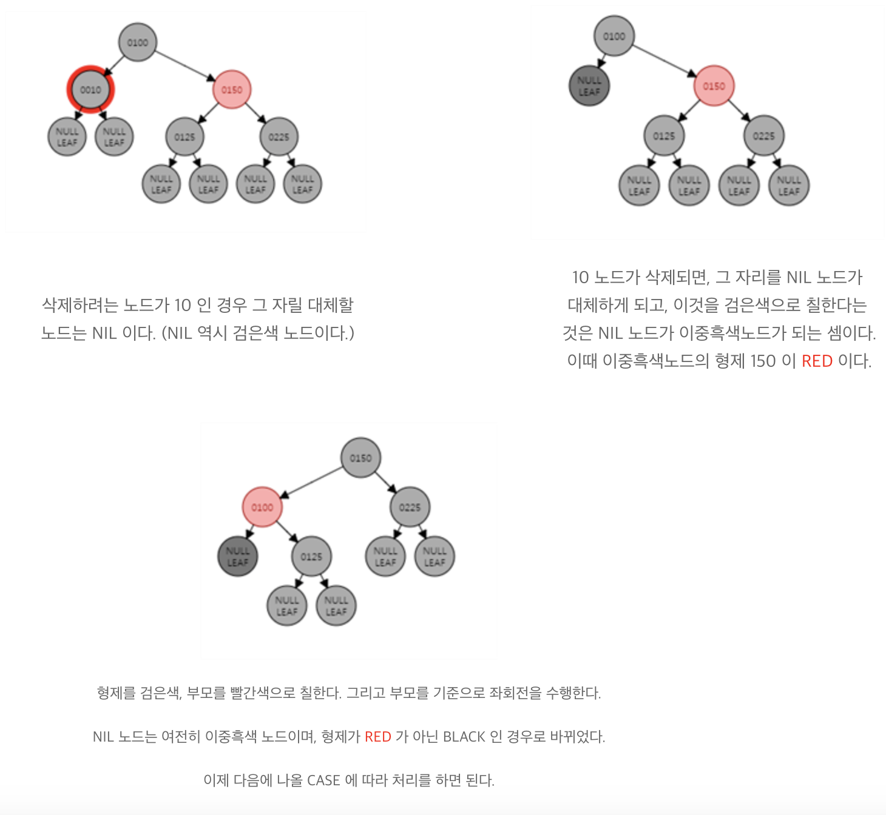
	
	3. double black node의 형제가 black이고, 형제의 왼쪽 자식이 red 오른쪽 자식이 black인 경우
	
	    형제 노드를 red, 형제노드의 왼쪽 자식을 black 으로 칠한후 형제노드를 기준으로 우회전한다.
	
	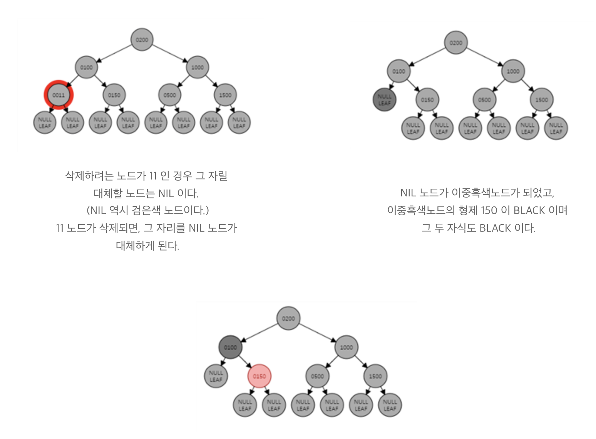
	
	4. double black node의 형제가 black이고 형제의 오른쪽 자식이 red인 경우
	
	    부모노드의 색을 형제에게 넘긴다. 이 후, 부모노드와 형제노드의 오른쪽 자식을 black으로 칠한다. 부모노드 기준으로 우회전 한다.
	
	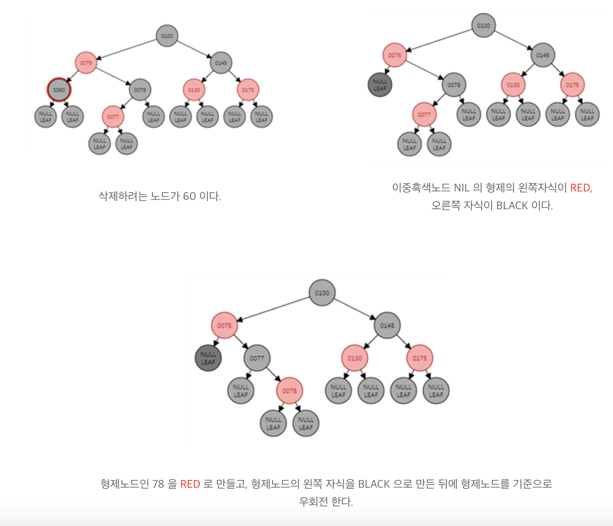

## Btrees

##### 특성

1. Root node가 Leaf node인 경우를 제외하고는 항상 최소 2개의 Children을 가진다.
2. Root node와 Leaf node를 제외한 모든 node들은 최소 [M/2], 최대 M개의 Subtree를 가진다.
3. 모든 Leaf node들은 같은 Level에 존재하여야 한다.
4. 새로운 Key 값은 Leaf node에 삽입된다.
5. node 내 Key 값들은 오름차순이다.
6. Leaf node는 최소 [M/2] - 1개의 Key를 가지고 있어야 한다.
7. 입력된 자료는 중복될 수 없다.

**M: tree의 degree**

<br>

##### Btree Example

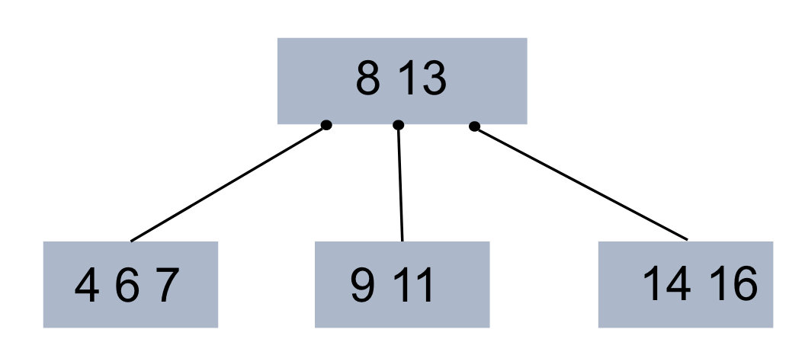

- `root`노드의 데이터는 8, 13
- 8보다 작은 데이터는 8의 왼쪽 서브트리에, 8과 13 사이의 값은 8의 오른쪽 13의 왼쪽 서브트리 (중간)에 , 13보다 큰값은 13 오른쪽 서브 트리에 값을 이루고 있다.

<br>

##### Node Insertion

Overflow가 발생할 경우

1. **Key Rotation** : Check for Siblings for rotation

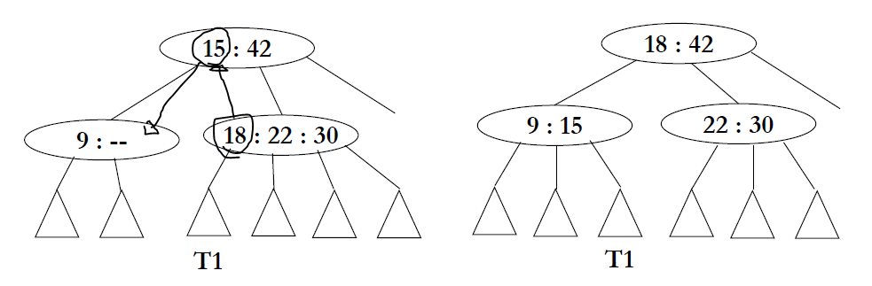

**Example) Insert value 18**

2. **Node Split**

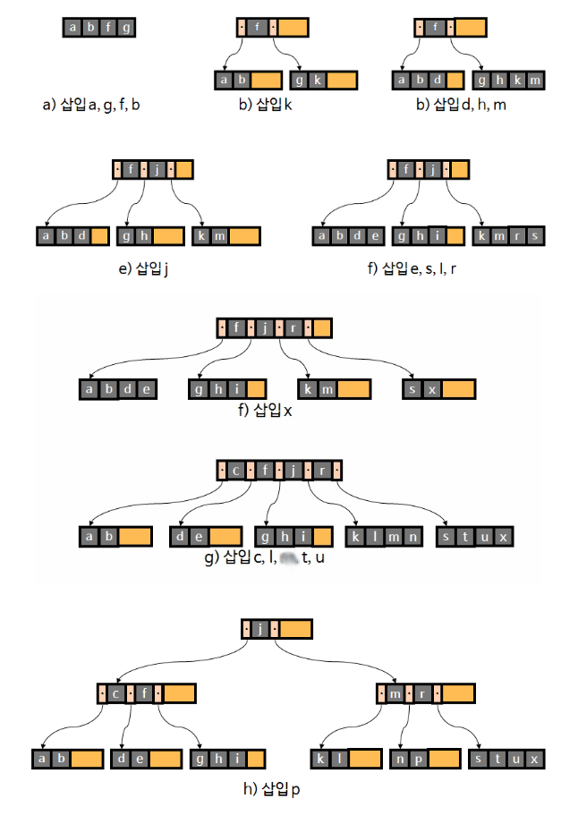

Overflow가 발생하는 node의 가운데 Key 값을 상위 레벨로 올린다.

<br>

(1)과 (2)를 반복하며 진행

##### Node Deletion

삭제를 위해서는 Leaf node로 해당 원소를 이동시켜야 한다.

1. **Leaf node**를 삭제하는 경우

   **CASE 1**

   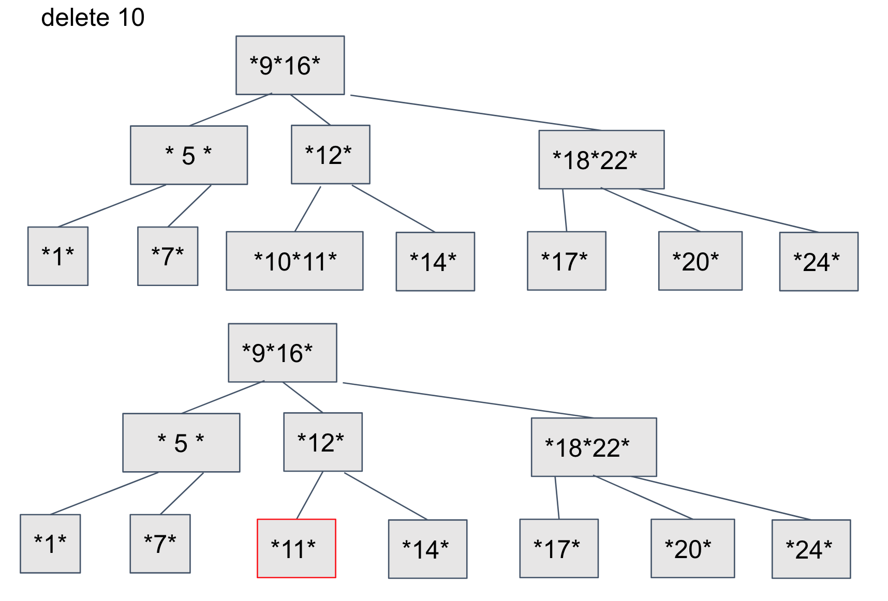

    노드에서 데이터를 삭제하여도 `B-Tree`를 유지

   **CASE 2**

   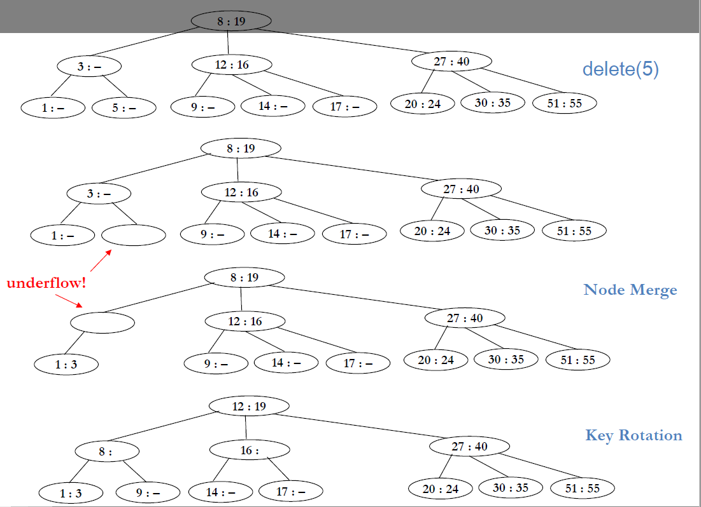

   Leaf 노드에서 5를 삭제하면 B-tree 구조가 깨짐

   삭제한 노드의 부모 노드로 올라가며 데이터를 가져온다.

   5의 부모노드와, 형제 노드를 merge하고, Key Rotation.

   root 까지 반복해가면서 B-tree 구조를 만들도록 한다.

2. **Internal node**를 삭제하는 경우

   **CASE 1**

   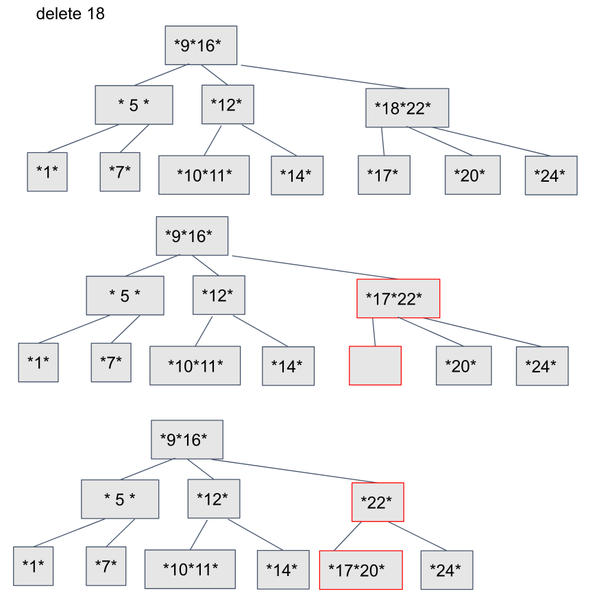

   노드에서 데이터를 삭제하고 왼쪽 서브트리에서 최대값을 노드에 위치. 

   같은 방식으로 부모노드에서 자식노드로 값을 가져오고 형제노드와 merge 하며 `B-Tree`조건이 맞을때까지 반복	

   **CASE 2**

   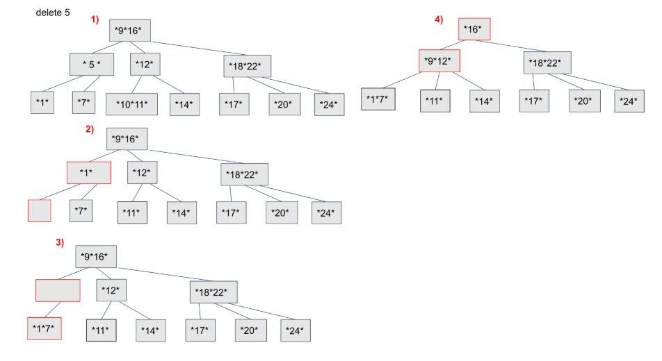

<br>

###### B+Tree

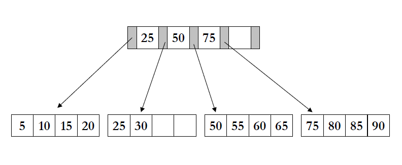

- 모든 데이터 값은 Leaf Node에 저장
- Leaf node는 Linked list로 구성되어 있어 sibling node끼리 연결
- Non-leaf node들은 value의 저장 위치를 표시하는 index로만 사용(data는 leaf node에 따로 저장)
- Data node(Leaf node)와 Index node(Non leaf node)의 크기는 동일하지 않아도 된다.

## Hashing

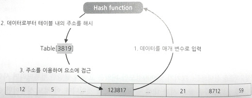

  데이터는 해시 함수를 거치면 다음 그림처럼 테이블 내의 주소(즉, 인덱스)로 변환된다.

<br>

용어정리 : 

1. Collision(충돌) : 서로 다른 입력 값에 대해 동일한 해시 값, 즉 해시 테이블 내의 동일한 주소를 반환하는 것. 어떤 해시 함수든, 그 알고리즘이 아무리 정교하게 설계되었다 하더라도 모든 입력 값에 대해 고유한 해시 값을 만들지는 못한다. 한마디로 말해서, 해시 함수의 충돌은 피할 수 없다.

2. Cluster(클러스터) : 일부 지역의 주소들을 집중적으로 반환 하는 결과로 데이터들이 한 곳에 모이는 문제

<br>

##### Hash Function

*1. Division Method(나눗셈 법)* 

**나눗셈법은 입력 값을 테이블의 크기로 나누고, 그 '나머지'를 테이블의 주소로 사용한다.**

**주소 = 입력 값 % 테이블의 크기**

특징

1. 어떤 값이든 테이블의 크기로 나누면 그 나머지는 절대 테이블의 크기를 넘지 않는다.
2.  테이블의 크기를 n이라 할때, 0~n-1 사이의 주소를 반환함을 보장.
3. 테이블의 크기 n을 소수(Prime Number)로 정하는 것이 좋다고 알려져 있다.

<br>

*2. Digit Folding(자릿수 접기)*

**숫자의 각 자릿수를 더해 해시 값을 만드는 것.**

특징

1. 문자열을 키로 사용하는 해시 테이블에 특히 잘 어울리는 알고리즘
2. 문자 열의 각 요소를 ASCII  코드 번호(0~127)로 바꾸고 이 값을 각각 더하여 접으면 문자열을 해시 테이블 내의 주소로 변환 가능

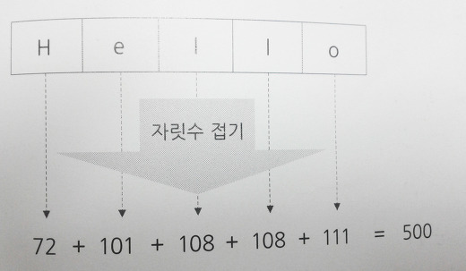

<br>

##### Collision Resolution

1. Open Hashing(개방 해싱) : 주소 밖에 새로운 공간을 할당하여 문제 해결

   1-1 Separate Chaining

2. Closed Hasing(폐쇄 해싱) : 처음에 주어진 해시 테이블 공간 안에서 문제 해결

   2-1 Linear Probing

   2-2 Quadratic Probing

   2-3 Double Hashing

   2-4 Rehashing

<br>

1. Separate Chaining

    충돌이 발생하면 각 데이터를 해당 주소에 있는 링크드 리스트에 삽입하여 문제를 해결하는 방법. 개방 해싱 알고리즘이다.

   특징 

   1. 새 데이터를 링크드 리스트의 가장 앞(즉, 헤드의 앞)에 삽입한다.

      (그러면 데이터 삽입시, 링크드 리스트 테일을 찾는 '순차 탐색' 을 수행하지 않아도 된다.)

   2. 원하는 데이터를 찾기 위해 순차 탐색을 해야 하는 링크드 리스트의 단점을 가짐.

   3. 해시 테이블 + 이진 탐색 트리의 결합은 최고!

   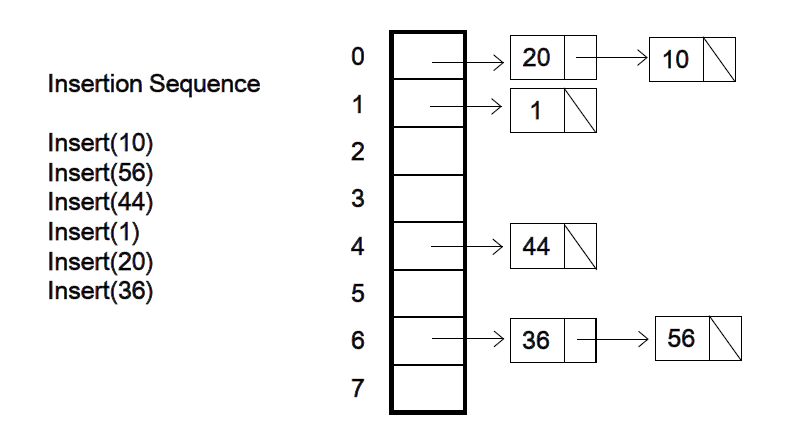

2. Linear Probing

   해시 함수로부터 얻어낸 주소에 이미 다른 데이터가 입력되어 있음을 발견하면, 현재 주소에서 고정 폭(예를 들면 1)으로 다음 주소로 이동.

   특징

   1. Cluster(클러스터) 현상이 매우 잘 발생한다.

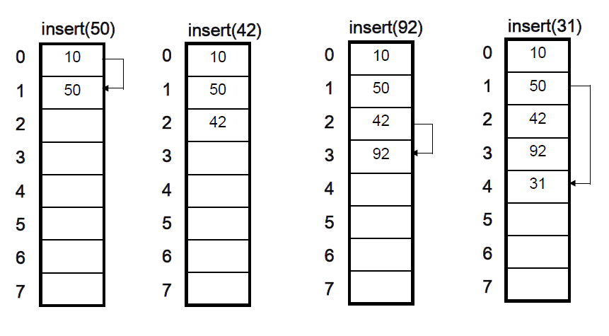

3. Quadratic Probing

   선형 탐사가 다음 주소를 찾기 위해 고정폭만큼 이동하는 것에 비해 제곱 탐사는 이동폭이 제곱수로 늘어나는 것이 다르다.

   특징

   1. 서로 다른 해시 값을 갖는 데이터에 대해서는 클러스터가 형성 되지 않도록 하는 효과가 어느 정도 있지만, 같은 해시 값을 갖는 데이터에 대해서는 2차 클러스터 발생

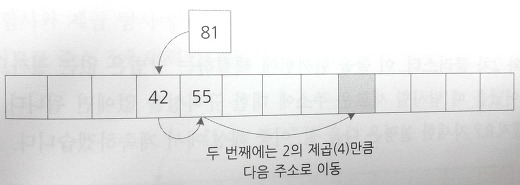

4. Double Hashing

    클러스터 방지를 위해, 2개의 해시 함수를 준비해서 하나는 최초의 주소를 얻을 때 또 다른 하나는 충돌이 일어났을 때 탐사 이동폭을 얻기 위해 사용

5. Rehashing

   해시 테이블의 크기를 늘리고, 늘어난 해시 테이블의 크기에 맞추어 테이블 내의 모든 데이터를 다시 해싱하는 것

## BloomFilter

##### 구성요소

- Hash Function : 해시 알고리즘 구현체
- Bloom Filter Key : 해시 알고리즘에 의해 반환된 Key
- Bloom Filter Index
- add(), isExist(): 삽입과 탐색 기능

<br>

##### 작동 방식

예를 들어, M(bloom Filter의 bit size) = 10

K(Hash functions의 수) = 2라 하자.

2개의 Hash function을 h1, h2라 하고 Bloom filter의 배열은 아래와 같다.

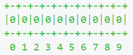

데이터 A를 삽입 한다고 가정하면, 데이터 A를 두 해시 함수 h1, h2를 거쳐 해시 값을 계산한다.

만일 h1(A) = 3, h2(A) = 7 였다면, 이 해시 값 3, 7에 해당하는 index에 1을 셋팅한다.

이제 배열은 아래와 같아진다.

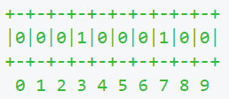

그 다음 데이터 A를 검색한다면, 해시 함수를 거쳐 3, 7에 대응하는 배열을 확인할 것이다.

배열을 보면 양쪽 모두 1로 되어 있어서 return 값은 true로 던져질 것이다.

그 다음 데이터 C를 검사한다면(h1(C) = 3, h2(C) = 6), 3은 1이나 6 index가 0이므로 false를 리턴하게 된다.

<br>

많은 비트를 할당할수록 성능은 좋을 수 있으나 많은 메모리가 필요, 해싱 함수를 늘리게 되면 연산이 많아지게 되나 메모리를 덜 차지하게 되는 trade-off가 존재.

<br>

##### 특징

- false positive probability(h(x) is already set to  by other sertions^&^)

---
### Graph1

그래프란?

- Vertex(정점)와 Edge(선)로 표현을 하는 것
- 방향 그래프(directed graph) : edge들이 방향성을 가지고 있다.
- 비방향 그래프(undirected graph) : edge들이 방향성을 가지고 있지 않다.


**용어**

1. adjacent(인접) : edge로 이어져있는 vertex들의 관계
2. degree : 해당 vertex에 연결된 edge수
3. in-degree : 들어오는 edge 수
4. out-degree : 나가는 edge 수
5. loop : 자신에서 자신으로 가는 edge
6. simple path : 경로 중 edge가 중복으로 지나지 않는 경우
7. elementary path : 경로 중 vertex가 겹치지 않는 경우
8. cycle : 경로 중 시작과 끝이 같은 경우
9. simple cycle : cycle중 vertex가 중복으로 지나지 않는 경우
10. sparse graph : vertex의 수보다 edge의 수가 적은 것
11. dense graph : vertex의 수보다 edge의 수가 큰 것
12. isolated : vertex에 연결된 edge가 없는 경우 (degree == 0)
13. isomorphic(동형) : 직관적인 생김새는 다르지만 본질적으로 구조가 같다는 것
14. complete graph : 모든 vertex가 edge로 연결되어 있는 것
15. multi graph : vertex사이에 edge가 하나 이상인 것
16. spanning tree (신장 트리) : 그래프네 모든 vertex를 포함하는 트리


**구현방법**

1. 인접 행렬
   - 간단함
   - O(V^2)의 공간 복잡도
2. 인접 리스트
   - O(|E|+|V|)의 공간 복잡도
   - sparse graph에 적합함.


**대표적인 문제해결방법**

1. Topological sort : 어떠한 일을 하는 순서를 찾는 알고리즘
2. shortest path selection
3. network flow problem : 시작에서 목표까지 갈 수 있는 flow의 최대 수를 찾는 것
4. minimum spanning tree(MST) 
5. DFS
6. BFS

---

### Graph2

**Shortest Path Algorithm** 

- weight가 있는 그래프에서 weight의 합이 가장
- 만약 음수값의 가중치가 있으면 정의가 안될 수 있다.


**unweighted shortest paths** : BFS를 이용해서 가장 가까운 길을 찾는다.


**Greedy Algorithm** : 매 stage에서 최선의 선택을 하는 것


**Dijkstra**

시간 복잡도 : O(|E|log|V|)

우선순위 큐 이용

```
Dijkstra(G=(V, E, w), s)
{
    S = {};
    for each v in V do
   	{ 
   		d[v] = +infinity;
    	pred[v] = nil;
    }
    d[s] =0;
    for each v in Adj[s] do
    {
    	d[v] = w[s, v];
	    pred[v] = s;
    }
    Add each vertex to priority queue Q;
    While (Q is not empty) do
    { 
    	u = Delete_Min(Q); S = S + {u};
	    for each v in Adj[u] do
    	{
    		if (d[u] + w(u, v) < d[v]) then
		    {
		    	d[v] = d[u] + w(u, v);
			    pred[v] = u;
			    Decrease_Priority(Q, v);
			 }
    	} /* End for */
    } /* End while */
} /* End Dijkstra */
```


**벨만포드 알고리즘**

- 음수의 weight를 가진 graph에서도 shortest path를 찾을 수 있다.
- 시간복잡도 : O(|V||E|)
- 다익스트라에 비해서 느리기 때문에 신중하게 사용해야한다.

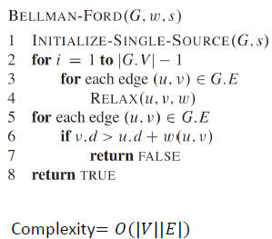


- 벨만포드그림 참고사이트 : https://www.crocus.co.kr/534

---

### Sorting

**Merge Sort**

- 분해 - 합병 과정을 반복하여 sort를 수행하는 것.

- 안정정렬

- 시간 복잡도 - O(nlongn)
- 레코드를 연결리스트로 구성하면, 링크 인덱스만 변경되므로 데이터의 이동은 무시할 수 있을 정도로 작아진다. 
  => 데이터의 크기가 큰 레코드를 정렬할 때 효율적
- 반면 배열로 구성할 경우 임시 배열이 필요하다.
  => 데이터의 크기가 큰 경우 이동횟수가 많아져 비효율적

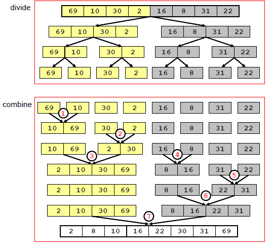

```c++
void merge(int list[], int left, int mid, int right){
  int i, j, k, l;
  i = left;
  j = mid+1;
  k = left;

  /* 분할 정렬된 list의 합병 */
  while(i<=mid && j<=right){
    if(list[i]<=list[j])
      sorted[k++] = list[i++];
    else
      sorted[k++] = list[j++];
  }

  // 남아 있는 값들을 일괄 복사
  if(i>mid){
    for(l=j; l<=right; l++)
      sorted[k++] = list[l];
  }
  // 남아 있는 값들을 일괄 복사
  else{
    for(l=i; l<=mid; l++)
      sorted[k++] = list[l];
  }

  // 배열 sorted[](임시 배열)의 리스트를 배열 list[]로 재복사
  for(l=left; l<=right; l++){
    list[l] = sorted[l];
  }
}

// 합병 정렬
void merge_sort(int list[], int left, int right){
  int mid;

  if(left<right){
    mid = (left+right)/2 // 중간 위치를 계산하여 리스트를 균등 분할 -분할(Divide)
    merge_sort(list, left, mid); // 앞쪽 부분 리스트 정렬 -정복(Conquer)
    merge_sort(list, mid+1, right); // 뒤쪽 부분 리스트 정렬 -정복(Conquer)
    merge(list, left, mid, right); // 정렬된 2개의 부분 배열을 합병하는 과정 -결합(Combine)
  }
}
```


**Quick Sort**

- 불안정 정렬
- 매우 빠른 수행 속도를 자랑
- 추가적인 메모리가 필요 없음
- 리스트를 비균등하게 분할
  => 리스트의 한 요소를 선택해서 분할(피벗 - pivot)
- 만약 이미 정렬된 리스트에 대해서는 최악


```c++
int partition(int list[], int left, int right){
  int pivot, temp;
  int low, high;

  low = left;
  high = right + 1;
  pivot = list[left]; // 정렬할 리스트의 가장 왼쪽 데이터를 피벗으로 선택(임의의 값을 피벗으로 선택)

  /* low와 high가 교차할 때까지 반복(low<high) */
  do{
    /* list[low]가 피벗보다 작으면 계속 low를 증가 */
    do {
      low++; // low는 left+1 에서 시작
    } while (low<=right && list[low]<pivot);

    /* list[high]가 피벗보다 크면 계속 high를 감소 */
    do {
      high--; //high는 right 에서 시작
    } while (high>=left && list[high]>pivot);

    // 만약 low와 high가 교차하지 않았으면 list[low]를 list[high] 교환
    if(low<high){
      SWAP(list[low], list[high], temp);
    }
  } while (low<high);

  // low와 high가 교차했으면 반복문을 빠져나와 list[left]와 list[high]를 교환
  SWAP(list[left], list[high], temp);

  // 피벗의 위치인 high를 반환
  return high;
}

// 퀵 정렬
void quick_sort(int list[], int left, int right){

  /* 정렬할 범위가 2개 이상의 데이터이면(리스트의 크기가 0이나 1이 아니면) */
  if(left<right){
    // partition 함수를 호출하여 피벗을 기준으로 리스트를 비균등 분할 -분할(Divide)
    int q = partition(list, left, right); // q: 피벗의 위치

    // 피벗은 제외한 2개의 부분 리스트를 대상으로 순환 호출
    quick_sort(list, left, q-1); // (left ~ 피벗 바로 앞) 앞쪽 부분 리스트 정렬 -정복(Conquer)
    quick_sort(list, q+1, right); // (피벗 바로 뒤 ~ right) 뒤쪽 부분 리스트 정렬 -정복(Conquer)
  }

}
```


**sort의 시간복잡도**


참고 사이트(다양한 내용 잘 정리 되어 있음. 추천 추천 추천)

https://gmlwjd9405.github.io/2018/05/08/algorithm-merge-sort.html
