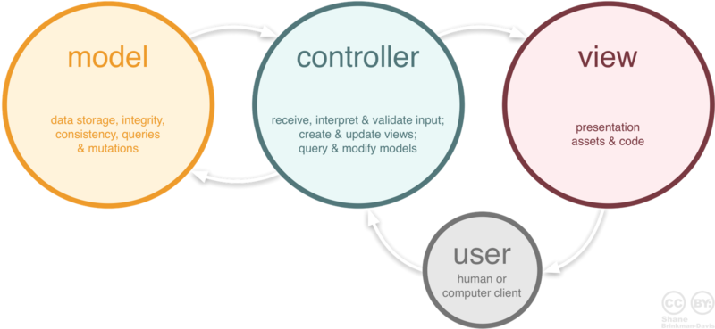

## Design pattern

**<목차>**

- [디자인 패턴이란?](#design-pattern?)
- [MVC 패턴](#mvc-pattern)
- [싱글톤](#singleton)
- [템플릿 메소드 패턴](#template-method-pattern)
- [스트레티지 패턴](#strategy-pattern)

---

### <a name = "design-pattern?">디자인 패턴이란</a>

- 소프트웨어를 설계할 때 특정 맥락에서 자주 발생하는 고질적인 문제들이 또 발생했을 때 재사용할 할 수있는 훌륭한 해결책
- 패턴
  - 각기 다른 응용 소프트웨어를 개발할 때에도 공통되는 설계 문제가 존재하며 이를 처리하기 위한 해결책에도 공통점이 있다. 이를 패턴이라고 한다.
  - 패턴은 공통의 언어를 만들어주며 팀원 사이의 의사소통을 원활하게 해주는 아주 중요한 역할을 한다.

### <a name ="mvc-pattern"> MVC 패턴 </a>

-  model, view, controller의 약자.

- user가 controller를 조작하면 model을 통해 데이터를 가져오고 그 데이터를 view를 제어해 user에게 다시 전달합니다. 

**Model**

- 애플리케이션의 정보, 데이터를 나타냄. data,정보들의 가공을 책임지는 컴포넌트
- 내부 비지니스 로직을 처리하기 위한 역할.(애플리케이션이 "무엇"을 할 것인지)
- 규칙
  1. user가 편집하기 원하는 모든 데이터를 가지고 있어야함.
  2. veiw나 controller에 대한 어떤 정보도 알지 말아야함.
  3. 변경이 일어나면, 변경 통지에 대한 처리방법을 구현해야함.
     (속성 변경에 대한 이벤트를 발생시키고 이벤트를 수신해 처리하는 방법 구현, 또한 모델은 재사용이 가능해야하며 다른 인터페이스에서도 변하지 않아야함.)

**View**

- 인터페이스 요소를 나타냄. 데이터를 기반으로 user들이 볼 수 있는 화면.
- 모델이나 컨트롤러가 보여주려고 하는 모든 요소를 보여주기 위한 역할.
- user의 입력을 받아서 모델의 데이터를 업데이트.
- 규칙
  1. 모델이 가지고 있는 정보를 따로 저장해서는 안됨.
  2. 모델이나 컨트롤러와 같이 다른 구성요소들을 몰라야함.
  3. 변경이 일어나면, 변경 통지에 대한 처리방법을 구현해야함.
     (변경이 일어나면 누군가에게 변경을 알려줘야 하는 방법을 구현해야함. 예를 들어, user가 화면에서 내용을 변경하면 모델에게 전달해줘야 함.)

**Controller**

- 데이터와 user인터페이스 요소들을 잇는 다리역할을 합니다.
- user가 데이터를 클릭, 수정 등을 하는 것에 대한 이벤트를 처리하는 부분.
- 모델이 "어떻게"처리할 지를 알려주는 역할.
- 규칙
  1. 모델이나 뷰에 대해서 알고 있어야 함.
  2. 모델이나 뷰의 변경을 모니터링 해야함.
     (모델과 뷰에게 각각의 변경 내용을 통지해줘야함. 애플리케이션의 메인 로직을 담당.)

**왜 사용해야하는가**

- 사용자가 보는 페이지, 데이터처리, 제어 컨트롤러 이 3가지로 구성되는 하나의 애플리케이션은 각각 맡은바에만 집중 할 수 있게됩니다.
- 유지보수성, 확장성, 유연성이 증가, 중복코딩 문제 해결

**한계**

- view와 model이 controller에 연결되어 서로 의존성을 띄게 된다.
- 복잡한 화면과 데이터의 구성이라면, controller에 다수의 model과 view가 복잡하게 연결되어 있는 상황이 생길 수 있다. 
- 너무 복잡하고 비대해져서, 새 기능을 추가할 때마다 크고 작은 문제가 발생하고 분석이나 테스트도 어려워진다.

**요약**

- 개발할 때 3가지 형태로 구분하여 개발하는 소프트웨어 개발 방법론
- model-controller-view
- 복잡한 대규모 프로그램을 개발을 하게 되면 문제가 발생.

### <a name = "singleton">싱글톤</a>

- 애플리케이션이 시작될 때 어떤 클래스가 최초 한번만 메모리를 할당하고 그 메모리에 인스턴스를 만들어 사용하는 디자인 패턴
- **생성자가 여러 차례 호출되더라도 생성되는 객체는 하나**

**쓰는 이유**

- 고정된 메모리 영역을 얻으며 한번의 new로 인스턴스를 사용하기 때문에 메모리 낭비 방지
- 데이터를 공유하기 쉬움.
- 안드로이드 앱에서 액티비티나 클래스별로 주요 클래스들을 일일이 전달하기 번거롭기 때문에 싱글톤이 편리.

**문제점**

- 싱글톤 인스턴스가 너무 많은 일을 하거나 데이터를 공유하면 다른 클래스와 인스턴스가 결홉도가 높아져 객체 지향 설계 원칙에 위배
- 수정이나 테스트가 어려워짐.
- 멀티 쓰레드환경에서 동기화가 제대로 이루어지지 않을 경우 인스턴스가 두개 생성
  **해결책**
  - **thread safe lazy initialization** : private생성자로 외부 생성을 막고 synchronized키워드로 thread-safe하게 만듬. 하지만, 큰 성능저하가 발생하므로 권장 X
  - **thread safe lazy initialization + double-checked locking** : if문으로 동기화시켜 인스턴스를 생성. thread-safe하면서 synchronized블럭을 타지 않기에 성능 완화

### <a name = "template-method-pattern"> 템플릿 메소드 패턴 </a>

- 알고리즘의 구조를 메소드에 정의하고, 하위 클래스에서 알고리즘 구조의 변경없이 알고리즘을 재정의 하는 패턴.
- 같은 역할을 하는 메소드지만 여러 곳에서 다른 형태로 사용이 필요한 경우 유용함.

**사용방법**

- 클래스에서 기본 레이아웃을 가진 메소드를 생성한다. 레이아웃에 사용되는 메소드들을 만든다.
- 클래스를 extends하여 override를 이용해 메소드를 정의한다.

### <a name="strategy-pattern">스트레티지 패턴 </a>

- 알고리즘군을 정의하고 각각 캡슐화하여 교환해서 사용할 수 있도록 만든다.
- 클라이언트와는 독립적으로 알고리즘을 변경할 수 있다.
- **원칙** 
  - 애플리케이션에서 달리지는 부분을 찾아내고, 달라지지 않는 부분으로부터 분리시킨다.
  - 상속보다는 implement를 활용
  - 구현이 아닌 인터페이스에 맞춰서 프로그래밍 한다.
    (변화하는 부분이 정의가 안되는 것을 막기 위해)

**사용방법**

- 달라지는 부분을 따로 interface로 만든다.(인터페이스 내에 행동에 대한 method 정의)
- 만든 interface를 구현하는 class를 생성하고 override를 이용해 method를 정의.
- 이후 해당 method를 필요에 맞게 사용할 수 있도록 한다.

reference

1. https://gmlwjd9405.github.io/
2. https://m.blog.naver.com/jhc9639/220967034588
3. https://medium.com/@jang.wangsu
4. https://jeong-pro.tistory.com/86
5. https://jusungpark.tistory.com/7

