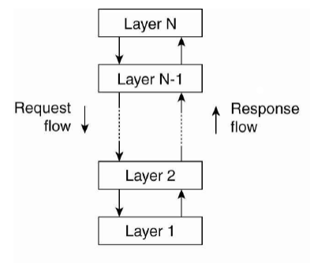
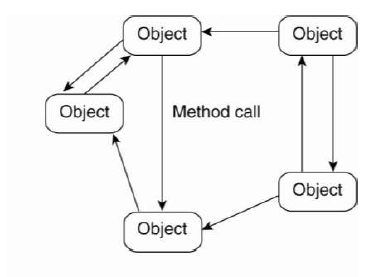
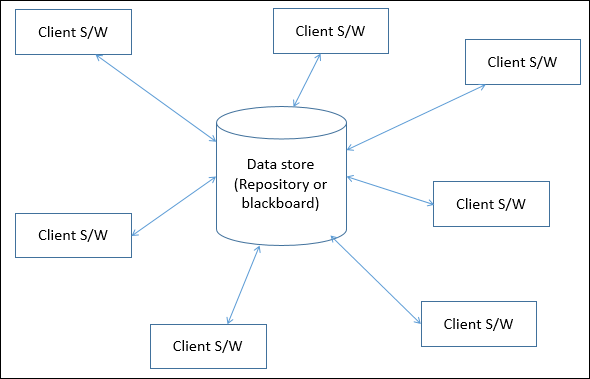
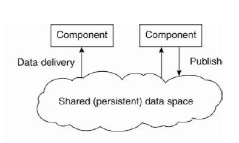
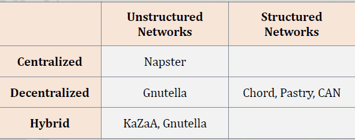
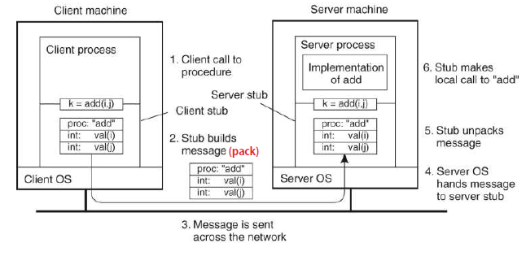

## **Distributed Computing**

**목차**

1. [**Block Chain** ](#block_chain)
   - [Bitcoin](#bitcoin)
   - [Ethereum](#ethereum)
   - [Hyperledger Fabric](#hyperledger)
   - [BFT](#bft)
2. [**Distributed System**](#distributed-system)
   - [Intro](#intro)
   - [Architecture](#architecture)
   - [Communication](#communication)

---

### <a name ="block_chain"> Block Chain</a>

#### <a name="bitcoin">비트코인(Bitcoin)</a>

- 암호화폐의 일종으로 2009년 생김.
- private key(unlock), public key(lock)를 가지고 있음. 

**UTXO모델** - 비트코인의 거래 단위

- Unspent Transaction Outputs(UTXOs)
- UTXO단위로 비트코인을 가지고 있고 한번에 사용해야한다.
- 보낼 비트코인 이상의 UTXO를 선택하고 남은 비트코인은 자신에게 전송.
- 이전에 사용되었던 트랜잭션의 output을 인자로 받아서 이용한다.

**Transaction**

- 모든 트랜잭션은 모든 ledgers에 broadcast되고 로그가 남겨진다. 또한, 모든 노드에 의해 검사가 이루어진다.
- 구성요소
  - metadata : hash value, ver, input size, output size, lock time
  - input : 이전 transaction의 hash value, output 순서, script(unlocking)
  - output : bitcoin value, script(locking)
- Script(비트코인의 언어 - turing incomplete)
  - stack based
  - native support for cryptography
  - simple, not turing compelete(no loops)
  - 무한한 표현을 만들어낸다.

**Blockchain**

- block은 여러 개의 트랜잭션을 포함하고 있다.
- 노드는 block을 생성하고 추가할 수 있으며 broadcast한다.
- 다른 노드들은 정당성을 체크하고 수용한다.
- 요소 : 이전 블럭의 hash, Timestamp, transaction data
- 만약 정보가 임의로 수정되면 hash값이 변경되어 정당하지 않은 것으로 판정되므로 불가하다.
- P2P네트워크에 의해서 관리된다.

**Double spending attack**

- 같은 비트코인을 이용해 두번의 트랜잭션을 발생.
- 기존의 블록체인에서 새로운 분기를 생성.
- 분기가 생기면 길이가 긴 블록체인이 살아남는다.
  - 보통 6개 이상의 블럭이 붙어야 확정이 된다.(안정성 확보)

**Block incentive**

1. hash를 풀어 block을 생성하면 bitcoin을 받게 된다. 이후 합의가 되어 블럭이 안정화가 되면 보상을 받게 된다.
2. transaction fee를 받게된다. block에 transaction이 쌓이면 이에 해당하는 수수료를 받게된다.

**Block Structure**

1. block header

   - hash value, bit , nonce, prev_block, time, ver

   - merkle root : 만약 transaction이 변경되면 값이 바뀌어 hash값이 바뀌며 체인이 깨진다.

2. transaction data

   - input(이전 트랜잭션의 정보, unlocking 등), output(value, locking 등) 데이터
   - coinbase : 임의의 데이터를 넣을 수 있음.

   - merkle tree
     - transaction을 tree형태로 배치하고 hashing 하여 놓을 것.	
     - transaction에 변화가 있으면 해당 branch만 변경하면 된다.

**POW(proof of work) - 작업증명**

- hash를 풀어 가장 먼저 푸는 사람이 보상을 가져간다. (블록 생성)
  - hash는 (nonce, prev_hash, tx,..)등을 넣어서 한다. 이 중 nonce를 변화시켜 원하는 타겟에 도달하면 성공한 것.
  - 만약 nonce값으로 원하는 값을 못찾을 경우. coinbase를 변화시켜 merkle root를 변화시켜 값을 찾아간다.
  - hashing power가 강력할수록 힘이 있는 노드.
- hash의 난이도는 적합한 생성시간(10분에 한개)을 유지하도록 난이도가 조절된다. (2주마다)
- hash를 이용하므로 다른 노드들이 검증하기 매우 쉽다. nonce만 알게되면 쉽게 검증 완료.

**THIN / SPV client**

- 노드가 블록의 헤더만 유지하고 트랜잭션 데이터를 가져가지 않음. (데이터를 줄임.)
- 몇몇 노드만 full 노드의 상태를 유지하여 검증을 진행.
- 모두가 전체 체인을 유지하면 데이터가 너무 커지는 문제가 발생.

**특징**

- 약 10분에 하나씩 생성
- 1 Mbyte
- 20000개의 signature operation이 있음.
- 100M satoshis per bitcoin
- bitcoin의 총량은 23M
- bitcoin생성량이 반감되고 있다. (4년마다)
- tps : 7 (이 속도를 올리기 위해 노력중, 이더리움은 약 20)

**hard forking, soft forking**

- hard forking 
  - 기존에 블록체인 완전히 바꾸는 것으로 이전의 버전들과 호환이 되지 않아 오래된 노드들은 따라갈 수 없음.
  - 마이너와 사용자가 무조건 업데이트 해야함.
  - 예시 : 블록사이즈를 증가시킨다. 기존의 노드들이 기준보다 큰 블럭이 생기는 것을 거부하게 되고 호환되지 않는 문제 발생.
- soft forking 
  - 한정된 transaction에 대해서 새로운 feature를 추가한다. 오래된 노드들도 따라갈 수 있다.
  - 마이너는 반드시 버전을 업데이트 해야하며, 일반 사용자는 업데이트 하지 않아도 된다.
  - 예시 : 블록 사이즈를 3에서 2로 낮추게되면 기존의 블록은 여전히 트랜잭션을 처리할 수 있음. 하지만, 새로운 블럭을 3으로 만드려는 시도를 하면 거부 당한다.

**비트코인의 한계**

- 비트코인은 결국 특정 갯수까지만 생성 가능.
- 현재는 비트코인 reward가 대부분 채굴자의 수익.
- 미래에는 transaction fee를 통해 채굴자의 수익이 결정됨.

**SHA-256 : 비트코인 hash function** 

- 256비트로 구성되어 64자리 문자열을 반환한다.
- 만약 충돌이 발생한다고 하더라도 '하드포크'와 같은 방법을 통해 알고리즘을 개선할 수 있음.

**Mining Pool**

- 목표 : 같은 coinbase를 기반으로 해시를 푼다. 만약 풀면 pool manager에게 그 코인을 전송.
- 구성원들이 얼마나 성과를 보였는지에 따라서 reward를 배분.
- Mining Share : 답은 아니지만 답에 근접한 값 (이를 제출함으로 일하는 것을 증명)
- 보상 배분 방식
  - pay per share : share가 올 때마다 보상을 지급. 마이너가 일을 안할 수 있음.
  - proportional : 최종 블럭 생성 이후 보상을 지급. 마이너가 좀 더 열심히 마이닝에 참여
- 장점
  - 개개인의 채굴자가 참여 가능.
  - software upgrade가 쉽다.
- 단점
  - pool manager를 무조건 신뢰해야함
  - 중앙화
  - 중복 공격이 가능해질 수 있음.

**PoS(proof of stake)**

- 일정 액수를 걸고 추첨에 따라 블럭 생성 권한을 주는 것.
- voting에 weight를 주는 것. 자신이 가진 자산이 많으면 힘이 강하다.
- 만약 51% attack을 하면 자신을 공격하는 행위가 된다.
- PoW는 현재 자원을 많이 낭비하는 형태로 이루어진다. 하지만, PoS는 hashing이 필요하지 않아 별도의 자원을 낭비하지 않는다.
- **문제점**
  - 한계 비용이 없어 여러 분기로 나뉜 블럭들에 모두 지분을 증명할 수 있다.
  - long range attack은 검증자가 어떠한 것이 정당한지 알 수 없고 혹여 거짓인 것이 참인것 처럼 합의될 경우 정당한 거래를 한 사람이 모두 공격당하는 꼴을 보인다.
  - short range attack은 검증자가 어느 쪽 체인에든 무조건 합의를 하는 것. 그래야 어느쪽이 살아남아도 보상을 받을 수 있는 것. => 어느쪽이든 잃을 것이 없다는 의미
  - 이를 막기 위해 보증금과 벌금 제도를 부가해서 해결하려 한다.
  - 블록상에서 증명할 떄에 보증금을 어느정도 걸어놓고 만약 거짓이면 보증금에서 벌금을 차감하는 방식으로 손해가 발생하지 않는 현상을 막고 있다.

#### <a name="ethereum"> 이더리움 </a>

- 비트코인의 언어가 복잡한 transaction을 지원하지 못해 생겨남.
- 비트코인의 block size가 1mb밖에 되지 않아 대기하는 transaction이 증가해 premium fee가 생겨났고 이러한 가격상승 문제를 해결하기 위해 탄생.
- 계좌 기반의 암호화폐
- 이더리움의 contract는 수행되거나 컴파일 되어져야 할 어떤 것이 아닌 이더리움의 실행 환경안에 살아있는 자율 에이전트로서 메시지나 트랜잭션이 도착하면 항상 특정한 코드를 실행하고 이더 잔고와 영속적인 변수들을 추척하기 위해 자신의 키/값 저장소를 직접 통제하는 역할을 한다. 이를 **smart contract**라고 한다.

**계좌의 종류**

- Externally owned account(EOA) - 사용자 계좌
  - wallet을 이용한 거래에 사용.
  - 비트코인의 private key와 비슷하다.
  - 누구든지 만들 수 있다.
- Contract account(CA) - smart contract
  - 이더리움 네트워크에서 돌아가는 프로그램.
  - private와 연동되어 있지 않다.
  - 누구든지 만들 수 있다.
- 둘중 EOA가 상위 계정이고 새로 생성되는 트랜잭션은 EOA에서 시작한다.

**Acoount State**

- nonce, balance
- storage root : merkle partricia tree의 루트노드를 해시한 것. (초기에는 비어있음.)
- code hash : 계좌 코드에 대해 EVM에 의해 해시된 것. (값이 없을 수 있음.)

**Communication between Accounts**

- 계좌는 커뮤니케이션이 가능하다.

- 커뮤니케이션을 통해 돈을 전달하거나 정보를 전달한다.

- 2가지 transcation의 도움을 받아 커뮤니케이션이 진행된다.

  - EOA - transactions

  - CA - internal transactions

    - not serialized
    - EOA에 대한 응답의 transaction이다.

    

**Transaction(트랜잭션)**

- EOA가 보낼 메시지를 가지고 있는 서명된 데이터 패키지.
- 구성요소
  - nonce : 보내진 transaction의 갯수를 카운트 한것.
  - gasprice : 매 단계마다 지불하는 수수료
  - gaslimit : 트랜잭션 실행이 허용되는 최대 계산 가능 횟수.
  - to : 목적지 주소
  - value : 보낼 금액 (wei단위)
  - v,r,s : 보내는 사람의 서명을 담아주는 것.
  - init : EVM코드(새로운 contract account를 초기화 해주는 것.)
  - data : 옵션 필드로 오직 메세지 콜에서만 존재. EVM은 해당 데이터에 어떤 값이 존재하는지 미리 알고 있고 opcode를 수행한다.

**Message(메시지)**

- EVM에서만 존재하는 가상의 객체.
- CA에 의해 생성.
- 구성요소
  - from : 메시지 발신처
  - to : 메시지 수신처
  - value : 메시지와 함께 전달되는 이더
  - data : 선택적 데이터 필드
  - gaslimit 
- contract -> contract (callee의 주소를 참조)
- contract에서 ether전송 (보통 call/transfer/send가 있는데 transfer를 사용 권장.)
  - call의 경우 EOA쪽과 햇갈릴 수 있음.

**Gas**

- 트랜잭션 발생 수수료로 gas를 사용.
- gas price를 설정함으로 블록에 포함될 트랜잭션의 우선순위를 결정할 수 있다.
- 만약, gas limit을 넘어 트랜잭션이 정상적으로 실행되지 않았다면 사용된 gas는 환불되지 않는다.
- gas limit은 무조건 높게 잡는 것이 좋은게 아니다. block이 gas limit을 넘게 되면 트랜잭션을 블록에 포함할 수 없고 다음 블록이 채굴되어 포함되기 까지 트랜잭션 풀에서 펜딩 상태로 대기하게 된다. 
  **그러므로 적절한 크기의 gas limit을 이용해 최대한 빠르게 트랜잭션이 블럭에 포함되게 해야한다.**
- gas price는 1gas당 가격이다. wei단위로 계산되며 무조건 1gas가 1wei로 되는 것은 아니다.

**Block**

- 구성요소

  - 블럭 헤더
  - 트랜잭션 집합의 정보
  - 현재 블럭의 ommers블럭에 대한 헤더 집합.

- 블럭 헤더

  - parantHash : 부모 블록의 해시값.
  - ommerhash : 현재 블록의 ommers 해시값의 리스트
  -  beneficiary : 이 블럭 채굴에 대한 수수료를 받을 account 주소
  - **stateRoot** : state 트리의 루트 노드 해시값
  - **transactionsRoot** : 이 블록에 포함된 모든 트랜잭션을 포함한 트리의 루트 노드의 해시값
  - **receiptsRoot** : 이 블록에서의 모든 트랜잭션의 receipt를 포함한 트리의 루트 노드의 해시값.
  - logsBloom : log정보를 구성하는 bloom filter라는 자료 구조의 형태
  - difficulity : 블록 생성 난이도
  - number : 현재 블록의 count(제네시스 블록이 0일 때, 이 후 블록들에 대해서 이 값이 하나씩 증가)
  - gasLimit : 블록 당 현재 gas 제한량
  - gasUsed : 현재 블록에서 사용된 가스의 총량
  - timestamp : 현재 블록 시작 시 unix 타임 스탬프
  - mixHash : nonce와 더불어 현재 블록이 충분한 연산을 실행됐음을 입증하는 해시값(nonce를 조절하여 구한 유효한 범위 내의 해시값인 것 같다)
  - nonce : mixHash와 더불어 현재 블록이 충분한 연산을 행했음을 입증하는 해시값(유효한 mixHash값을 찾았을 때의 nonce값을 말한다)

- ommers : 현재 블럭의 부모와 동일한 부모를 두고 있는 블럭.

  - 블록의 난이도가 상대적으로 낮아 채택되지 못한 블럭
  - 이러한 블럭들을 포함하여 채굴자에 대한 보상을 확대하는 것이다.
  - 이렇게 증명된 ommer 블럭들의 리스트를 블럭 헤더에 포함하여 이를 검증하도록 한다.

  

#### <a name = "hyperledger"> 하이퍼레저 패브릭 </a>

- permissioned
- privacy
- finality : block이 생성되면 chain에 추가되면 이게 최종. 변경X
- performance : 수천 tps의 속도
- Smart contracts in general purpose languages
- No “mining” or native crypto-currency required for consensus
- Execute-order-validate(hyperledger) vs order-execute(bitcoin, ethereum)

- Highly modular
- Pluggable consensus, ledger, membership services, endorsement and validation

**Fabric Ledger**

- world state 
  - (key,value)DB, 가장 최신의 상태를 유지
  - LevelDB : key/value store (간단한 것)
  - CouchDB : document store (복잡한 queries)
- block chain 
  - world state에 가해지는 transaction을 모아둔다.
  - channel configuration을 써둔다.

**Nodes**

- committing Peer : 최종적으로 검증을 하는 역할.
  - ledger와 state를 유지
  - transaction commit
  - smart contract를 가질 수 있다.
- endorsing peer : 사용자의 요청이 있으면 그것을 수행해서 임시결과를 만들고 요청을 승인하는 역할
  - 트랜잭션을 받아 수행하고 response한다.
  - smart contract가 무조건 있어야 한다.
- ordering node : 임시결과들을 voting을 통해서 순서를 정한다.
  - committing peer와 endorsing peer 사이에서 communication한다.
  - smart contract를 가지고 있지 않다.

**Consensus**

- Endorse
- Order
- Validate

**transaction**

1. **propose transaction** 

   - client가 transaction을 제출하는 것으로 emndorsement policy에 따라 상의를 거친후 진행된다.

2. **execute proposal**

   - endorsing peer가 proposal을 실행시킨다.
   - 각각의 실행은 RWsets으로 포착되며 ledger에는 반영되지 않는다.

3. **proposal response**

   - endorse가 RWsets을 사인해서 클라이언트로 돌려보냄.

     (이는 나중에 consensus에 사용됨.)

4. **order transaction**
   - client가 검증 후 ordering service에 transaction 전송
   - 다른 application에서 들어온 transaction도 함께 처리할 수 있다.
5. **Deliver transaction**
   
- ordering service가 끝난후 생성된 block들을 다른 모든 peer에게 broadcast한다.
  
6. **validate transaction**
   - committing peer가 데이터가 유효한지를 다시 한번 판단한다.
   - valid transaction은 world state와 ledger에 모두 저장.
   - invalid transaction은 ledger에만 저장한다.
7. **notify transaction**
   
   - 트랜잭션이 수행된 결과에 대해서 client(application)에게 전달한다.

#### <a name ="bft">BFT</a>

**Replication**

- performance : 서버를 복제함으로 데이터를 분산시키고 성능을 올림.
- fault tolerance : 장애가 발생해도 정상 수행할 수 있도록 함.
- 각각의 replication은 state machine. input이 들어가면 output이 나옴.
- 상태는 passive, active

**Passive Replication(primary-backup)**

- 만약 primary가 crash되면 backup이 바로 그 역할을 한다.
- primary와 backup은 checkpoint를 저장함으로 계속 동기화 해줘야한다.

**Active Replication(State Machine Replication)**

- 서버들이 operation을 동일한 순서로 진행. (같은 상태가 되는 것)
- client들은 oepration을 보내고 제일 먼저 오는 서버의 답을 취함.

**Byzantine Fault Tolerance**

- byzantine node가 존재하여 발생하는 문제
- 틀린 결과를 주거나 답은 안주거나 늦게주는 행위 등을 한다.
- SMR을 이용해 Client가 voting을 할 수 있도록 하여 fault를 골라냄.

**BFT SMR**

- f개의 byzantine node가 있더라도 f+1개의 reply를 받으면 옳은 것을 판단할 수 있음.
- replica들이 동일한 sequence의 input을 받게된다.
  (모든 리시버들이 연속되는 multicast 메세지를 받는 것을 확인함을써 보장함. - total order)

**System Property**

- safety : 모든 서버가 동일한 state로 transition한다는 것. (같은 순서의 request 실행)
- liveness : 무한정 지연되어서는 안된다. 무조건 진행을 시켜야함. (정상 node는 실행)

**Five Distributed Computing Fundamental Results**

- Impossibility of reliable communication
  - 신뢰할 수 없는 네트워크에서 신뢰할 수 있는 채널을 만드는 것을 불가능하다.
  - 무한히 시도하면 언젠간 응답을 받는다는 가정이 최선의 방법.
- Equivalence between total order and consensus
  - total order mulicast는 consensus한 것이다. 
  - 모든 노드가 동일한 순서의 request를 받는 것은 consensus된 것이다.
- Impossibility of fault-tolerant consensus
  - 비동기 네트워크에서 하나라도 crash된다면 consensus를 할 수 없다.
- Minimum synchrony required for FT consensus
  - 메세지 사이에 시간 제한이 있다면 시간 제한안에 실행이 안될 수 있으니 시간 제한을 늘려가며 모든 노드들이 동일한 순서의 request를 처리할 수 있도록  하는 것.
  - 동기화된 시스템에서 가능하다.
- Fault thresholds: f+1, 2f+1, 3f+1 …
  - ordering
    - sync : f+1(crash), 3f+1/f+1 (byzantine)
    - non-sync : 2f+1(crash), 3f+1(byzantine)
  - execution
    - crash : f+1
    - byzantine : 2f+1

 

 

# <a name="distributed-system"> Distributed System</a>

## <a name="intro"> Intro</a>

**분산컴퓨팅은 독립적인 컴퓨터들이 모여서 일관성있는 모임이 되는 것이다.**

 

**특징**

- 각기 다른 컴퓨터들이 모여서 작업하는 것을 user에게 감춘다.
- user와 application은 이 시스템과 일관된 방법으로 상호작용한다.
- 상대적으로 expand와 scale이 쉽다.
  - expand : 기능의 확장(scale up)
  - scale : 규모면의 확장(scale out)
- 미들웨어 : 각각 다른 머신 별 OS차이로 발생하는 것을 미들웨어가 변환하여 application에게 같은 interface를 제공할 수 있도록 한다.

**목표**

- user와 resource가 쉽게 연결되도록한다.
- 직접 연결된 것들이 보이지 않도록한다.(하나의 시스템처럼 보이게)
- support opennes(규정, 규격등을 준수한다면 누구든 참여가능)
- be scalable
  - 규모적 측면
  - 지역적인 측면
  - 관리적인 측면

**Transparency**

1. access : 데이터에 어떻게 접근하는지 숨겨줌.
2. location : 데이터의 위치를 숨겨줌.
3. migration : 자원의 위치가 바뀌어도 정상 작동. (이동 여부를 모름)
4. relocation : 사용하는 동안 옮겨도 숨겨줌.
5. replication : 복제품을 만들어 (performance, availability)
6. concurrency : 몇몇 사용자들로부터 동시 사용되도 숨겨준다.
7. failure : resource의 실패와 회복을 숨겨준다.

**Three basic techiniques for scaling**

- hiding communication lantencies : async기법을 활용해 communication lantency를 숨김.
- distribution : 각각의 서버의 기능을 분산해 놓는다.
- replication : availability를 증가시켜주진 못하지만, performance를 향상시킨다. 그러나 한번에 업데이트하기가 어렵다.

**transaction**

- atomic한 명령단위
- 다양한 명령이 하나의 트랜잭션으로 발생된다.
- ACID
  - Atomic : 트랜잭션 한 단위로 일이 이루어져야한다.
  - Consistent : 트랜잭션에 따른 결과는 언제나 같아야한다.
  - Isolated : 독립적으로 실행된다. 다른 것의 간섭을 받지 않음.
  - Durable : 한번 commit되면 변화는 유지된다.

#### ## <a name = "architecture"> Architecture</a>

**layered architecture**

- component들이 layer로 구성되어있고 하나의 layer단계를 넘어서 콜한다.
- ex) TCP socket연결과정.
  

 

**object-based architecture**

- 각각의 object들은 어떠한 component들을 정의하고 있는지에 따라 상응한다.

- RPC를 이용해 method를 call한다.

  

  

 

**Data-centered architecture**

- 중앙 repository의 데이터를 각 client들이 사용하는 구조이다.

 

**Event-based architecture**

- event 전파를 통해 communication한다.
- broadcast할 수도 선별적으로 multicast할 수도 있다.
- ex>publish/subscribe system

\CS_INFO\cs_knowledge\CS_knowledge\assets\event_based.png)

 

**Shared data space**

- event-based와 data-centric이  합쳐진 형태이다.
- 통신하는 프로세스가 모두 active될 필요는 없다.

 

**Two-Tiered Architecture**

- client와 sever부분을 나눈것
  1. 원격제어
  2. web searching
  3. scaling technique
  4. sql programming
  5. web browser, local cache

\CS_INFO\cs_knowledge\CS_knowledge\assets\two-tiered.png)

 

**Decentralize Architecture**

1. vertical distribution
   - 기능들을 분할하는 것.
   - 각각의 머신들이 각기 다른 기능을 수행하는 그룹을 이룬다.
   - 다른 파트가 생기므로 scale up이다.
2. Horizontal distribution
   - 동일한 기능을 수행하는 것을 복제 분할.
   - 같은 파트에 대해서 분할을 하게 되므로 scale out이다.
3. Peer to Peer system
   - horizontal의 예시이다.
   - structured와 unstructured의 두가지 형태를 가진다.
   - structured
     - DHT-based system (Chord) : ring형태로 논리적으로 연결되어 있다.
   - unstructured
     - 잘알려진 노드로 부터 이웃노드 리스트를 받아서 시작함.
     - peer를 연결할 때에 NRU와 같이 사용안되는 peer들부터 교체하는 방식을 주로 사용한다.

4. superpeers

   - superpeer들은 하나의 그룹을 형성하고 잇으며 이는 cetralized.

   - superpeer간의 관계는 peer to peer로 decentralized

     \CS_INFO\cs_knowledge\CS_knowledge\assets\super_peer.png)

 

**Client/Server Architecture**

- powerful한 node가 server의 역할을 한다.
- client는 sever에게 데이터를 요청한다.
- 매우 성공적인 모델 (HTTP, FTP, Web services)
- 한계점
  - server가 처리할 수 있는 request가 한계가 있음.
  - 만약 server에 문제가 생기면 전체 시스템에 영향을 끼침.
  - client의 자원은 낭비하는 형태이다.

**Peer to Peer Model**

- server와 client가 하나의 노드에서 모두 수행된다.

- **client가 늘어나면 server도 늘어나는 효과가 았는 것**

- **장점**

  - Efficient use of resources : 사용안되는 자원이 없다.
  - Scalability : 서버와 클라이언트가 동시에 확장되는 것.
  - reliability : 동일한 역할을 해주는 것들이 존재하기에 하나가 죽어도 상관 없다.
  - easy of administration : 중앙 관리자가 아닌 각 노드들이 관리해야하므로 관리가 편리함.

- indexing server에 따른 구분

  - centralized
  - decentralized
  - hybrid

- overlay network 구조에 따른 구분

  - unstructured
  - structured

  

- Napster

  - 중앙에 indexing server가 있어 원하는 파일의 위치의 ip를 알려주는 역할을 함.
  - 장점
    - 간단하다
    - search : O(1)
    - control하기 편하다.
  - 단점
    - 서버는 O(n)상태를 유지해야함.
    - 서버가 모든 일을 다 처리
    - 만약 서버가 죽으면 전체 시스템에 문제.

   

- Gnutella

  - 파일을 요청할 때 연결된 주변 노드들에게 전파시키며 위치를 찾고 파일을 받아온다.
  - 장점
    - 완전한 탈중앙화
    - search cost를 분산한다.
  - 단점
    - search cost : O(N)
    - search time : O(N)
    - 만약 노드가 참여를 하지 않으면 unstable해진다.

   

- KaZaA

  - 슈퍼노드들을 기준으로 중앙화된 그룹이 있다.
  - 파일 요청이 오면 슈퍼노드들끼리 search를 진행하여 파일을 찾고 받아온다.
  - 중앙화와 탈중앙화의 특징을 모두 갖추고 있다.

 

- DHT(distributed hash table)
  - object의 hash값과 가장 가까운 거리의 id를 가지는 노드에 object를 저장.
  - 만약 중간에 더 가까운 노드가 들어오면 데이터의 위치가 바뀐다.
  - 노드들끼리 decentralized로 연결되어 있음.

 

- Chord Protocol
  - hash를 사용해서 node의 위치를 결정하고 object를 hash해서 해당 값보다 높은 위치에 있는 가장 가까운 노드에 해당 object를 mapping 시킨다.
  - 위의 방법으로 모든 데이터의 위치가 결정되 후 search를 하면 순차 탐색이므로 효율성이 떨어지는 문제가 있다.
  - 위의 문제를 해결하기 위해서 finger table을 도입
  - n+2^(i-1)순으로 탐색을 진행한다. 해당 위치에서 가장 가까운 노드를 기준으로 한다.
  - 그러나 노드의 안정성이 떨어지기에 잘 사용되지는 않는다.

 

**BitTorrent**

- file의 chunk를 노드들이 가지고 있으며 이러한 chunk들을 여러 노드들에게 받아 file을 완성하는 것.
- no strong guarntee : 노드들이 chunk를 안가지고 있을 확률이 존재하기에 보장하지 못한다.
- 각 노드간에 chunk유무를 기록한 bitmap을 교환함으로써 필요한 chunk를 받아온다.
- 구성요소
  - web server : web server를 이용해 토렌트 파일을 찾는다.
  - .torrent file : name, size, checksum(size를 해싱해 정상 파일 여부를 확인) , **tracker의 ip와 port**
  - tracker : random하게 active한 peer들의 리스트를 반환한다
  - peers 
    - downloader : 파일의 일부분을 가지고 있는 peer
    - seeder : 완전한 파일을 가지고 있는 peer

- chunk 
  - 파일을 분할하는 단위, 보통 256kb
  - 각각의 peer들은 어떠한 chunk를 가지고 있는지 bitmap으로 가지고 있다.
  - 가장 희귀한 chunk부터 먼저 받도록 되어있다. (병목현상 제거, peer가 네트워크를 떠나도 chunk유지 가능.)
  - 보통 4-5개의 연결을 유지하고 만약에 chunk교환이 없으면 그 노드를 버리고 새로운 노드를 연결한다.

## <a name = "communication"> Communication </a>

**IPC - inter process communication**

**persistent communication**

- sender는 전송하고 멈출 수 있고 receiver가 꼭 active할 필요는 없다.
- buffer에 메세지가 쌓인다.

**transient communication**

- receiver가 실행중일 때 message를 보낼 수 있다. 
- 만약 동작중 문제가 생기면 그냥 메세지는 삭제.

**async communication**

- sender가 메세지를 보낸 후 바로 다른 일을 할 수 있다.

**sync communication**

- sender가 response가 올 때가지 block, waiting해야한다.

 

**RPC - remote procedure call**

- 분산 네트워크 컴퓨터 환경에서 프로그래밍을 쉽게 할 수 있도록 도와줌.
- 클라이언트 - 서버간의 커뮤니케이션에 필요한 상세한 정보는 최대한 감춘다.
- 클라이언트와 서버거 모두 active해야한다.
- 클라이언트와 서버가 local method를 사용하는 것처럼 호출할 수 있다.
- IDL형식으로 변환하는 이유는 각각의 노드마다 데이터 타입과 메모리 저장방식등이 다르기 때문에 변환하여 전송함으로 각 노드에 맞게 사용할 수 있도록 한다.
- 구성요소
  - caller/callee : 사용자가 필요한 비즈니스 로직을 IDL로 작성
  - stub : IDL을 읽어 원하는 language로 생성, marshalling/unmarshalling을 한다.
  - RPC Runtime : server와 client를 binding함.
- 과정
  - client가 원하는 데이터를 IDL로 인코딩하여 server에 요청한다.
  - sever는 IDL필터로 디코딩하여 작업을 실행한다.
  - 실행 후 결과를 IDL로 인코딩해서 보낸다.
  - 클라이언트가 IDL 디코딩하고 결과를 처리한다.
- 장점
  - 비즈니스 로직에 집중할 수 있음.
  - 다양한 언어를 가진 환경에서 쉽게 확장 가능
  - 쉽게 인터페이스 협업 가능
- 단점
  - 새로운 학습 비용이 든다.
  - 사람의 눈으로 읽기 힘듬.

 

**message queue**

- **메세지 지향 미들웨어(MOM)** :  비동기 메세지를 사용하는 다른 응용 프로그램 사이에서 데이터 송수신을 의미
- client와 server가 모두 active할 필요는 없다.
- MOM을 구현한 시스템이 메세지 큐라고 한다.
- 장점
  - asynchronous : queue에 저장하기 때문에 나중에 처리 가능.
  - decoupling : 애플리케이션과 분리할 수 있음.
  - resilience : 일부가 실패 시 전체에 영향을 주지는 않음.
  - redundancy : 실패할 경우 지실행 가능.
  - guarantee : 작업이 처리된걸 확인 가능.
  - scalable : 다수이 프로세스들이 큐에 메세지를 보낼 수 있음.
- 사용처
  - 다른 곳은 API로부터 데이터 송수신가능.
  - 다양한 애플리케이션에서 비동기 통신 가능.
  - 이메일 발송 및 문서 업로드 가능.
  - 많은 양의 프로세스들을 처리할 수 있음.

 

**Epidemic protocol**

- 정보들을 모든 노드들에게 빠르게 퍼트리고 싶어 생겨난 프로토콜

- 주위의 노드들을 감염시켜가며 퍼트려가는 것

- 상태

  - infective : 다른애들을 감염시키는 애들.
  - susceptible : 감염되기 전.
  - removed : 감염만 되고 다른 애들에게 전파X

- 보통 PULL방식을을 주로 이용함. (전파가 됨에 따라 전파 확률이 점점 올라감.)

  

 

 

reference

1. https://www.binance.vision/ko/blockchain/hard-forks-and-soft-forks
2. https://banksalad.com/contents/
3. https://brownbears.tistory.com/385
4. https://simsimjae.tistory.com/229
5. https://www.tutorialspoint.com/software_architecture_design/data_centered_architecture.htm
6. https://12bme.tistory.com/176
7. https://leejonggun.tistory.com/9
