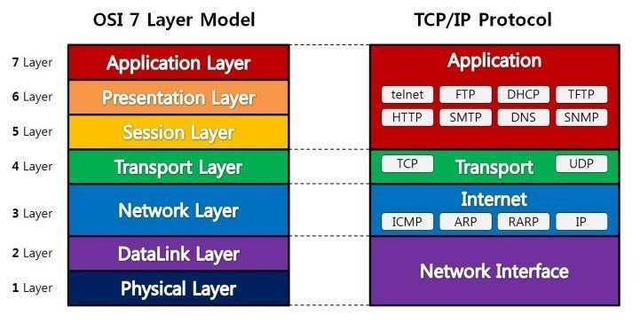

**NETWORK(네트워크)**

---

### **목차**

- [개요](#basic)
- [OSI 7계층](#OSI-7%EA%B3%84%EC%B8%B5)
- [TCP/IP 플로토콜 스택 4계층](#tcp/ip-protocol)
- [TCP/IP 특징](#tcp/ip-specific)
- [주요포트 번호](#important-port-num)
- [HTTP, HTTPS](#http,https)
- [GET, POST](#get,post)
- [ARP 프로토콜(주소 결정 프로토콜)](#arp-protocol)
- [프록시 서버](#proxy-server)
- [브라우저에서 특정 주소를 입력하였을 때 렌더링 되는 과정](#browser-rendering)
- [Multi-Thread 서버](#multi-thread-server)
- [쿠키,세션](#cookie,session)
- [서버확장방법](#server-scale)

---

### <a name = "basic"> 개요</a>

**용어정리**

1. 컴퓨터 네트워크 : 컴퓨터와 컴퓨터를 통신망으로 연결한 것

2. 노드 : 컴퓨터 네트워카상에 연결된 장치

3. 호스트 : 고유 IP주소를 가진 노드

4. 링크 : 물리적으로 노드와 노드를 연결하는 통로

5. 홉 : 거리의 단위, 보통 한 링크를 이동하면 한 홉

6. 경로 : 네트워크 상의 두 노드 간의 이동 경로

7. 프로토콜 : 데이터 통신을 원활하게 하기 위해 필요한 통신 규약

### OSI 7계층

**네트워크에서 통신이 이루어지는 과정을 7단계로 나눈 것**

**이유** 

- 통신이 일어나는 과정을 단계별로 파악하고 문제 발생 시에 필요한 단계만 수정할 수 있음.
- 규격을 정함으로써 설계가 유리하고 모듈화 할 수 있다.
- **용이성, 유지관리의 수월성**

1. 물리계층
   - 전기적, 기계적, 기능적인 특성을 이용해 통신 케이블로 데이터 전송
   - 통신단위 : **비트**(bit) - 0,1로 표현
   - 데이터를 주고 받기만 할 뿐, 데이터가 무엇인지, 에러가 있는지를 파악하지 않음.
   - 장비 : 통신케이블, 리피터, 허브
   - **정리 : 통신 케이블을 통해 데이터를 전송하는 계층, 데이터의 어떠한 것인지 신경쓰지 않음.**
   
2. 데이터 링크계층

   - 물리 계층을 통해 송수신되는 정보의 오류와 흐름을 관리 - **안전한 정보의 전달을 수행을 도와줌**, **오류검출, 회복을 위한 오류 제어, 흐름 제어**
   - **맥주소**를 가지고 통신 (맥 주소는 네트워크 카드가 생성될 때 부여되는 물리적 주소)
   - 통신단위 : **프레임**
   - 장비 : 브릿지, 스위치
   - **CRC**기반의 오류 제어와 흐름 제어 필요 (전송 전 CRC값을 계산하여 데이터에 붙여 보내고 수신 후 CRC값을 재계산하여 값이 일치하는지 여부를 파악함.)
   - **정리 : 송수신하는 정보가 안전하게 전달되도록 하는 서비스 계층, MAC address를 가지고 통신, 오류 검출과 흐름 제어를 통해 안전하게 도달하도록 함.**

3. 네트워크 계층
   - **데이터를 목적지까지 안전하고 빠르게 전달 (라우팅)**
   - 경로와 주소를 정하고 패킷을 전달하는 역할을 한다.
   - 데이터를 연결된 다른 네트워크를 통해 전달함으로써 인터넷이 가능하게 하는 계층
   - 논리적 주소 (IP)를 가진다. 네트워크 관리자가 주소 할당, 계층적인 형태
   - 통신 단위 : **패킷**
   - 데이터는 패킷 안으로 캡슐화, 패킷 헤더는 송신지와 수신지의 주소들을 포함.
   - TCP/IP -> IP계층 
     - IP패킷의 전달 및 라우팅을 담당하는 계층
     - 데이터링크 계층의 하드웨어적 특성에 관계없이 독립적인 역할 수행
     - IP계층 상에 있는 주요 프로토콜 (IP-패킷전달, ICMP-전달의 에러 보고 및 진단, 라우팅-경로를 찾아줌.)
- **정리 : 시스템간 연결성과 경로 선택을 제공하는 역할, IP address를 이용해 라우팅 프로토콜이 연결된 네트워크에서 최적 경로 선택**
  
4. 전송 계층
   - 통신을 활성화하기 위한 계층, 보통 TCP프로토콜 이용, **포트**를 열어준다.

   - 데이터가 오면 하나로 합쳐 5계층에 던져 준다.

   - 특정 연결의 유효성을 제어, 연결 기반이다.

   - **패킷들의 전송이 유효한지 확인하고 전송 실패한 패킷들을 다시 전송한다는 것**

   - **multiplexing** : 전송하려는 데이터를 TCP/UDP 세그먼트로 만들 때 헤더를 추가하여 출발지 포트번호와 목적지 포트번호를 두는 것.

   - **Demultiplexing** : 도착한 세그먼트는 헤더를 확인하여 이 과정을 거친후 대상 소켓에 데이터전달.

   - TCP 프로토콜
     - 양종단 호스트 내 프로세스 상호 간에 신뢰적인 연결지향성 서비스 제공

     - 가상 회선 방식을 제공.

     - **신뢰적인 전송을 보장**

     - Reliable(신뢰성) : 패킷 손실, 중복, 순서 바뀜 등이 없도록 보장

     - Connection-oriented(연결지향적) : 양단간 TCP가 제공하는 연결성 회선을 통해 통신.

     - 3-way handshaking과정을 통해 연결 설정, 4-way handshaking을 통해 해제

     - 3-way handshaking SYNC(Cli) - SYNC+ACK(Ser) - ACK(Cli) 순으로 이루어짐

       

       

     - 4-way handshaking : FIN(Cli)- ACK(Ser) - FIN FLAG(Ser) - ACK(Cli)
       (Client는 server로부터 FIN을 수신하더라도 일정시간동안 세션을 남겨두고 대기)

       

       비정상 종료 사례

       1. colse_wait : 애플리케이션에서 close가 안되어 TCP포트가 계속 CLOSE_WAIT상태로 기다리게 되고 이후에 이런 것들이 계속 쌓이면 이후에 더 이상의 연결을 못하는 경우 발생.
       2. FIN_WAIT1 : ACK를 못받는 상태로 일정 시간이 지나면 TIME OUT으로 자동으로 닫는다. 보통 서버를 찾지 못하는 경우가 많음.
       3. FIN_WAIT2 : ACK이후에 FIN신호를 받지 못하여 기다리는 상태로 이 역시 TIME_OUT이 되면 스스로 닫는다.

     - 스트림 전송으로 전송 데이터의 크기가 무제한

     -  streaming 서비스에 불리함.(만약 패킷이 유실되면 재요청을 해야하므로)

     - 통신 단위 : **세그먼트**

   - UDP프로토콜

     - **신뢰성이 낮은 프로토콜**
     - 가상회선을 굳이 확립할 필요가 없고 유연하며 효율적 응용의 데이타 전송에 사용(비연결형 프로토콜)
     - **비연결성, 신뢰성 없음, 순서화되지 않은 데이터그램**
     - 실시간 응용 및 멀티캐스팅 가능
     - 헤더가 단순(checksum필드를 이용해 최소한의 오류만 검출)
     - 통신단위 : 데이터그램 (독립적인 관계를 지니는 패킷)
     - 서버 소켓과 클라이언트 소켓의 구분이 없음.
     - IP기반으로 데이터 전송.
     - 최대 전송 크기는 65535바이트임.

     

   - **정리 : 최종 시스템 및 호스트 간의 데이터 전송 조율을 담당. 데이터의 용량,속도,목적지 등을 처리**
   
5. 세션 계층

   - 세션 : 둘 이상의 통신 장치나 컴퓨터와 사용자 간의 대화나 송수신 연결상태를 의미하는 보안적인 대화 및 시간대
   - 일정 시간동안 들어오는 일련의 요구를 일정하게 유지시키는 기술이 중요!

   - **데이터가 통신하기 위한 논리적인 연결**
   - 4계층도 연결을 맺고 끊을 수 있기에 어느 계층에서 통신이 끊어졌나 판단하기에는 한계가 있어 4계층과는 무관하게 응용 프로그램 관점에서 봐야한다.
   - **동시 송수신 방식, 반이중 방식, 전이중 방식**의 통신 방법 제공.
   - TCP/IP세션을 만들고 없애는 책임 - 두 HOST 사이에 연결을 제공
   - **포트 연결**이 유효한지 확인하고 설정함
   - 통신 단위 : 메세지
   - **동기 기능, 대화의 기능**을 수행
   - 대화를 관리하기 위해 **토큰**이라는 특수 메세지를 사용. 토큰은 대화 단위를 구분하는 **주동기 토큰**과 대화 내에서 세분화 시켜주는 **부동기 토큰**으로 나뉨.
   - **정리 : 2대의 기기, 컴퓨터 또는 서비 간 대화가 필요할 경우 세션을 만들고 작업을 처리**

6. 표현 계층
   - 데이터 표현이 상이한 응용 프로세스의 독립성 제공, 암호화
   - **MIME인코딩, 암호화** 등을 한다.
   - 사용자 명령어를 완성 및 결과 표현, 포장, 압축, 암호화
   - **정리 : 응용프로그램이나 네트워크를 위해 데이터를 변환하거나 암호화, 복호화한다.**

7. 응용 계층
   - 최종 목적지이다.
   - HTTP, FTP, SMTP, POP3, IMAP, Telnet등과 같은 프로토콜이 있다.
   - 위의 프로토콜을 쉽게 사용할 수 있게 해주는 응용프로그램들이 많다. 
   - **결론적으로 통신의 양 끝단은 프로토콜이지 응용프로그램이 아니다.**
   - **정리 : 사용자에게 보이는 부분으로 웹 브라우저나 응용 프로그램 등이 대표적**

#### <a name = "tcp/ip-protocol">TCP/IP 플로토콜 스택 4계층</a>

1. Network Access Layer
   - OSI 7에서 물리계층, 데이터링크  계층에 해당
   - 네트워크 카드와 디바이스 드라이버 등과 같이 하드웨어적인 요소와 관련되는 모든 것을 지원하는 계층
   - 송신 : 상위 계층에서 전달받은 패킷에 MAC주소를 가진 헤더를 추가하여 프레임 만들고 물리 계층으로 전달.
   - 수신 : 데이터 링크 계층에서 헤더를 제거하여 상위 계층의 네트워크 계층으로 전달.
2. Internet Layer
   - OSI 7에서 네트워크 계층에 해당.
   - 상위 전달 계층에서 받은 데이터에 IP패킷 헤더를 붙여 IP 패킷을 만들어 전송.
   - 통신 노드 간의 IP패킷을 전송하는 기능 및 라우팅 기능 담당.
   - 비연결지향적이며 신뢰할 수 없는 프로토콜 - 매번 경로가 일정치 않다.
3. Host-to-Host
   - OSI 7에서 전송 계층에 해당.
   - 네트워크 양단의 송수신 호스트 사이에서 신뢰성 있는 전송 제공
   - TCP와 UDP프로토콜을 이용한다.
   - 시스템의 논리주소와 포트를 가지고 있어 상위 계층의 프로세스를 연결해서 통신
4. Application Layer
   - 세션, 표현, 애플리케이션 계층에 해당
   - 응용프로그램 등을 이용해 프로토콜과 서비스를 이용하는 인터페이스 제공

#### <a name = "tcp/ip-specific"> TCP/IP 특징</a>

- 오늘날 인터넷 통신의 대부분은 패킷 통신을 기본으로 함.
- 패킷 통신을 위한 인터넷 규약
- IP : 데이터 조각들을 최대한 빨리 목적지로 보내는 역할(주소 - 호스트의 주소)
- TCP : 도착한 조각을 점검하고 순서를 다시 정리함. 이후, 빠진 패킷이 있으면 재요청.
- PORT : 수신 호스트에서 목표 어플리케이션을 식별하는 번호

#### 네트워크 망

- LAN : 한 지역적 공간의 호스트들 끼리 연결되어 있는 소규모 네트워크
- WAN : LAN-LAN의 연결하는 대규모 네트워크

#### <a name = "important-port-num"> 주요포트 번호</a>

- HTTP(80) : 웹을 지원하기 위한 프로토콜, GET,PUT 같은 프로토콜 기능을 포함해 웹 서버에게 어떠한 Content를 요청하고 또는 웹 서버로 정보를 보내는 역할을 수행 (HTTPS(443))
- FTP(20,21) : TCP를 활용해 대량의 파일을 송수신하는 프로토콜
- TFTP(69) : UDP를 사용하는 파일 전송 프로토콜, 주로 장비를 다루는 경우 사용
- Telenet (23) : 원격지에 있는 장비로 표준 터미널 에뮬레이션 기능 제공
- SMTP(25) : 전자메일을 전송하는 프로토콜, 받을 때는 POP3 활용 
- SNMP(161) : 네트워크 장비를 모니터링하고 제어하기 위해 사용하는 프로토콜
- DNS(53) : 도메인 주소를 IP ADDRESS로 변경하는 일

  

#### <a name = "http,https"> HTTP, HTTPS</a>

- 웹 브라우저와 휍 서버 사이의 데이터 통신 규칙
- 웹 페이지의 링크를 클릭하면 브라우저는 HTTP요청 형식에 따라 웹 서버에 데이터를 전송, 웹 서버는 브라우저가 보낸 데이터를 분석하여 요청을 처리 후 응답
- HTTP : TCP -> HTTP / HTTPS : TCP -> SSL -> HTTP
- SSL 프로토콜은 정보 암호화시 공개키와 개인키라는 두가지 키를 이용.
- HTTP구조
  - 요청
    - 요청라인 : GET,POST(method), URI(인터넷에 있는 자원을 나타내는 유일한 주소), HTTP버전
    - 요청헤더  : accept, cookie, conent-type, content-length, ifmodifysince
    - 요청바디 : 엔티티
  - 응답
    - 응답라인 : 버전, 상태코드, 상태 메세지
    - 응답 헤더 : content-type, content-length, set-cookie, etag
    - 응답 바디 : HTML, JSON, Octet stream등이 있음.

- HTTPS는 암호화에 따른 속도 저하 문제가 있음.
- 상태코드
  - 200 : 성공(대부분 성공을 의미)
  - 300 : 리다이렉션(이전주소로 데이터를 요청해 새 URL로 리다이렉트를 유도하는 경우)
  - 400 : 클라이언트 에러 (유효하지 않은 자원을 요청했거나 권한이 잘못된 경우)
  - 500 : 서버에러(서버에 오류가 난 경우. 503 - 서버 과부한)

#### <a name = "get,post"> GET, POST</a>

- HTTP프로토콜을 이용해서 서버에 요청할 때 사용. 
- GET 
  - URL을 통해 모든 파라미터 전달 (중요한 정보가 유출될 수 있어 문제 발생.)
  - URL에 길이 제한이 있어 많은 데이터 전달 X
  - 어떤 데이터를 조회해 보여주는 용도에 주로 사용.
- POST
  - 정보가 HTTP BODY에 포함되어 전달(노출 X)
  - 길이 제한이 없음.
  - 서버의 값이나 상태를 바꾸기 위해 사용

#### <a name = "arp-protocol"> ARP 프로토콜(주소 결정 프로토콜)</a>

- 네트워크 상에서 IP주소를 물리적 네트워크 주소로 대응시키기 위해 사용되는 프로토콜.
- IP(3계층) -> MAC(2계층)으로 대응시킬 때 사용.

#### <a name = "proxy-server"> 프록시 서버</a>

- 컴퓨터 네트워크에서 다른 서버 상의 자원을 찾는 클라이언트로부터 요청을 받아 중계하는 서버. 
- 요청된 자원들이 캐시로 임시 저장된다. 이후 재요청을 하게 되면 원격서버에 접속할 필요 없이 프록시 서버 내의 정보를 제공 받음.
- 위의 장점을 활용해 병목현상을 줄일 수 있다.
- 만약 데이터가 자주 갱신되는 서버의 경우 캐시 만료기간을 설정해두어 만료기간 이전에는 프록시에서 이후에는 서버에 재요청 할 수 있도록 하면된다.

#### <a name = "browser-rendering"> 브라우저에서 특정 주소를 입력하였을 때 렌더링 되는 과정</a>

1. **DNS를 통해 도메인을 아이피로 바꾼다. 이때 DNS서버는 (Local - Root - TLD ...등을 거치면 알아낸다.)**
2. **ARP를 이용해 IP와 MAC주소 획득(이는 IP를 이용해 물리적인 네트워크 주소를 알아낸것.)**
3. **도메인의 프로토콜에 맞는 포트를 가져와 소켓 스트림을 요청.**
4. **전송계층에서 CLIENT의 포트를 할당하여 헤더에 축가한 세그먼트를 만든후 네트워크로**
5. **네트워크에서는 목적 IP와 CLIENT의 IP주소가 삽입된 패킷을 생성한 후 데이터 링크로**
6. **데이터 링크 계층에서는 MAC주소를 헤더에 추가한 프레임을 만들고 물리계층으로**
7. **물리 계층은 이를 전기적인 신호로 서버에 전달.**
8. **이러한 과정을 통해 TCP연결이 이루어져 3HANDSHAKING이 일어나 연결완료**
9. **이후, HTTP요청을 보낸다.**
10. **HTTP요청에 따른 응답으로 받아온 데이터를 파싱하여 렌더트리를 구성하고 렌더링하는 과정을 거쳐 사용자에게 보여줌.**

#### <a name = "multi-thread-server">Multi-Thread 서버</a>

1. listen socket을 통해 클라이언트가 들어오면 자식 프로세스를 만드는 것이 아닌 쓰레드를 만드는 것.
2. 만들어진 쓰레드를 이용해 클라이언트의 요청을 처리하는 것
3. 멀티 프로세스보다 좀 더 작고 빠르게 동작하지만 디버깅이 힘들고 하나의 쓰레드가 문제가 생기면 전체 프로세스에 영향을 끼칠 수 있음.

#### <a name = "cookie,session">쿠키,세션 </a>

**쿠키과 세션을 사용하는 이유**

- HTTP프로토콜의 특징이자 약점을 보완하기 위해서 사용한다.

- 특징

  - Connectionless : request에 대한 response를 보내고 접속을 끊는 특성이 있다.

  - Stateless : 통신이 끝나며 상태 정보는 유지하지 않는다.

    만약, 쿠키와 세션이 없으면 페이지를 이동할 때마다 계속 로그인 해야함. 이를 해결하고 로그인 인증을 유지하게 해주는 것이 쿠키와 세션.

**쿠키**

- 로컬에 저장되는 키와 값이 들어있는 작은 데이터 파일.
- 데이터 : 이름, 값, 만료날짜, 경로 정보, 도메인
- 만료기간이 있는 것은 일정기간만 사용할 수 있도록 하는것, 만약 최신화가 되면 데이터를 갱신해야하기 때문에. => 로그인 상태 유지에도 활용됨.
- 쿠키는 클라이언트의 상태 정보를 로컬에 저장했다가 참조한다.
- **동작 프로세스**
  - 클라이언트가 페이지를 요청
  - 서버에서 쿠키를 생성
  - HTTP헤더에 쿠키를 포함 시켜 응답
  - 브라우저가 종료되어도 쿠키 만료 기간이 있다면 클라이언트가 보관
  - 같은 요청을 할 경우 HTTP헤더에 쿠키를 함께 보냄
  - 서버에서 쿠키를 읽어 이전 상태 정보를 변경할 필요가 있을 때 쿠키를 업데이트 하여 변경된 쿠키를 HTTP헤더에 포함시켜 응답.
- **사용 예시**
  - 방문 사이트 로그인 시, '아이디와 비밀번호 저장'
  - 쇼핑몰 장바구니 기능
  - 자동로그인 및 팝업 체크

**세션**

- 쿠키를 기반하지만 정보를 서버가 관리하는 것.
- 일정 시간동안 같은 브라우저로부터 들어오는 일련의 요구를 하나의 상태로 보고 그  인증 상태를 유지하는 기술.
- 웹 서버에 접속한 이후 브라우저를 종료할 때 까지 유지되는 상태
- 접속 시간에 제한을 두어 일정 시간 응답이 없다면 정보가 유지되지 않게 설정 가능.
- 클라이언트가 request를 보내면, 해당 서버의 엔진이 클라이언트에게 유일한 ID부여
- 서버가 정보를 저장하기에 동 접속자 수가 많으면 서버에 과부하를 주게 되므로 성능 저하의 요인이 된다.
- 보안 면에서는 쿠키보다 우수.
- **동작 프로세스**
  - 클라이언트가 서버에 접속시 세션 ID발급, 클라이언트 상태 저장.
  - 서버가 부여한 ID를 클라이언트가 쿠키로 저장해 사용.
  - 클라이언트는 다시 접속할 때, 이 쿠키를 이용해 세션 ID값을 서버에 전달.
  - 서버는 세션 ID를 전달 받아서 별다른 작업없이 세션 ID로 세션에 있는 클라이언트 정보를 가져옴.
  - 이를 가지고 요청을 처리하며 클라이언트에게 응답을 한다.

- **사용 예시**
  - 로그인 같이 보안상 중요한 작업을 할때 사용.

**쿠키와 세션의 차이**

- 저장위치 : 쿠키 - 로컬 / 세션(ID) - 서버
- 속도 : 쿠키 > 세션 (세션은 서버에서 처리해야하므로 시간이 더 오래 걸림.)
- 보안 : 쿠키 < 세션 (쿠키는 로컬에서 저장되고 관리되어 변질되거나 스니핑 당할 우려가 있음.)
- 저장 기간 
  - 쿠키 : 파일로 저장되므로 브라우저를 종료해도 계속해서 정보가 남아있을 수 있음.
  - 세션 : 브라우저가 종료되면 만료시간 상관없이 삭제

**쿠키/세션과 캐시의 차이점**

- 캐시는 이미지나 CSS,JS파일 등을 브라우저나 서버 앞 단에 저장해놓고 사용하는 것.
- 한번 캐시에 저장되면 브라우저를 참고하기에 서버에서 변경되어도 사용자는 변경되지 않게 보일 수 있음.
- 변경을 할 때는 캐시를 지워주거나 서버가 클라이언트로 응답을 보낼 때 header에 캐시 만료 시간을 명시하는 방법등을 이용하면 알 수 있다.

### <a name = "server-scale">서버확장방법</a>

1. **scale up  **
   - 서버의 성능을 높이는 것임.
   - 서버가 하나이므로 만약 장애가 발생하면 전체 시스템에 영향을 줄 수 있음.
   - 한대가 모든 데이터를 처리하므로 데이터 갱신이 빈번하게 일어나는 "데이터베이스 서버"에 적합한 방식.
2. **scale out**
   - 서버를 여러 대 추가하여 시스템을 확장하는 방법
   - 동일한 성능을 가진 서버를 추가하는 것으로 부하를 균등하게 해주는 "**로드밸런싱**"이 필수적으로 동반되어야 함.
   - 여러 서버 중 하나가 장애를 일으켜도 다른 서버로 서비스를 제공할 수 있다는 장점이 있음.
   - 데이터 변화가 적은 웹 서버에 적합한 방식.

**로드밸런싱**

- **라운드 로빈(Round Robin Method)**
  - 서버에 들어온 요청 순서대로 돌아가며 배정하는 방식
  - 여러 대의 서버가 동일한 스펙을 가지며 서버와의 연결이 오래 지속되지 않는 경우에 활용하기 적합함.
- **가중 라운드 로빈(Weighted Round Robin Method)**
  - 각각의 서버마다 가중치를 매기고 가중치가 높은 서버에 클라이언트 요청을 우선적으로 배분.
  - 서버별 트래픽 처리 능력이 상이한 경우 이용.
- **IP해시 (IP Hash Method)**
  - 사용자의 IP를 해싱해 분배함.
  - 사용자별로 항사 같은 서버로 연결되는 것을 보장.
- **최소 연결(Least Connection Method)**
  - 요청이 들어온 시점에 가장 적은 연결상태를 보이는 서버에 트래픽 배분.
  - 자주 세션이 길어지거나, 서버에 분배된 트래픽들이 일정하지 않은 경우에 적합.
- **최소 리스폰타임(Least Response Time)**
  - 서버의 현재 연결 상태와 응답시간을 모두 고려하여 트래픽 배분.
  - 가장 적은 연결 상태와 짧은 응답시간을 보이는 서버에 우선 배분.

**로드밸런서** 

- 한대의 서버에서 각기 다른 포트 번호를 부여하여 다수의 서버 프로그램을 운영하는 경우라면 L4로드밸런서 이상을 사용해야함.

- **L4로드밸런서**
  - 네트워크 계층이나 전송 계층의 정보(TCP/UDP포트 정보)를 바탕으로 로드를 분산
  - 데이터를 보지 않고 패킷 레벨에서만 로드를 분산하기에 빠르고 효율이 높음.
  - 데이터 내용을 복호화할 필요가 없어 안전
  - 가격이 저렴
  - 패킷의 내용을 볼 수 없어 섬세한 라우팅이 불가.
  - 사용자의 IP가 수시로 바뀌는 경우라면 연속적인 서비스를 제공하기 어려움.
- **L7로드밸런서**
  -  애플리케이션 계층(HTTP, FTP, SMTP)에서 로드를 분산하기 때문에 HTTP헤더, 쿠키 등과 같은 사용자의 요청을 기준으로 특정 서버에 트래픽을 분산.
  - 특정한 패턴을 지닌 바이러스를 감지해 네트워크를 보호할 수 있으며, Dos/DDos와 같은 비정상적인 트래픽을 필터링할 수 있음.
  - 상위 계층에서 로드를 분산하기에 섬세한 라우팅 가능.
  - 캐싱 기능을 제공.
  - 패킷의 내용을 복호화해야하므로 높은 비용을 지불

reference

1. https://brunch.co.kr/@toughrogrammer/16
2. https://shlee0882.tistory.com/110
3. https://mangkyu.tistory.com/15
4. https://djswpsk1024.tistory.com/34
5. https://kadamon.tistory.com/22
6. https://jeong-pro.tistory.com/80
7. https://interconnection.tistory.com/74
8. https://interconnection.tistory.com/74
9. http://library.gabia.com/contents/infrahosting/1222
10. https://post.naver.com/viewer/postView.nhn?volumeNo=27046347&memberNo=2521903
11. https://sjh836.tistory.com/81