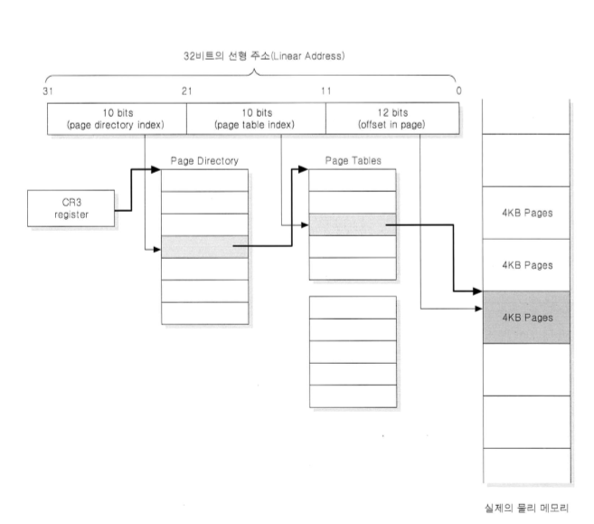

# 운영체제

**목차**

- [프로세스와 쓰레드](#process-thread)
- [CPU 스케줄링](#cpu-scheduling)
- [프로세스 동기화](#process-synchronize)
- [메모리관리](#memory-management)

---

## <a name = "process-thread"> 프로세스와 쓰레드 </a>

**프로세스**

- 연속적으로 실행중인 프로그램.
- 각 프로세는 메모리에 적재 가능하며 CPU의 할당을 받을 수 있음.

 

**구성요소**

- Code 영역 : 소스 코드 등
- Stack 영역 : 지역 변수, 매개 변수, 리턴 값 등 임시 데이터로 사용.
- Data 영역 : 전역 변수, 정적 변수, 배열, 구조체 등
- heap 영역 : 동적 변수 등

 

**상태**

- new : 프로세스 생성
- running : 프로세스 동작 중.
- waiting : 특정 이벤트 발생 시 대기 상태.
- ready : CPU할당 받기 위해 대기.
- terminate : 실행 종료.

 

**PCB(프로세스 제어 블럭)**

- 프로세스의 정보를 담고 있는 자료구조.
- 프로세스가 생성될 때 고유한 PCB를 가지게 되며 상태변화가 일어날 때 PCB값이 변화한다. 프로세스가 완료되면 PCB도 함께 삭제.
- 구성요소
  - Process state : ready, running 등등
  - Process number : 프로세스 id
  - Program counter : 다음 실행할 명령어 주소
  - CPU registers
  - CPU scheduling information : 우선 순위, 최종 실행시각, CPU 점유시간 등
  - Memory-management information : 해당 프로세스의 주소 공간 등
  - Accounting information : 페이지 테이블, 스케줄링 큐 포인터, 소유자, 부모 등
  - I/O status information : 프로세스에 할당된 입출력장치 목록, 열린 파일 목록 등

 

**프로세스 스케줄링**

- **장기 스케줄러**
  - 메모리와 디스크 사이의 스케줄링을 담당.
  - 프로세스를 메모리에 올림으로써 new->ready 상태 변환.
  - 메모리에 여러 프로그램이 올라가는 것을 제어하는 것.
- **단기 스케줄러**
  - CPU와 메모리 사이의 스케줄링을 담당.
  - ready queue에 존재하는 프로세스 중 어떤 프로세를 running시킬지 결정.
    (보통 가장 먼저 도착한 프로세스부터 cpu할당 => dispatcher)
  - ready -> running 상태 변환.
- **중기 스케줄러**
  - 메모리와 디스크 사이에서 스케줄링을 담당.
  - 프로세스가 들어오면 바로 메모리에 올림.
  - 메모리 내에서 CPU 할당을 위한 경쟁이 심화되면 swapping 기법을 이용해 프로세스를 디스크로 내려서 경쟁을 제어함.

 

**IPC(inter process communication)**

- 프로세스 간 통신을 도와주는 것.

- 프로세스는 완전한 독립 실행 객체이다. 다른 프로세스의 영향을 받지 않는다는 장점이 있지만 통신이 어렵다는 문제가 있다. => IPC를 이용해 통신을 한다.
- **모델**
  - **공유 메모리**(공유메모리 방법)
    - 두 개 이상의 프로세스들이 메모리 공간의 일부를 공유.
    - IPC속도가 빠르다. / 프로그램 레벨에서 통신 기능 제공 / 자유로운 통신 가능.
    - 구현하기 어려움.
    - 프로세스가 CPU를 사용하는 행위이므로 IPC를 한다고 해서 context switch가 많이 일어나지는 않는다.
    - 동시에 메모리에 접근하지 않도록 방법을 마련해야함. locking이나 세마포어 등
  - **메세지 전달**(pipe, socket 등의 방법)
    - 커널을 경유하여 고정길이 메세지, 가변길이 메세지를 송수신한다.
    - 메모리 공유없이 동작 가능.
    - 구현하기에 간단하여 사용하기 편리
    - 커널을 경유해야하므로, 속도가 느리다.
    - IPC를 할 때마다 send하면 받을 때까지 기다려야 하므로 context swtich가 일어나고 receive하면 상대방이 보낼 때까지 기다려야 하므로 context switch가 일어난다.
    - 커널이 동기화를 제공하기 때문에 동기화 고려는 하지 않아도됨.

   

**쓰레드**

- 프로세스 내에서 실제로 작업을 수행하는 주체를 의미.
- 모든 프로세스는 한 개 이상의 쓰레드를 가지고 있다.
- **구성요소**
  - PC(program counter)
  - resgister set
  - stack space
  - **공유 자원 : code, data, file**
- 쓰레드별 독립적으로 함수 호출이 가능하고 이는 독립적인 실행 흐름이 가능하다는 것이다. 이를 위해 스택 메모리는 각각의 쓰레드가 따로 가지고 있다.
- 멀티 쓰레드 장점 
  - **사용자에 대한 응답성 증가** : 모든 쓰레드가 멈추지 않는 이상 계속해서 작업이 진행되기에 사용자에 대한 응답성 증가.
  - **프로세스의 자원과 메모리 공유 가능** : 프로세스의 자원과 메모리를 공유하므로 공통된 자원을 많이 이용하는 경우에는 context switch가 덜 일어나 성능을 향상 시킬 수 있다.
- 멀티 쓰레드 단점
  - 안정성이 중요한 작업에서는 어울리지 않는다. 하나의 쓰레드가 문제가 생기면 전체 프로세스가 영향을 받을 수 있음.
  - 반면, 프로세스는 독립적인 객체이므로 하나의 프로세스가 문제가 생겨도 다른 프로세스는 영향을 받지 않음.

 

## <a name = "cpu-scheduling"> CPU 스케줄링 </a>

**어떤 프로세스에 CPU를 할당할 것인지 정하는 것이 CPU 스케줄링이다.**

**선점, 비선점**

- 선점 : 운영체제가 강제로 프로세스로부터 CPU를 가져와 다른 프로세스에 할당하는 것.
- 비선점 : 프로세스가 종료되거나 IO request가 발생할 때 까지 대기하다가 다른 프로세스에 CPU할당.

**FCFS(first come first serve)**

- ready queue에 있는 순서대로 cpu를 할당.
- 프로세스의 처리 순서에 따라서 성능이 크게 달라질 수 있다.
- 비선점 스케줄링

**SJF(Shortest jop first)**

- 수행 시간이 가장 짧은 프로세스부터 CPU할당.
- 수행시간이 길은 프로세스는 CPU를 할당받지 못해서 기아현상이 발생.
- 이를 예방하기 위해 aging 기법을 통해 우선순위를 조정해주기도 함.
- 비선점 스케줄링 

**SRTF(Shortest Remaining Time First)**

- 프로세스의 남은 수행 시간이 짧은 순서에 따라 할당.
- 프로세스 실행 중간에 더 짧은 burst time을 가지는 프로세스가 들어오면 context switch발생.
- 지속적으로 프로세스 burst time을 관찰하고 context switch가 발생하는 오버헤드가 있다.
- 선점 스케줄링 

**Priority Scheduling**

- 특정 기준으로 우선순위를 부여해 그 순서에 따라 할당하는 방식.
- 프로세스 나이를 기준으로 우선순위를 결정하고 aging방식으로 기아문제를 해결.
- 선점과 비선점이 모두 가능하다.
  - 선점 : 더 높은 우선순위가 생기면 context switch발생.
  - 비선점 : 더 높은 우선순위가 생기면 ready queue의 head에 프로세스를 위치.

**Round Robin**

- 프로세스들 사이에 우선순위를 두지 않고 time quantum으로 공정하게 프로세스를 반복 실행하는 것.
- response time이 빨라진다.
- context switch에 대한 오버헤드가 커진다.
- 선점 스케줄링

**Multi-level queue**

- 작업들을 여러 종류의 그룹으로 나누어 여러 queue에 넣는다.
- queue별로 독립적인 우선순위와 스케줄링 정책 사용.
- queue에 절대적 우선순위 존재.

**Multi-level feedback queue**

- 여러 queue를 가지고 있으며 점진적으로 queue를 이동해가는 것.
- 각 큐마다 다른 스케줄링 정책을 가지고 있다.
- 모든 프로세스는 초기에 가장 상위 queue로 들어온다.
- aging기법이나 boost방법을 이용해 기아문제를 해결한다.

  

## <a name ="process-synchronize">프로세스 동기화</a>

**프로세스들이 공유하는 데이터의 일관성을 보장하며 실행 순서 규칙을 보장하기 위한 방법.**

**Race Condition**

- 공유된 자원의 둘 이상의 입력 또는 조작의 타이밍이나 순서 등이 결과값에 영향을 줄 수 있는 상태.

**Critical Section**

- 공유 데이터에 접근하는 코드 블럭.
- 여러 프로세스가 동시에 데이터에 접근면 일관성 문제가 생길 수 있으므로 한번에 하나의 프로세스만 접근할 수 있도록 해야함.

**critical section problem**

- 해결 조건
  1. mutual exclusion
     프로세스 A가 임계 구역에서 돌고 있으면, 다른 프로세스들은 임계 구역에서 수행될 수 없다.
  2. progress
     임계구역에 프로세스가 없으면 대기하는 프로세스 중에 하나는 곧바로 임계 구역에 진입되어야 한다.
  3. bounded waiting
     임계 영역을 요청한 프로세스는 무제한 대기 되어서는 안되며, 제한된 대기 시간을 가져야한다.
- 피터슨 알고리즘 : 위의 3가지 조건을 충족하며 flag와 turn 변수를 사용.
  - 2개의 프로세스에 대해 문제를 해결할 수 있으나 burst time동안 while문을 통해 대기하므로 busy waiting문제가 발생한다.

**Mutex(상호배제)**

- 공유된 자원에 여러 프로세스나 쓰레드가 접근하는 거을 막아준다.
- aging기법을 도입해서 기아문제를 해결한다.

- 프로세스가 lock을 걸고 들어가면 해당 프로세스만 lock을 풀 수 있다. locking과 unlocking은 atomic하게 일어난다.

**세마포어**

- 뮤텍스와 유사하게 작동하나 프로세스의 개수를 counting할 수 있다.
- 프로세스 개수를 counting하여 여러 프로세스가 동시에 사용할 수 있도록한다.

|      | 세마포어                           | 뮤텍스                                               |
| ---- | ---------------------------------- | ---------------------------------------------------- |
| 개수 | 여러개                             | 하나                                                 |
| 소유 | X                                  | O                                                    |
| 변화 | 뮤텍스로 변경 가능                 | 세마포어로 변경 불가                                 |
| 해제 | 다른 프로세스나 쓰레드가 해제 가능 | 뮤텍스를 소유하고 있는 프로세스나 쓰레드만 해체 가능 |

**우선순위 역전**

- 우선순위가 낮은 프로세스 때문에 우선순위가 높은 프로세스가 실행되지 않는 현상.

  

  프로세스 C가 sem-a를 가지고 있는데 block이 걸리고 프로세스A까지 실행되지 못하게 되는 상황이다. 이런 경우 C의 우선순위를 조절해 주는 것이 필요.

  

  ​	이처럼 조절하면 C가 실행된 이후 A가 정상적으로 실행된다.

**교착상태**

- 발생조건

  1. **Mutual exclusion**: 오직 하나의 프로세스만 하나의 자원을 사용할 수 있다. 적어도 하나의 자원은 공유가 불가능한 자원이다.
  2. **no preemeption**: 중간에 끊을 수 없는 상황, 이미 할당된 자원이 갑자기 반납되어서는 안된다. 프로세스가 스스로 반납.
  3. **Hold and wait**: 적어도 하나의 자원을 보유한 프로세스가 다른 프로세스의 자원을 추가로 얻기를 기다릴 때
  4. **circular wait**: 프로세스들이 자원을 소유하고 요청하는 형태가 원형을 이룰 때를 말한다. 각 프로세스에는 하나의 자원이 할당되어있고, P1은 P2자원을 기다림, P2는 P3자원을 기다림, P3는 P1자원을 기다릴 때 원형을 이룬다.

- 예방 조건

  **(1) Mutual Exclusion 부정**

   사실 이 조건을 충족시키지 않는 방법은 존재하지 않는다.

   애초에 자원에 동시 접근이 불가능하기 때문에 동시에 접근을 하게 하는것은 불가능

  **(2) Hold and Wait 부정**

   프로세스가 자원을 요청할 때는 항상 어느 자원도 소유하고 있지 않게 해야 한다.

   프로세스가 실행되기 전에 필요한 자원들을 모두 요청하고 할당받아야 한다.

  → 할당된 모든 자원이 바로 사용되지 않기에 자원의 이용도가 낮을 수 있다.

  → 우선순위가 낮은 프로세스들은 자원을 할당받지 못하는 시간이 길어지는 Starvation 문제가 생길 가능성도 생긴다.

  **(3) No Preemption 부정**

   1번 resource를 잡고있는 process가 2번 resource를 요청했을 때 바로 받을 수 없다면 1번과 (다른 프로세스에 게 할당된) 2번 모두 release 하도록 한다. release함으로써 preemption이 되어버린다.

   또한, 프로세스는 요청 중인 새로운 자원을(2번) 할당받고 또한 대기 중에 선점되었던(끊겼던) 모든 자원(1번)을 회복할 때에만 다시 시작할 수 있다.

  **(4) Circular Wait 부정**

   resource에 ordering(순서)을 부여하여 순서에 맞게 resource를 요청할 수 있고 할당받을 수 있게 한다. 동시에 요청 불가능하기에 원형을 이룰 수 없다.

  

## <a name = "memory-management"> 메모리 관리 </a>

**프로세스가 메모리에 적재되어야 실행이 가능하다. 한정된 공간의 메모리를 효율적으로 관리를 하며 사용해야한다.**

**가상메모리**

- 한정된 크기의 메모리내에서 최대한 많은 프로세스를 할당하여 효율적으로 사용하기 위해 만든 기술.
- 보조 기억장치를 주기억장치처럼 사용할 수 있다.
- **장점**
  - 더 많은 프로그램을 실행할 수 있다.
  - 실제 물리 메모리의 크기에 제한을 받지 않는다.
  - 프로그램의 swap에 필요한 입출력 감소.(일부만 swap하도록 처리)
- 32bit 머신은 4GB의 가상메모리 공간을 가진다. (기본 저장 단위가 1Byte인 머신에서 32bit로 표현 가능한 범위가 4GB)

**페이징 기법**

- 프로세스를 일정 크기인 페이지로 잘라서 메모리에 적재하는 방식.
- 실제 메모리는 프레임이라는 단위로 분할하고 가상메모리는 페이지단위로 분할한다. 프레임과 페이지의 사이즈는 같아야한다.
- 이후 페이지를 프레임에 할당해야하는데 연속적으로 할당되지 않아도 괜찮다. MMU 재배치 레지스터의 값이 연속적인 순서대로 읽어올 수 있도록 도와준다.
- 내부단편화 문제가 발생한다.(실제 프로세스의 크기가 페이지 크기의 배수로 떨어지지 않을 경우.)
- TLB가 존재하여 TLB에 최근에 참조한 page를 저장하고 있기 때문에 우선적으로 참조하게 되고 있을 경우 page table을 안봐도 되는 이점이 있다.

**세그먼트 기법**

- 프로세스를 페이지 단위로 나누는 것이 아닌 내용단위로 분할한다.
- mmu의 도움으로 연속된 세그먼트를 이용한다.
- 세그먼트별로 r,w,x의 비트를 만들어 접근을 제어한다.
- 세그먼트 별로 사이즈가 다르기 때무에 외부 단편화가 발생한다.

페이지와 세그먼트의 장점을 합친 **세그먼트 페이징 기법**을 주로 사용한다. 내용 단위로 분할하여 보호와 공유에서 이점을 취하고 이를 page단위로 분할하여 외부단편화로 인한 메모리 낭비가 되는 것을 방지한다. 그러나 두 과정을 모두 거쳐야하므로 속도면에서는 약간 떨어질 수 있다.

reference

1. https://github.com/Code-Diary/CS-diary/blob/master/OS.md#Synchronization

2. https://jinhyy.tistory.com/34