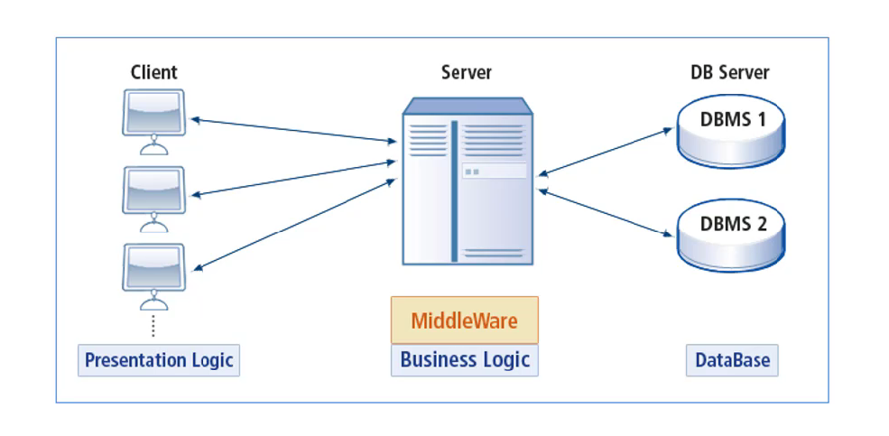

# 웹 프로그래밍

*해당 자료는 [부스트코스 웹프로그래밍](https://www.edwith.org/boostcourse-web)에 기반을 두고 있음.*

 

### 목차

##### [1. 웹프로그래밍 기초 ](#웹프로그래밍-기초)

 

### 웹프로그래밍 기초

---

#### 프로그래밍 언어

- 저급언어
- 고급언어
- 컴파일러

##### 저급언어

- 2진수로 이뤄진 값으로 작성하는 프로그래밍 언어를 **기계어**라고 함.
- 기호로 작성된 언어를 **어셈블리어**라고 하며 이를 숫자로 바꿔주는 것을 **컴파일러**라고 한다.

##### 고급언어

- 사람 중심의 언어
- **컴파일러**를 이용하여 소스코드를 번역한다.

##### 웹관련언어

1. Python : 입문자가 읽기 쉽고 적은 코드를 사용하여 프로그램을 개발할 수 있음.
2. PHP : 웹의 80% 이상이 PHP로 만들어졌다고 함.
3. JavaScript : 초기에는 브라우저에서 동작하는 언어였으며 현재는 서버에서도 작성하는 프로그램으로 영역확대.
4. Java : 엔터프라이즈 소프트웨어 환경에 잘 맞는 언어
5. Ruby : 빠른 개발에 널리 사용되며, 단순함과 세련된 웹 어플리케이션을 만들 수 있음.

#### 웹의 동작(HTTP프로토콜 이해)

**인터넷(네트웍 통신)의 이해**

- 물리적인 하나의 컴퓨터에 여러개의 서버가 동작가능

- 각각의 서버는 각각의 포트를 가지고 있음
- TCP/IP라는 약속으로 연결되어 있는 경우가 많음.

**HTTP**

- HTTP는 서버와 클라이언트가 인터넷상에서 데이터를 주고 받기 위한 프로토콜(protocol)입니다.
- 현재는 version2까지 나옴.
- 기본 포트값 80번

- 작동방식
  - 서버/클라이언트 모델을 따름
  - 클라이언트가 요청을 서버에 요청을 보내고 서버가 응답을 보내는 것
  - 서버는 응답을 하고나면 연결을 끊어버림.
  - **장점** : 불특정 다수를 대상으로하는 서비스에 적합함. 계속적으로 연결된 상태가 아니기에 최대 연결 수보다 훨씬 많은 요청과 응답을 처리할 수 있음.
  - **단점** : 연결을 끊기에 클라이언트의 이전상황을 알 수 없음. 이러한 특징을 무상태(stateless)라고 함. 정보유지를 위해서 쿠키라는 개념도입.

**URL**

- 인터넷 상 자원의 위치를 나타내기 위해서 사용
- 프로토콜의 종류 + 자원이 있는 서버의 **IP(도메인주소)** + 자원의 위치
  **총 3가지**로 구분이 되어 있음.

**HTTP - HTTPS의 차이**

https의 경우 보안이 강화된 http통신을 의미하며, 통신시 인증 및 암호가 요구된다. 그러므로 강력한 보안이 필요한 전자상거래 등에 이용된다.

#### 웹 Front-End, Back-End

##### 프론트엔드

사용자에게 웹을 통해 다양한 콘텐츠(문서, 동영상, 사진등)을 제공한다. 또한 사용자의 요청(요구사항)에 반응해서 동작한다.

**프론트 엔드 구조**

- 적절한 배치와 일관된 디자인등과같이 잘 구조화 하여서 만들어야함.
- 가독성이 좋게 디자인하는 것이 좋다. 사용자의 요청을 잘 반영해야함.
- HTML(구조를 결정함) 
- CSS(디자인적 요소 결정)
- JavaScript(요청 반영-동적제어) - 상대적으로 복잡한 interactive를 담고있음.

##### 백엔드

서버입장에서 개발이 진행, 프론트엔드로 부터 요청을 받고 그에 대한 결과를 넘겨주는 역할을 한다.

#### Browser의 동작

서버에서 전송한 데이터가 클라이언트에 도착해야 할 곳은 Browser이다.

- 서버와 HTTP로 정보를 주고 받을 수 있는 네트워크 모듈도 포함.

- 서버에서 받은 문서(html, css 등)를 해석하고 실행하는 parser도 있음.
- 브라우저 별로 각기 다른 엔진을 포함.

<browser component>

<browser flow>

<예시 - 사파리 브라우저에서 처리되는 webkit 렌더링 엔진의 처리과정>

HTML + CSS = Render tree

만약 브라우저 탐색 시 스크롤이나 화면의 위치 변경이 일어나더라도 처음부터 모든 과정이 이루어지는 것이 아닌 render tree의 값을 변경하여 새로 display를 해준다. 여기서 캐시나 쿠키에 저장을 하면 더욱 효율적으로 사용 가능.

reference : https://www.html5rocks.com/en/tutorials/internals/howbrowserswork/

#### Browser에서의 웹 개발

- html코드 사이에 자바스크립트 코드와 css코드가 존재할 수 있다.

- HTML문서는 html태그로 시작해 html태그로 끝남.

- head는 HTML의 추가적인 설명(자세한 문서에 대한 정보)을 담고있음.

- body는 화면에 표현되어야할 정보가 포함.

- HTML은 계층적.

- HTML은 tag를 사용하여 표현한다.
- javascript코드는 보통 body아래에 위치시켜주는 것이 일반적
  (렌더링을 방해할 수 있기 때문에)
- css는 head에 위치시키는 것이 일반적임.

#### 웹서버

- 웹 서버는 소프트웨어를 말하지만, 웹 서버 소프트웨어가 동작한느 컴퓨터도 의미한다.

- 웹 서버의 가장 중요한 기능은 client가 요청하는 html문서나 각종 리소스를 전달하는 것입니다.
- 웹 브라우저나 웹 크롤러가 요청하는 리소스는 컴퓨터에 저장되어 있는 정적인 데이터이거나 동적인 결과가 될 수 있다.
- **웹크롤러** : 네이버나 구글 같은 포털에서 다른 웹사이트 정보를 읽어갈 때 사용하는 소프트웨어

**웹 서버 소프트웨어의 종류**

* apache가 가장 대표적인 소프트웨어
  * 거의 대부분 운영체제에서 사용 가능
  * 오픈소스 소프트웨어
* nginx 지속적으로 성장을 하고 있는 소프트웨어
  * 차세대 웹서버로 불리면 더 적은 자원으로 더 빠르게 데이터를 서비스
  * 오픈소스 소프트웨어

#### WAS(web application server)

**클라이언트 / 서버 구조**

클라이언트 - 서비스를 요청하고 제공받는 대상

서버 - 요청된 서비스에 대한 처리를 하고 제공하는 대상

**DBMS**

- 다수의 사용자들이 데이터베이스 내의 데이터를 접근할 수 있도록 해주는 소프트웨어

- 개발자들이 매우 편리하게 데이터를 관리할 수 있게 되었음.

**미들웨어**

- 클라이언트와 DBMS사에 별도의 서버를 운영
- 클라이언트 쪽에 비즈니스 로직이 많을 경우, 클라이언트 관리 비용이 증가하는 문제 발생.
  => 미들웨어를 통해 클라이언트는 입,출력만 담당하면 된다.

**WAS**

- 일종의 미들웨어로 웹 클라이언트의 요청 중 보통 웹 애플리케이션이 동작하도록 지원하는 목적을 가짐.
- 초기에는 정적인 것만 제공하다가 동적인 것을 제공할 필요가 있어져 생겨남.

**WAS 기능**

1. 프로그램 실행환경과 DB접속 기능을 제공.
2. 여러개의 트랜잭션을 관리
3. 업무를 처리하는 비즈니스 로직을 수행
4. 웹서버의 기능도 제공
   (was tomcat만 설치하여 사용 가능한 이유)

**웹서버, was의 차이점**

- was도 보통 자체적으로 웹 서버 기능을 내장
- 과거에는 was의 웹서버의 성능이 좋지 않아 별도의 웹서버를 설치했었음.
- 현재는 was가 가지고 있는 웹 서버도 정적인 컨텐츠를 처리하는데 있어 성능상 큰 차이가 없다.
- 규모가 커질수록 웹 서버와 was를 분리해야 관리적인 측면에서 유리하고 장애 극복 기능이 좋아진다.
  무중단 운영이 매우 중요해지는 경우에 특히 이렇게 구조화 해야함.
- 보통 웹서버를 먼저 위치시키고 그 뒤에 was를 위치시킨다.

