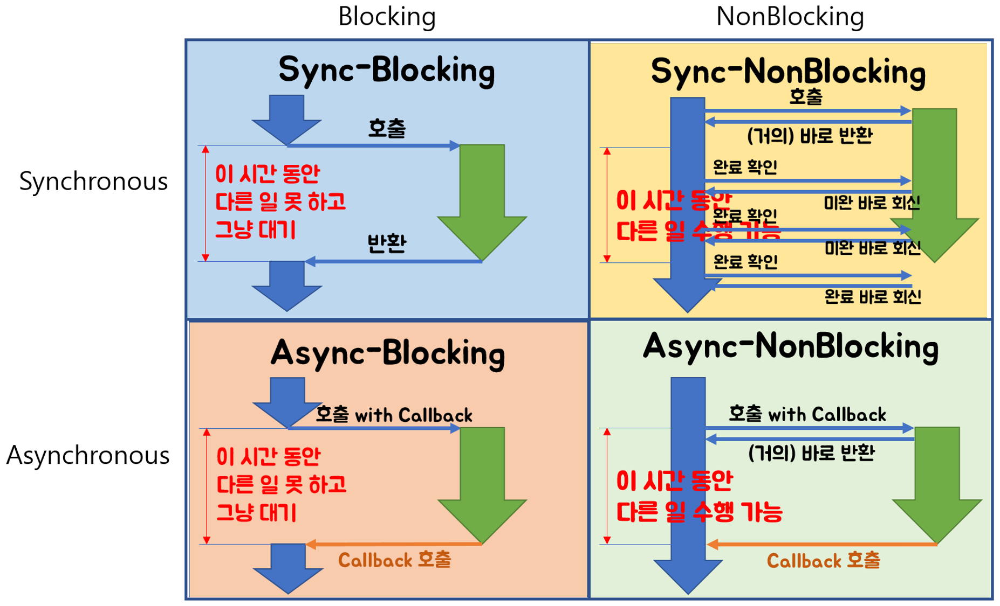

# Node-js

**목차**

##### [Node.js 기초](#Node.js-%EA%B8%B0%EC%B4%88)

##### [Node.js 특징](#Node.js-%ED%8A%B9%EC%A7%95)

---

## Node.js 기초

**해당 자료는 [생활코딩](#https://opentutorials.org/course/3332/21028)에 기반을 두고 있음.**

우리의 관심은 생산성에 초점을 맞추어 있다. 

node.js를 이용해서 사용자는 읽기, 쓰기를 할 수 있다.

node.js 를 조작하는 것은 javascript임.

**아파치와 차이점**으로 사용자에게 전달할 정보를 결정할 수 있다.

Template Literal => `(back) 를 쓴다 (작은 따옴표 아님)

- ${변수}형태로 쓰면 포함되므로 가독성이 좋아짐
- 개행에 대해 따로 기호를 써줄 필요가 없음

**URL구성**

HTTP : // opentutorial.org : 3000 / main ? id=HTML&page=12

프로토콜, 도메인, 포트, path , query string

- 웹서버 포트의 기본은 80번임/
- query string은 ?로 시작한다 .

**synchronous** vs **asynchronous**

synchronous : 모든 일이 순차적으로 처리된다.

asynchronous : 일을 할당하고 다른 일을 처리한다. (순서대로 안될 수 있음.)

node.js의 장점으로 꼽는 점 중 하나가 non-Blocking으로써 비동기로 작동하는 점이다.

**콜백 함수**란 비동기 방식에서 **어떤 수행이 완료되었을 때( event가 발생했을 때 ) 수행해야 할 함수**를 의미합니다.

만약 콜백 함수를 사용하지 않는다면 작업을 마치기 전에 다음 프로세스로 진행을 시키고 이에 따라 원하는 결과값을 얻지 못하는 경우가 발생할 수 있다.

**Block과 sync의 차이점**

- **Blocking/NonBlocking은 호출되는 함수가 바로 리턴하느냐 마느냐가 관심사**
  - 바로 리턴하지 않으면 Blocking
  - 바로 리턴하면 NonBlocking
- **Synchronous/Asynchronous는 호출되는 함수의 작업 완료 여부를 누가 신경쓰냐가 관심사**
  - 호출되는 함수의 작업 완료를 호출한 함수가 신경쓰면 Synchronous
  - 호출되는 함수의 작업 완료를 호출된 함수가 신경쓰면 Asynchronous

reference : https://homoefficio.github.io/2017/02/19/Blocking-NonBlocking-Synchronous-Asynchronous/

**HTML**

form태그에서 서버에서 수정, 삭제, 생성 등의 작업을 위해 데이터를 전송할 때에는 method는 post로 전송해야한다. (보안)

만약에 서버로부터 데이터를 가져오는 경우에 get을 사용하는 것

**객체 - Object**

배열은 정보를 순서에 따라서 정리정돈함 (순서가 식별자)

객체는 순서가 없는 정보를 저장할 때 최적 (이름으로 식별자)

javascript에서는 함수는 구문이면서 동시에 값이다. 이를 이용해 데이터와 함수를 그룹핑해서 정리 정돈할 수 있습니다.

---
## Node.js 특징

