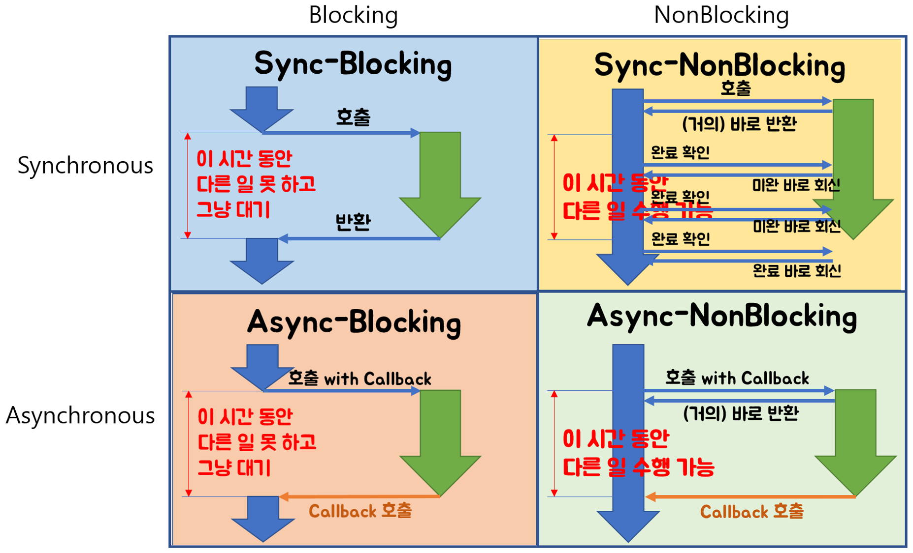

# JavaScript

**목차**

[1. Node.js 기초](#nodejs-%EA%B8%B0%EC%B4%88)

[2. Node.js 특징](#nodejs-%ED%8A%B9%EC%A7%95)

[3. JavaScript](#JavaScript)

---

## Node.js 기초

**해당 자료는 [생활코딩](#https://opentutorials.org/course/3332/21028)에 기반을 두고 있음.**

우리의 관심은 생산성에 초점을 맞추어 있다. 

node.js를 이용해서 사용자는 읽기, 쓰기를 할 수 있다.

node.js 를 조작하는 것은 javascript임.

**아파치와 차이점**으로 사용자에게 전달할 정보를 결정할 수 있다.

Template Literal => `(back) 를 쓴다 (작은 따옴표 아님)

- ${변수}형태로 쓰면 포함되므로 가독성이 좋아짐
- 개행에 대해 따로 기호를 써줄 필요가 없음

**URL구성**

HTTP : // opentutorial.org : 3000 / main ? id=HTML&page=12

프로토콜, 도메인, 포트, path , query string

- 웹서버 포트의 기본은 80번임/
- query string은 ?로 시작한다 .

**synchronous** vs **asynchronous**

synchronous : 모든 일이 순차적으로 처리된다.

asynchronous : 일을 할당하고 다른 일을 처리한다. (순서대로 안될 수 있음.)

node.js의 장점으로 꼽는 점 중 하나가 non-Blocking으로써 비동기로 작동하는 점이다.

**콜백 함수**란 비동기 방식에서 **어떤 수행이 완료되었을 때( event가 발생했을 때 ) 수행해야 할 함수**를 의미합니다.

만약 콜백 함수를 사용하지 않는다면 작업을 마치기 전에 다음 프로세스로 진행을 시키고 이에 따라 원하는 결과값을 얻지 못하는 경우가 발생할 수 있다.

**Block과 sync의 차이점**

- **Blocking/NonBlocking은 호출되는 함수가 바로 리턴하느냐 마느냐가 관심사**
  - 바로 리턴하지 않으면 Blocking
  - 바로 리턴하면 NonBlocking
- **Synchronous/Asynchronous는 호출되는 함수의 작업 완료 여부를 누가 신경쓰냐가 관심사**
  - 호출되는 함수의 작업 완료를 **호출한 함수**가 신경쓰면 Synchronous
  - 호출되는 함수의 작업 완료를 **호출된 함수**가 신경쓰면 Asynchronous

reference : https://homoefficio.github.io/2017/02/19/Blocking-NonBlocking-Synchronous-Asynchronous/

**HTML**

form태그에서 서버에서 수정, 삭제, 생성 등의 작업을 위해 데이터를 전송할 때에는 method는 post로 전송해야한다. (보안)

만약에 서버로부터 데이터를 가져오는 경우에 get을 사용하는 것

**객체 - Object**

배열은 정보를 순서에 따라서 정리정돈함 (순서가 식별자)

객체는 순서가 없는 정보를 저장할 때 최적 (이름으로 식별자)

javascript에서는 함수는 구문이면서 동시에 값이다. 이를 이용해 데이터와 함수를 그룹핑해서 정리 정돈할 수 있습니다.

---
## Node.js 특징

reference : https://junspapa-itdev.tistory.com/3

**핵심키워드**

- 구글 V8 자바스크립트 엔진
- 고성능 네트워크 서버
- 단일 쓰레드(Single Thread) 이벤트 루프(Event Loop) 기반
- 비동기 I/O 처리(Non-Blocking I/O)
- 자바스크립트
- 개발 생산성 향상
- 방대한 모듈 제공(NPM)

**쓰레드 기반 동기방식(Blocking I/O)**

- 하나의 쓰레드가 request를 받으면 모든 처리가 완료될때까지 기다리다가 처리결과가 완료되면 다시 응답을 보냄
- 기존 업무 처리가 완료되기 전에 또다른 request가 있으면 새로운 쓰레드가 업무를 처리함.
- 동시 request가 많은 경우 많은 쓰레드가 필요하게 되어 서버 과부하

**단일쓰레드 이벤트 루프 기반 비동기방식( Non-Blocking I/O)**

- 하나의 쓰레드가 request를 받으면 바로 다음 처리에 요청을 보내놓고 다른 작업을 처리하다가 먼저 요청한 작업이 끝나면 이벤트를 받아서 응답을 보낸다.
- 동시 request가 오더라도 처리가 완료될때까지 기다리지 않아도 되기 때문에 서버 부하가 적다.

**장점**

1. 자바스크립트를 동일하게 사용해서 서버단 로직을 처리할 수 있다. 
2. Non-blocking I/O와 단일 스레드 이벤트 루프를 통한 높은 처리 성능
3. 이벤트 기바 비동기방식이라 서버 무리가 적다.
4. npm을 이용해 자신이 필요한 모듈을 제공받을 수 있다.

**단점**

1. 로직이 복잡하면 callback함수의 늪에 빠질 수 있다.
2. 단일 쓰레드이기 때문에 하나의 작업 자체가 많이 걸리는 웹서비스에는 어울리지 않는다.
3. 에러가 나면 프로세스가 내려가기 때문에 모든 케이스에 대해 소스코드를 검증해야 한다.

 **express**

node.js의 핵심 모듈인 http와 connect 컴포넌트를 기반으로 하는 웹 프레임워크

## JavaScript

1. **var, let, const**
   - var : 변수를 여러번 선언해도 오류 안나고 계속 쓸 수 있다... 추후에 에러발생을 시킬 수 있다. 그래서 안쓰는게 좋음
   - let : 변수의 재선언 불가. 변수의 재할당은 가능. mutable함
   - const : 변수의 재선언, 재할당이 모두 불가. 
   - 그러므로 보통 let이나 const를 주로 사용한다. 재할당이 필요한지 여부에 따라서 let이나 const사용.
2. **typescript - 타입지정 : 버그방지에 효과가 있음**

   - 정적타입을 지원 : 여러명이 참여하는 프로젝트의 경우 자료형이 맞지 않아 문제가 생길 수 있으므로 엄격한 타입지정은 도움이 된다.
3. **세미콜론** 

   - 쓰지 않아도 동작은 한다. (ASI기능으로 자동삽입이 되어 괜찮다.)
   - ASI가 명확하게 분류하지 못하는 경우가 생길 수 있기 때문에 불안하면 쓰는게 좋을 것 같다.
4. **버전 es6으로 넘어오며 생긴 큰 차이점**
   
   1. default parameter를 넣을 수 있다.
   2. template literal을 사용할 수 있다. (${variable})과 같은 형태
   
   3. mulit-line string지원
   4. Destructuring Assignment지원 배열이나 객체의 속성을 해체하여 각각의 변수에 할당가능.

**callback - promise - async/await**

1. callback : 다른 함수에게 인자로 전달되어 어느 시점에 실행될 수 있도록 던져주는 함수. 이를 이용해 함수의 순서를 구현할 수 있다.
2. promise객체
   - 어떤 값이 생성되었을 때 그 값을 대신하는 대리자. 비동기 연산이 종료된 이후, 그 결과 값이나 에러를 처리할 수 있도록 처리기를 연결하는 역할을 한다.
   - 

